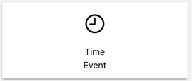
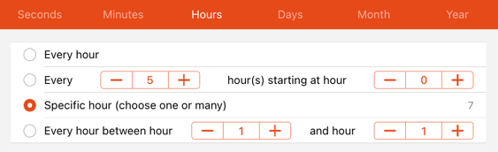

# Settings - Schedule

<!-- START MAINUI SIDEBAR DOC - DO NOT REMOVE -->
View upcoming time-based rules.

When you create a rule, add the `Schedule` tag and define a time trigger,

then this rule will be shown in the calendar view on this page.
<!-- END MAINUI SIDEBAR DOC - DO NOT REMOVE -->

As an example create a rule that triggers

every Saturday

at 7:00 in the morning

and it will appear in the schedule view:

A rule that is scheduled repeatedly like every day at 8:00 in the morning will therefore be shown on every day of the calendar view.
The way openHAB handles this, is that a rule will get a tag "schedule", so if you create a rule with the help of the  at the bottom right corner, openHAB automatically adds that tag (that is also true if you create a rule with a time trigger via the normal rule page).
In case you have timed that trigger that repeats very often and which would "pollute" the schedule view with far too many entries, you can just delete the tag "schedule" in the edit mode of that rule (it can always be added later again).

The page has a searchable list which allows to filter by the name of the rule.

To see more entries scroll to the left or the right.
Note that the selection functionality is currently not supported.
