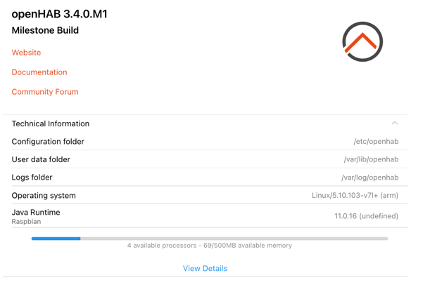
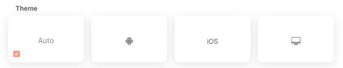
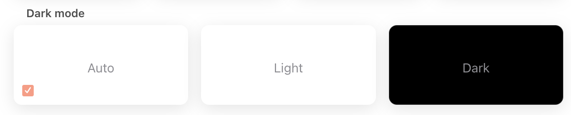
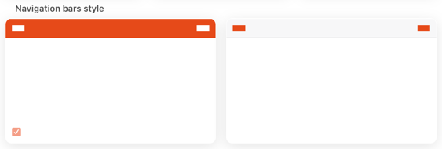
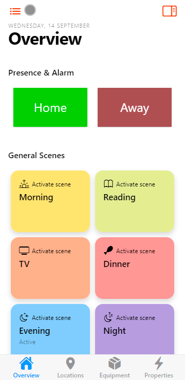
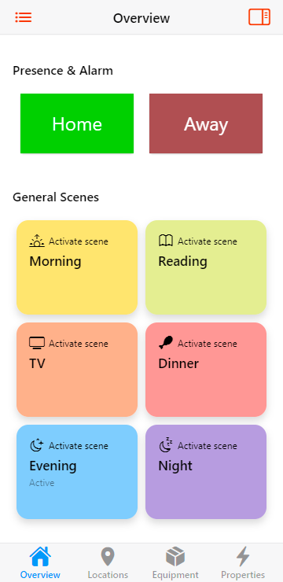
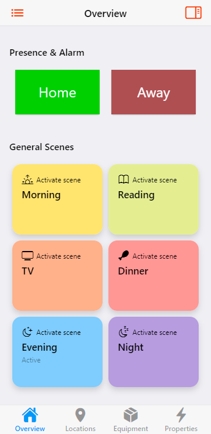
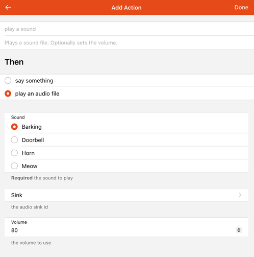
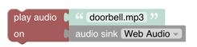
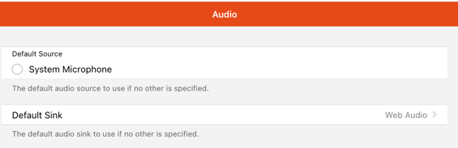

# Help & About Page

The about page shows general information of your openHAB configuration and  allows to configure some client related configuration.

  [[toc]]

## Top Section



- Version: shows the currently installed version of openHAB
- Links to the official openHAB Website, the openHAB Documentation and the Community Forum

## Technical Information

This section is collapsed by default and can be opened by clicking on it which then reveals the

- Configuration folder on the server
- User data folder on the server
- Logs folder on the server
- Operating System openHAB is running on
- Java Runtime openHAB is running on
- number of processors and memory

Clicking on View Details opens up a popup window that contains very detailed information like

- Runtime information
- Locale (language)
- System information including memory information
- A list of all installed bindings
- Client information including device information, client settings (see also the below section), screen information, theme, user agent information.

The content can be easily copied with the copy button on the top to provide it as additional information when asking questions in the community.

## Appearance (for this device only)

This section allows to have different appearance settings _per_ device.

- **Theme**: Selects the theme for that device
  - Auto: tries to detect the client type
  - Android
  - iOS
  - Destktop



- **Dark mode** setting
  - Auto: uses the default mode
  - Light-Mode
  - Dark-Mode



- **Navigation bars style**: inverts the colors in the navigation bar



## Miscellaneous settings

- **Simple navigation bar on home page**: When switching it on, it means the navigation bar will look the same even whether you're at the top of the page or not - you won't have the alternate look with the date.
The first image depicts the normal setting (off), the second image shows it switched off

 

- **Standard home page background color**: This only relates to the light color scheme.
The background color will be the same as the regular pages you can show from e.g. the sidebar, which is a kind of gray instead of white.
The first image depicts the normal white setting (off), the second image shows it switched off with the gray setting.

 

- **Disable card expansion animations**: Disables the animations when expanding a widget card.
- **Disable page transition animations**: Disables the transitions when switching from one page to the other.

### Enable Web Audio sink support

- This setting is also part of the miscellaneous settings.
- The intent of that option is to allow sending audio to that device, e.g. if that device is a tablet that is hanging on the wall in a room and a specific audio should be sent to that device for notification purposes.
- To activate audio output of that particular device, switch on this option.
In case you want to activate audio on multiple devices, each device needs to be activated by opening the about page on the device.
Technically, this information (and all the other miscellaneous settings) are stored in the local storage of the browser.
- For me information [see here](https://github.com/openhab/openhab-webui/pull/1422)

To test if it works play some static content that comes with openHAB in the /sounds dir using a openHAB console command.
Use [openHABs console](/administration/console.html#using-the-console) or just run the following from the linux shell:

> openhab-cli console

and then enter the following command:

```text
openhab> audio play webaudio barking.mp3
```

If you have a dog that gets triggered by barking you may opt for playing doorbell.mp3 instead.
If you play doorbell.mp3 your dog will then probably play its own barking audio sound. 😉
Note that most browsers block web pages from playing audio/video automatically nowadays (though some browsers have a setting to activate automatic play)

Here are some useful actions available to rules in which you can specify webaudio as sink, see:

- [playSound](/docs/configuration/multimedia.html#actions-2)

```text
playSound("webaudio", "barking.mp3")
```

- [say](/docs/configuration/multimedia.html#actions-3)

```text
say("Hello world!", "voicerss:enUS", "webaudio")
```

You can also configure webaudio as sink when creating rules in the UI:



or using it in a blockly rule:



It is important to understand that you cannot address one particular device.
When you play a sound on webaudio, it will be played on each device where webaudio is activated.

If you really like webaudio, you can also make it the default sink in the "Audio" settings - see [Settings->Audio](/docs/settings/services_system.html#Audio).
Then you can omit the webaudio sink ID from commands/actions.



## Reload

Reload the web page to reflect the selected changes.
