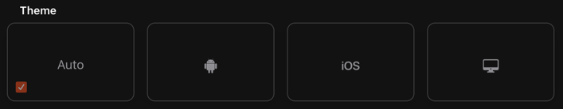
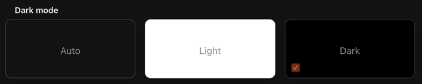
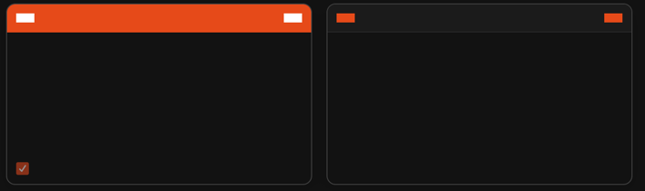

# Help & About Page

The about page allows to configure some client related configuration

{::options toc_levels="2..4"/}

- TOC
  {:toc}

## Top Section

- Version
- Links to the openHAB Website, the openHAB Documention and the Community Forum

## Technical Information

- Configuration folder
- User data folder
- Logs folder
- Operating System
- Java Runtime
  - View Details

## Appearance (for this device only)

- Theme

  - Auto: tries to detect the client type
  - Android
  - iOS
  - Destktop
- Dark mode setting

  - Auto: **TODO**
  - Light-Mode
  - Dark-Mode
- Navigation bars style

# Miscellaneous settings

- Simple navigation bar on home page: **TODO** What is the navigation bar
- Standard home page background color: **TODO**
- Disable card expansion animations: Disables the animations when expanding a widget card
- Disable page transition animations: Disables the transitions when switching from one page to the other
- Enable Web Audio sink support
  - **TODO** : see https://github.com/openhab/openhab-webui/pull/1422

# Reload

Reload the web page to see the selected changes.

