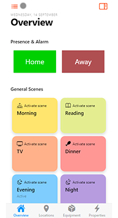
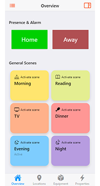

# Help & About Page

The about page shows general information of your openHAB configuration and  allows to configure some client related configuration.

  [[toc]]

## Top Section

- Version: shows the currently installed version of openHAB
- Links to the official openHAB Website, the openHAB Documentation and the Community Forum

## Technical Information

This section is collapsed by default and can be opened by clicking on it which then reveals the

- Configuration folder on the server
- User data folder on the server
- Logs folder on the server
- Operating System openHAB is running on
- Java Runtime openHAB is running on
- number of processors and memory

Clicking on View Details opens up a popup window that contains very detailed information like

- Runtime information
- Locale (language)
- System information including memory information
- A list of all installed bindings
- Client information including device information, client settings (see also the below section), screen information, theme, user agent information.

The content can be easily copied with the copy button on the top to provide it as additional information when asking questions in the community.

## Appearance (for this device only)

This section allows to have different appearance settings _per_ device.

- **Theme**: Selects the theme for that device
  - Auto: tries to detect the client type
  - Android
  - iOS
  - Desktop

- **Dark mode** setting
  - Auto: uses the default mode
  - Light-Mode
  - Dark-Mode

- **Navigation bars style**: inverts the colors in the navigation bar

## Miscellaneous settings

- **Simple navigation bar on home page**: When switching it on, it means the navigation bar will look the same even whether you're at the top of the page or not - you won't have the alternate look with the date.
The first image depicts the normal setting (off), the second image shows it switched off

 

- **Standard home page background color**: This only relates to the light color scheme.
The background color will be the same as the regular pages you can show from e.g. the sidebar, which is a kind of gray instead of white.
The first image depicts the normal white setting (off), the second image shows it switched off with the gray setting.

 

- **Disable card expansion animations**: Disables the animations when expanding a widget card.
- **Disable page transition animations**: Disables the transitions when switching from one page to the other.
- **Enable Web Audio sink support**: Please refer to the [Web Audio Sink docs]({{base}}/ui/mainui.html#web-audio-sink).
- **Listen for UI commands to**: Please refer to the [UI Command Item docs]({{base}}/ui/mainui.html#ui-command-item).

## Reload

Reload the web page to reflect the selected changes.
