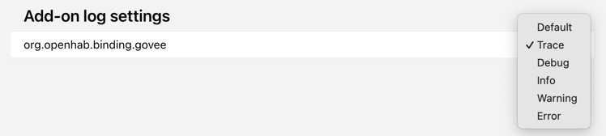

# Add-ons

This section lists the installed add-ons and provides direct access to the settings that are directly related to that add-on.

This section is particular important as it allows the setting of the log-level of a particular addon:

The standard log level is "Info" but to track down an issue it might be necessary to increase the log-level upon request.
For more information see [Logging in openHAB]({{base}}/administration/logging.html)
