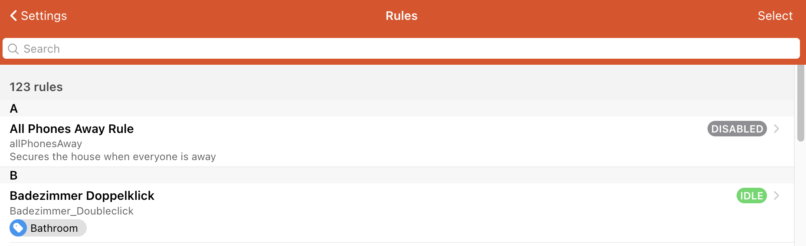
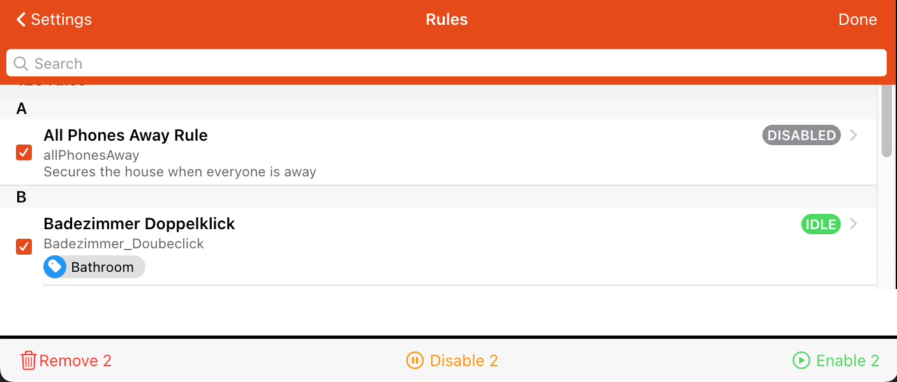
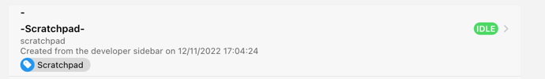
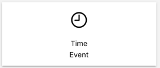
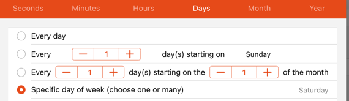
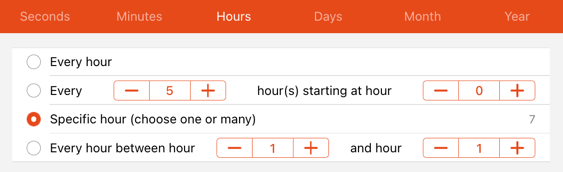
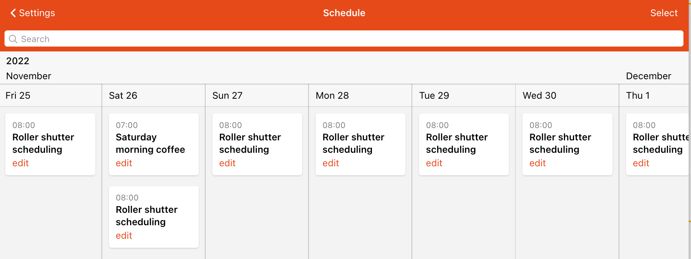

# Automation

This is the section to automate openHAB which provides rules, script and a scheduling section.
See [What's the Difference Between a Rule, Script, and Schedule?](/docs/tutorial/rules_introduction.html#what-s-the-difference-between-a-rule-script-and-schedule)

  [[toc]]

## Rules

Automate with triggers and actions: this links you to the page that allows you to manage your rules.

The page has a searchable list of rules where the following attributes

- name
- unique id
- description
- enabled state (disabled, enabled, idle, running)
- tags

The searchbar allows to filter by the name, the description and the tags of that rule.

When clicking "select" on the top right corner, the list allows to select multiple entries at the same time.

After selecting one or multiple rules three options appear in the footer to allow

- removing
- disabling or
- enabling

these rules.
Press "Done" to return back to the normal list view.

To add a rule press the plus icon on the lower right corner:  and follow the [rules tutorial](/docs/tutorial/rules_basic.html#create-the-rule).

## Scripts

Rules consisting of a single Script Action and has the tag "Script", there are no triggers so they must be run manually or called from another rule.

The list behaves exactly like the rule overview described above.

Note: there is a special in the "Developer Sidebar"->"Code Tools" section that allows to play around with script expressions.
Below that section is a link that allows to "Open a Scratchpad".
This in fact creates a script in the scripts section that is automatically named "-Scratchpad" and is tagged with the tag "Scratchpad".
It will appear in the list as follows.

## Schedule

View upcoming time-based rules

When you create a rule and define a time trigger

this rule will be shown in the Schedule Calendar view here.

As an example create a rule that triggers

every Saturday

at 7:00 in the morning

and it will appear in the schedule view:

A rule that is schedule repeatedly like everyday at 8:00 in the morning will therefore be shown on every day of the calendar view.
The way openHAB handles this, is that a rule will get a tag "schedule", so if you create a rule with the help of the  at the bottom right corner, openHAB automatically adds that tag (that is also true if you create a rule with a time trigger via the normal rule page).
In case you have timed that trigger that repeats very often and which would "pollute" the schedule view with far too many entries, you can just delete the tag "schedule" in the edit mode of that rule (it can always be added later again).

The page has a searchable list which allows to filter by the name of the rule.

To see more entries scroll to the left or the right.
Note that the selection functionality is currently not supported.
