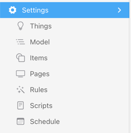
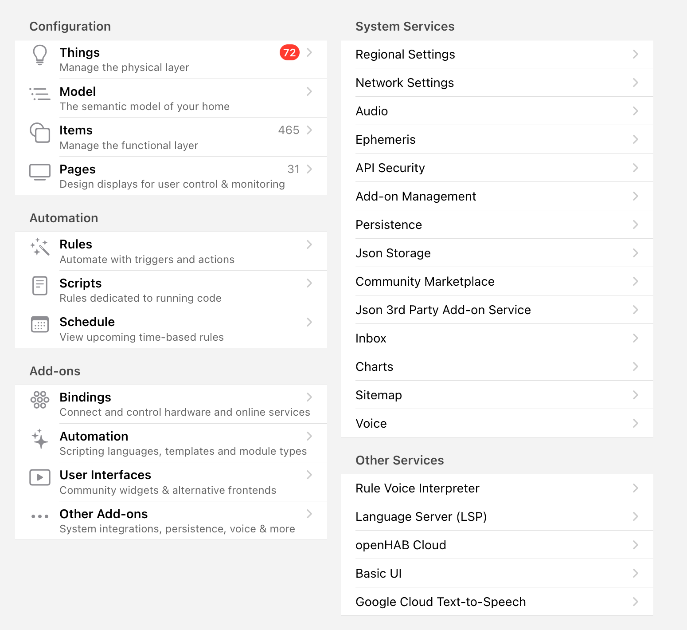

# Settings

The settings page can be reached via the menu and is main area where openHAB can be configured:

The _Settings_ entry links to an overview page that itself has several subsections that lead you to the respective configuration pages..

Some of these subpages, which are most often used, can also be accessed directly via the menu, e.g. either click on _Settings->Items_ in the overview page or on directly _Items_ in the menu.

{::options toc_levels="2..4"/}

- TOC
  [[toc]]

## Sections

- [Configuration](/docs/settings/configuration.html)
- [Automation](/docs/settings/automations.html)
- [Add-ons](/docs/settings/addons.html)
- [System Services](/docs/settings/services_system.html)
- [Other Services](/docs/settings/services_other.html)
