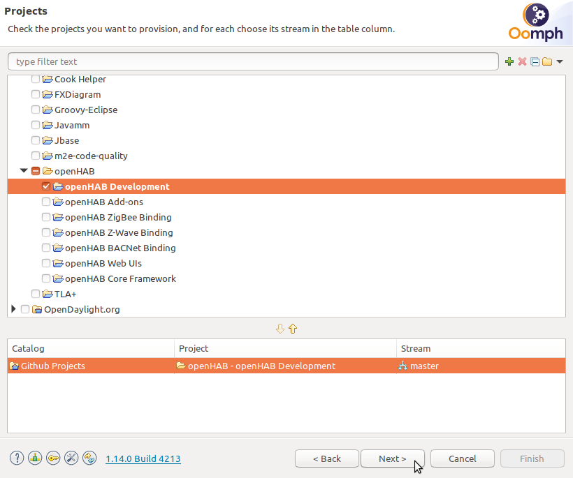
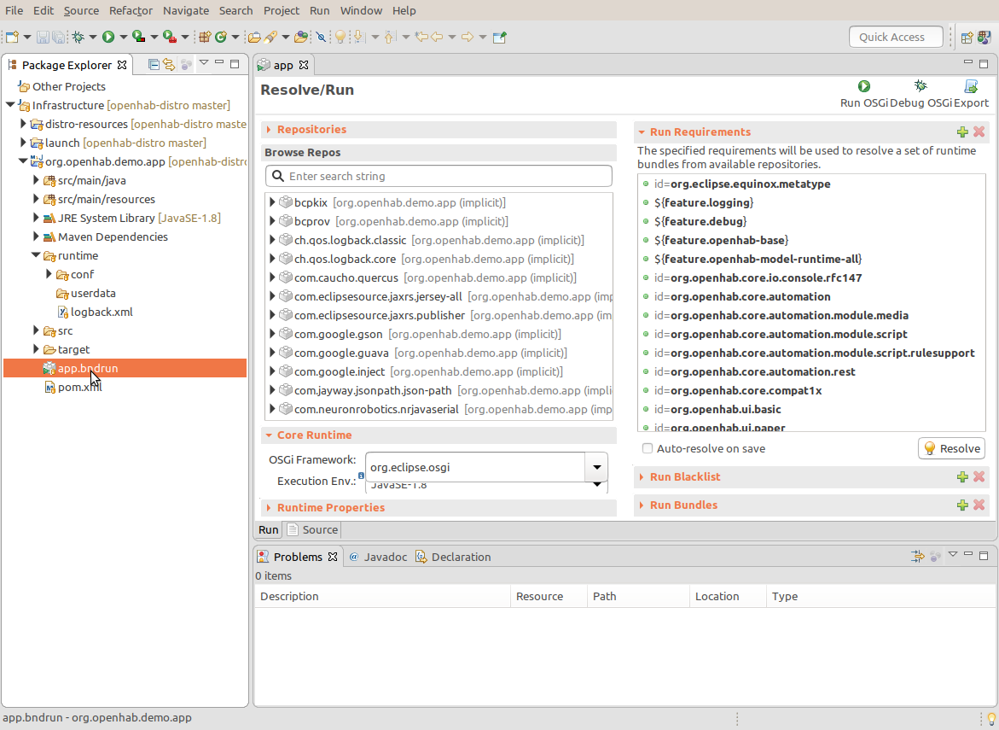

# Eclipse IDE

Eclipse is the development environment used since the inception of openHAB.
To make development easier an out-of-the-box setup is available that completely configures Eclipse to easily develop for the openHAB projects.
This guide describes the steps to setup Eclipse and how to run and debug an add-on in Eclipse.

::: tip Existing Eclipse Installations
If you already have Eclipse installed it is recommended to perform a separate Eclipse install for openHAB to avoid overriding your existing Eclipse configuration.
:::

## Eclipse IDE Setup

1. Install the Java 21 JDK if you did not have it installed.

   ::: warning Attention
   openHAB development requires **Java JDK version 21**.
   :::

1. Download the "Eclipse Installer": [can be downloaded from the Eclipse web site](https://wiki.eclipse.org/Eclipse_Installer)

1. Launch the Installer and on the menu on the top right (3 bars)

    

1. Select `ADVANCED MODE...`

    

1. Select `Eclipse IDE for Java Developers`. Select `Next >`.

    

1. Under `GitHub Projects > openHAB` select `openHAB Development` and any desired option from `openHAB Add-ons` (includes all add-ons from openhab-addons repo), `openHAB ZigBee Binding` or `openHAB Z-Wave Binding`.

    

    | Selection               | Install if                            |
    | ----------------------- | ------------------------------------- |
    | **openHAB Development** | **Debug/Demo Environment (Required)** |
    | openHAB Add-ons         | Add-ons Development                   |
    | openHAB ZigBee Binding  | ZigBee Binding Development            |
    | openHAB Z-Wave Binding  | Z-Wave Binding Development            |
    | openHAB BACNet Binding  | BACNet Binding Development            |
    | openHAB Web UIs         | Web UIs Development                   |
    | openHAB Core Framework  | Core Framework Development            |

1. Click `Next>`, verify/modify Root and install folder name. Click on `Show all variables` to open the window shown below.

    

    Explanation of some of the variables
    - `Root install folder`: The base folder where the `Installation folder` will be placed.
    - `Installation folder name`: This is the directory in the root install folder everything will be installed in.
    - `GitHub user ID`: This is your GitHub user name used to configure the cloned Git projects.

1. Click `Next>` and `Finish` to start installation.

    During install accept license agreement, "Unsigned Content" for Bndtools, and Eclipse Foundation certificates when requested to complete IDE installation.

1. At this point the Eclipse installer is finished and the Eclipse IDE is automatically launched to continue the installation process.

    ::: warning Attention
    **It is important**, during the first Eclipse IDE launch, to leave Eclipse open until all openHAB related initial Setup tasks / Download sources / Builds are completed.
    :::

    Setup tasks will personalize the IDE with openHAB code formatting tools, configurations and a demo app.
    Setup tasks will also download openHAB latest projects you have selected during installation. Like `openhab-distro` and the add-ons `openhab-addons` project if you have selected it.

    Click bottom right button in the IDE for Progress.

   

1. After all tasks are finished you are ready to start developing.

1. If you need additional libraries see the [Build System](../buildsystem.html) documentation.
    For other libraries supported out-of-the-box check the [Default Libraries](../guidelines.html#default-libraries) on the guidelines page.

## Working with Add-ons

To easily run, modify and debug an add-on the `openHAB Development` setup installs and imports a demo project that contains a complete openHAB environment to run and debug an add-on.
This mechanism replaces the add-on installation process via the UI that you would use outside the IDE.

### Running Add-ons

Under `Infrastructure` you will find the project `org.openhab.demo.app`.
This project contains the full configuration to run openHAB.
The following files are of interest for the execution environment:

```text
|- org.openhab.demo.app
|--- runtime
|------- conf             Here you configure the manual text files
|------- userdata         Here is the openHAB user data
|------- log4j2.xml       XML file for logging options
|--- app.bndrun           The file to start openHAB
|--- pom.xml              The pom file with all dependencies for the demo project
```

1. To let the demo project know about the add-on, the add-on must be added to the demo project `pom.xml`.
    Here is an example for the `astro` binding:

    ```xml
        <dependency>
        <groupId>org.openhab.addons.bundles</groupId>
        <artifactId>org.openhab.binding.astro</artifactId>
        <version>${project.version}</version>
        <scope>runtime</scope>
        </dependency>
    ```

1. To run the add-on with the `app.bndrun` run configuration.
    Double click to open `app.bndrun` file (takes a few seconds):

    

1. Under `Browse Repos` search for the add-on you want to run (`astro` in our case) and add it to the `Run Requirements` list using drag&drop from the `Browse Repos` list:

    ::: tip
    If you cannot find the binding you want run/debug in the Browse Repos list, or the list is empty,
    then it is likely either the `pom.xml` of the demo project contains an error or there is a build problem with your project.
    Check if your project has no compile errors.
    Or run Maven on the command line to check if it reports any errors.
    :::

    

1. Save and click "Resolve": a window with the list of resolved bundles will be shown.
    Click `Finish` and save the file.

    ::: tip
    Watch out - it's easy to miss saving the `app.bndrun` file.
    If you see the little asterisk next to `app` in the `app` tab you haven't yet saved.
    :::

    Now the IDE is ready to start openHAB with a minimum set of the openHAB core bindings, UIs and the add-ons you configured.

1. Start openHAB from the IDE by clicking "Run OSGi" (upper right of the `app.bndrun` window).

    ::: tip
    Depending on the amount of code you want to debug, especially when you're debugging not only add-ons, but also openHAB Core and UI's,
    start-up process may gets very slow and/or you get a `java.lang.OutOfMemoryError: Java heap space` exception.
    In case this happens, you could increase the maximum heap space by adding e.g. `-Xmx8G` (for a maximum of 8 gigabyte) to
    `Runtime Properties > JVM arguments` (bottem left of the `app.bndrun` window).
    Afterwards, you have to save `app.bndrun` file again.
    :::

1. You can check that openHAB is running with your browser by going to: `http://localhost:8080/` (the last `/` is important!)

1. You can check log output in the `Console` tab at the bottom.

1. Check the chosen binding is active in `UI > Settings > Bindings`

View all the above steps in a single animation:


### Modifying and Debugging Add-ons

If you don't just want to run an add-on, but also want to modify and debug it you need to install sources for the add-on and build them locally.

1. Install Sources

    Sources are installed by cloning the [openHAB Add-ons](https://github.com/openhab/openhab-addons/) repository.
    If you select `openHAB Add-ons` during installation the installer automatically clones the [openHAB Add-ons](https://github.com/openhab/openhab-addons/) repository into `git\openhab-addons` under your installation folder.

    If you didn't install `openHAB Add-ons` you can manually clone the [openHAB Add-ons](https://github.com/openhab/openhab-addons/) repository by executing `git clone https://github.com/openhab/openhab-addons.git` in the `git` folder under your installation folder.

    You can now modify add-on sources as needed.

1. Build Sources

    Add the add-on as an Eclipse project so that Eclipse will build it automatically.
    Import the add-on project via `File > Import... > Maven > Existing Maven Projects`.
    Specify your add-on's source root folder (e.g. `git\openhab-addons\bundles\org.openhab.binding.astro` under the installation folder) as the root folder in the wizard.

1. Start a Debug Session

    Simply start your debug session by clicking "Debug OSGi" (upper right of the `app.bndrun` window).
    You can now use breakpoints and all other Eclipse debug tools.

::: tip Where do add-on jar files come from?
If you just run an add-on following the above steps then the required add-on jar files are retrieved through your Maven repository folder `.m2/repository` (e.g. `.m2\repository\org\openhab\addons\bundles\org.openhab.binding.astro`).
If you imported your add-on as a project then the jar file is no longer retrieved from the Maven repository, but instead from the project build (e.g. `git\openhab-addons\bundles\org.openhab.binding.astro\target` under the installation folder).
:::

### Using New Bindings

If you want to develop a new binding read about the [Skeleton Script](../#develop-a-new-binding) to generate the base for your binding and create all required files.
Then follow the above steps to build your sources and to configure the demo app to run your binding.

## Updating openHAB

You can update the openHAB version you are running in the IDE at any time simply by updating your git repos under your install folder.
For example to update to the latest version run `git checkout` in each repo folder under your `git` folder in the installation folder.
