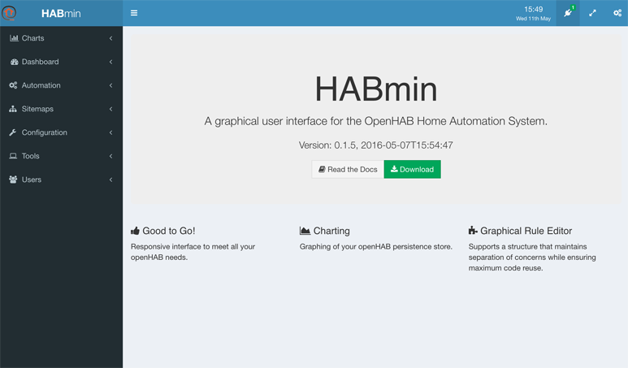
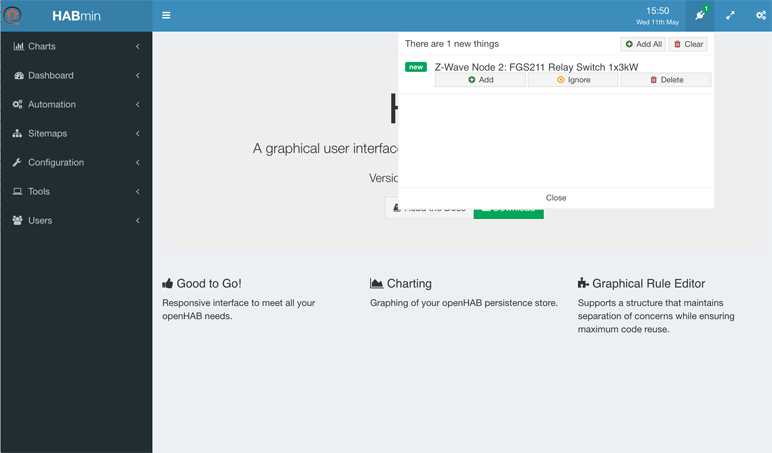
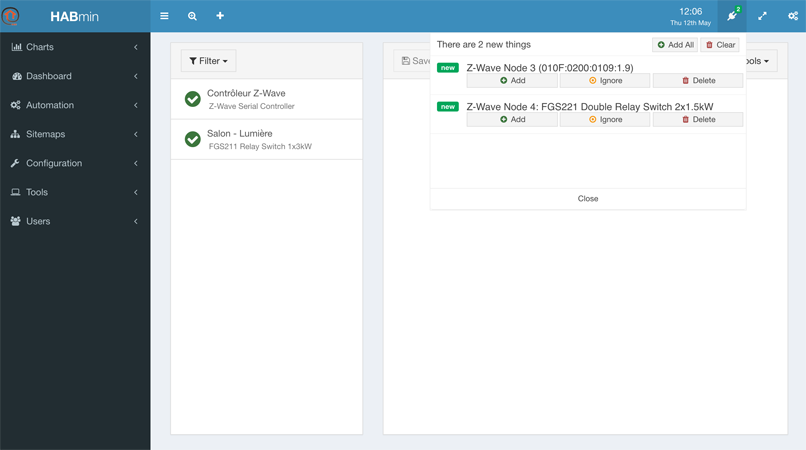
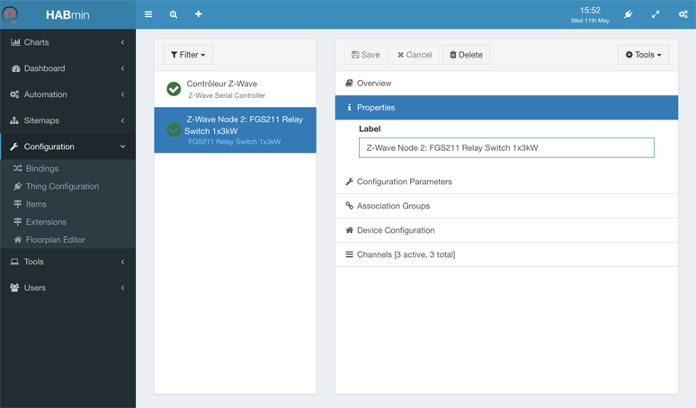



# Adding a new Thing

## Inserting the device in the z-wave network
The first action is to insert the new device in the z-wave netowrk. This is to be done using the controller.

openHAB has nothing to do at this stage. All the operations are managed from the controller itself.

## Adding the new Thing

A few seconds after your device has been inserted inside the network using the controller, a new Thing appears in the inbox.

As you can see in the following picture, a small green label with the number of new things appears at the top right of the HABmin 2 screen.

If you click on it, the inbox pops up with the list of the newly detected Things.

As you can see in the previous screenshot, HABmin is able to find out the model of the device that the Things represents. This allows HABmin to automatically setup the corresponding Items.

The "Z-Wave Node 2" mention gives the openHAB internal number of the ZWave node, in our case 2.

> HABmin is using an internal database to fetch configuration data corresponding to the device.
>
> If this device is not in the database, then no device model will be displayed but a code identifying the device.
>
> 
>
> In this example, the Thing "Z-wave Node 3" has not been found in the ZWave database and the Thing "Z-wave Node 4" has been successfully identified.
>
> The section *The ZWave Database* details more the database and how you can send information about a new device.
>
> If there is no device model nor code displayed, this means that HABmin is still waiting for information about the device. This occurs with battery powered devices, as HABmin has to wait for the next wakeup time of the device to obtain the needed information.

To be able to finalize configuration of the *Thing* and the linked *Items*, you have to click on "add" just below the name of the *Thing*.

You can then find the Thing in the list of Things, by clicking on *Configuration*, *Thing Configuration* in the right menu.

## Configuring the Thing

Configuring a newly imported Thing or changing the configuration of an older one is made through the *Configuration, Thing Configuration* menu.

This is described in the next chapter.

