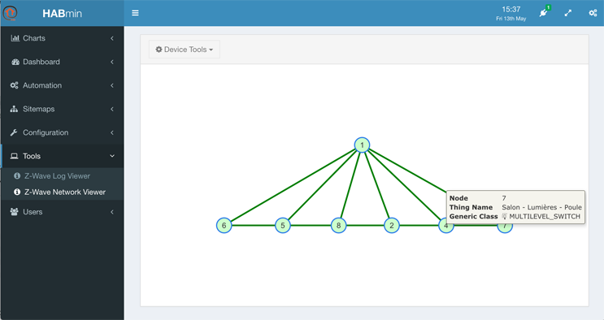



# Other tools of HABmin

## The Sitemap viewer

<<< WAITING FOR BEING FUNCTIONNAL IN HABMIN >>>

## The Z-Wave network viewer

In the left menu, click on *Tools*, *Z-Wave network viewer*.

The viewer displays a graph of the network. You can have information about the node by clicking on it.

When a node has any kind of error, it is displayed in red.

# The ZWave Database

HABmin is using an internal database to fetch configuration data corresponding to the device.

If this device is not in the database, then no device name nor model will be displayed but a code identifying the device.

In this example, the Thing "Z-wave Node 3" has not been found in the ZWave database and the Thing "Z-wave Node 4" has been successfully identified.

<<< TO BE COMPLETED >>>

