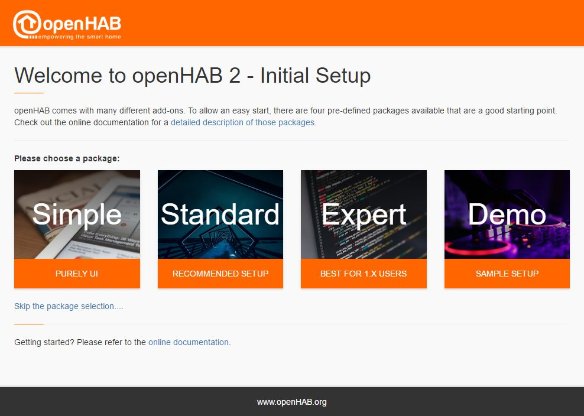
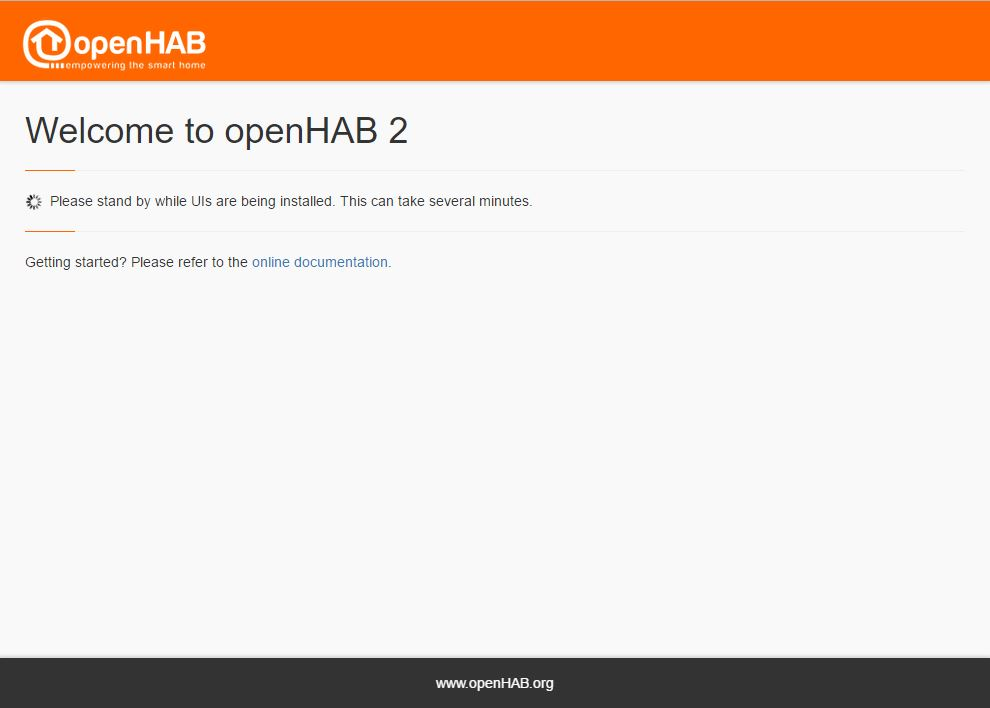



# First-time setup of openHAB

When you start openHAB for the first time, it only starts the dashboard.
So let's have a look at it: open a browser and browse to you openHAB dashboard:

<http://IP-of-your-machine:8080>

As you can see, you can choose between different options.
For starters, we recommend the "Standard" package.
This will install the "Paper UI" (here you can install add-ons, discover and configure things etc), the "Basic UI" (here you can have a look at your created sitemaps - we'll get back to this later), and the Habpanel (here you can create dynamic dashboards for your things).
After clicking in "Standard", openHAB will install the packages and afterwards take you to the start page.

To get an overview of the available user interfaces (UIs) and their intentions and capabilities, please proceed to the [UI page]({{base}}/tutorials/beginner/uis.html)
