

# Configuration of openHAB

We left at the [start page]({{base}}/tutorials/beginner/1sttimesetup.html) before showing you the differences of the UIs.
Now click on the "PAPER UI" link and you will be taken to the "Inbox".
The inbox is the place where you can discover/add new "things" (i.e. Zwave devices, Hue lamps, network devices and so on).

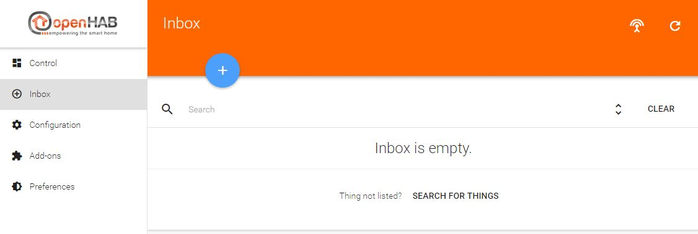

In order to be able to add new things, at first you must install the corresponding binding for that type of thing.
I.e. if you want to control your Zwave devices, you have to install the Zwave binding.
If you want to control your Hue lamps, you have to install the Hue binding etc.

The installation is done on the "Add-ons" page in the left menu.

You can scroll down and have a look at lots of bindings available for openHAB!

Let's start with the "Network Binding", as this binding can be used in every setup from the start and will show you the basic configuration possibilities.
With the network binding, you can define some of your network devices as things in order to use them in a rule for example, or just to see if they are online or offline and for how long.
Scroll down or use the "Search" field to find the "Network Binding".
Click on install, the binding will be downloaded and installed automatically.

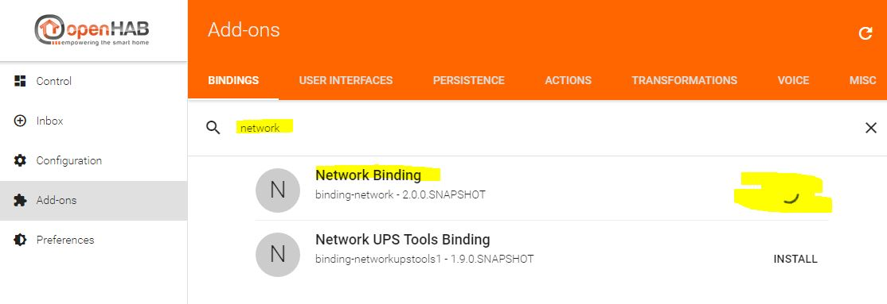

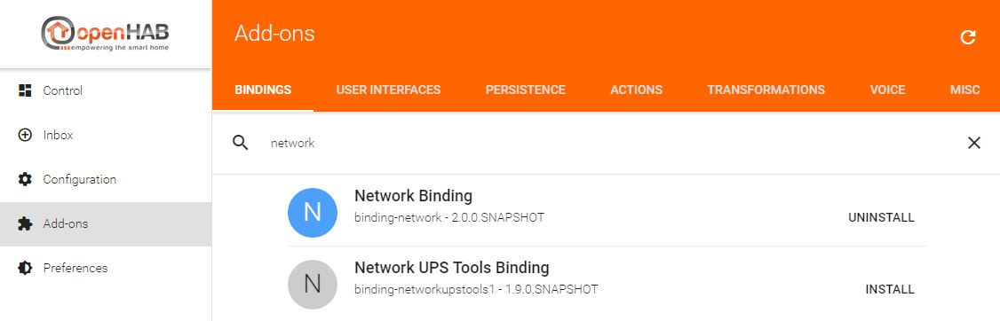

Now that the binding is installed, switch back to the "Inbox".
If you click the "+"-button, you now are able to choose the binding which you want to use for discovering new things.
Because we only installed the network binding so far, it's the only binding to choose.

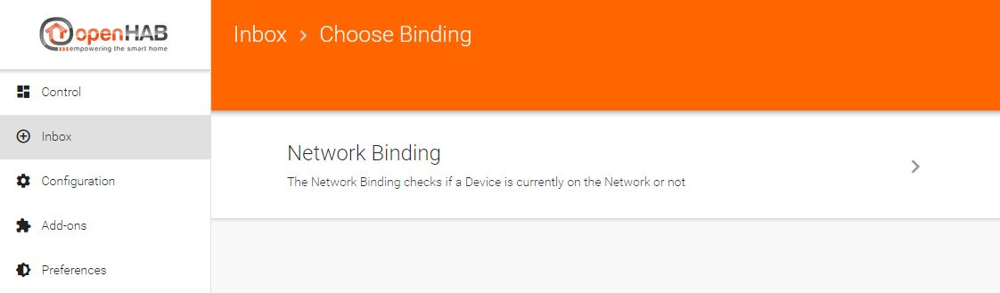

As soon as you click on "Network Binding", the binding will start an automatic discovery of all (reachable) network devices in the same subnet as your openHAB installation resides in via ICMP (ping).

The discovered "things" are now displayed in the inbox, and you can decide what to do next:

- Add the device as a thing by clicking the check icon.
- Ignore the device by clicking the crossed-out-eye icon.
- Delete the device by clicking the trashcan icon.

The difference between ignoring and deleting discovered things is as follows:

- If you ignore a thing, it disappears from the visible inbox.
If you decide to add it at a later time, you can do so by scrolling to the bottom of the inbox and click the "SHOW IGNORED" button.
- If you delete the thing, it won't be visible in the inbox any more.
But if you start a new discovery process later, the thing will reappear.

In this example, we click on the check icon of the thing with the IP address 192.168.1.103.
Let's assume this is John's mobile phone which we want to use for presence detection.
We change the (automatically added during the discovery) name of the thing on the next page to "John's Mobile" and click on the "ADD AS THING" button.
*Please note: If your network devices use a DHCP server to obtain ther IP addresses automatically, please make sure to define a DHCP reservation for a device which you want to use in openHAB.
Otherwise it's IP address may change in the future and your thing definiton won't work any more.
Information about how to define a DHCP reservation can be normally be found in the manual of your network router.*

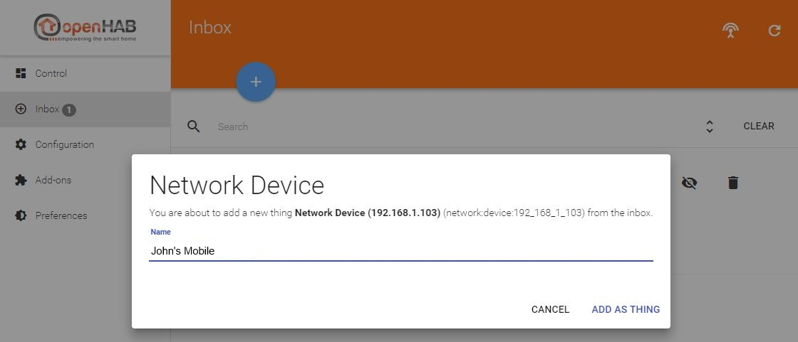

Before we proceed, let's change one of the default system settings of openHAB to ease up the following processes.
You will see why in a moment.
Go to "Configuration -> System" via the menu on the left.
Here you can find the basic system properties of your openHAB installation.
Scroll down to "Item linking", activate the "Simple Mode" slider and click the "SAVE" button which appears afterwards.
You will notice afterwards that the "Items" menu item will be gone.

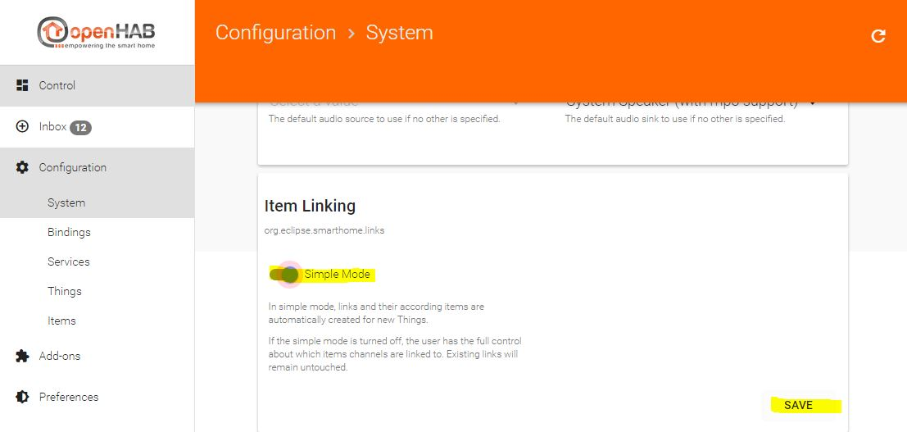

Now back to your recently added thing.
Go to the "Configuration -> Things" page.
There you will find your network device thing, including the name "John's Mobile" which we defined above.

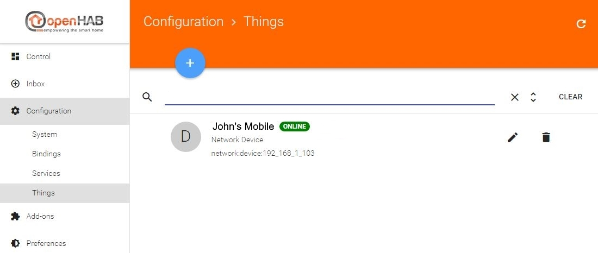

You can already see the status, "ONLINE", of the thing, so it's currently reachable by openHAB.
If you click on the name, you'll get to the next page showing the available channels of the thing.
Channels represent the different functions the items provide.
In this case you can see two channels: "Online" and "Time", the description below it says it all :)

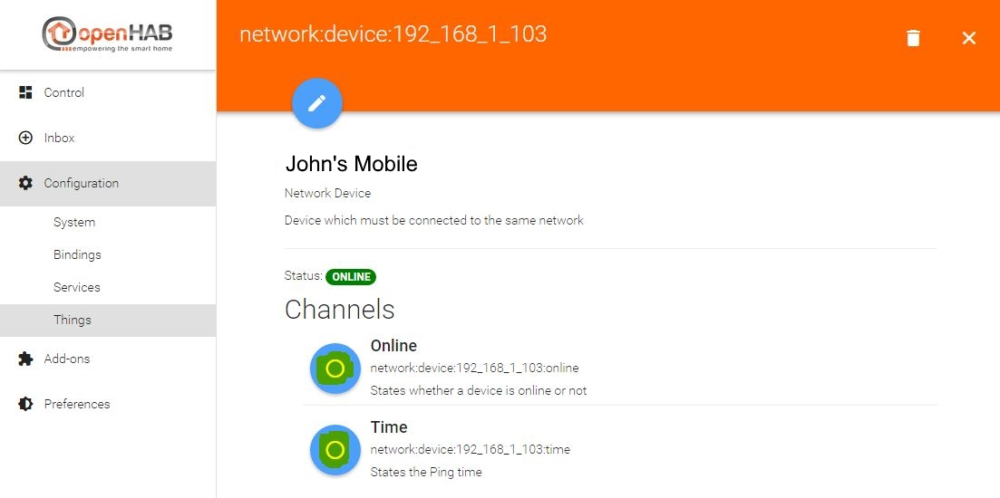

What is very important: The channels are not "linked" after the thing discovery.
Linking means to create an openHAB "item" which represents the state of a channel of a thing.
Because we activated the "Simple Mode" before, this can be done automatically by clicking the corresponding radio button left to the channel.
Otherwise you have to define the name of the item yourself.

So we'll link both channels of the "John's Mobile" thing now by clicking the radio buttons.

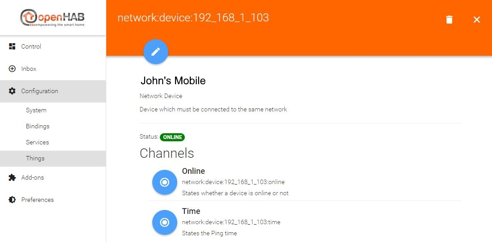

For most of the bindings each thing can be configured further by clicking the pen-icon.
There you can edit the name again, chose a location (this is important for the "Control" menu item later) and, of course, change binding related options.
With the network binding for example, you can also change the IP address, the timeout, the refresh interval etc.

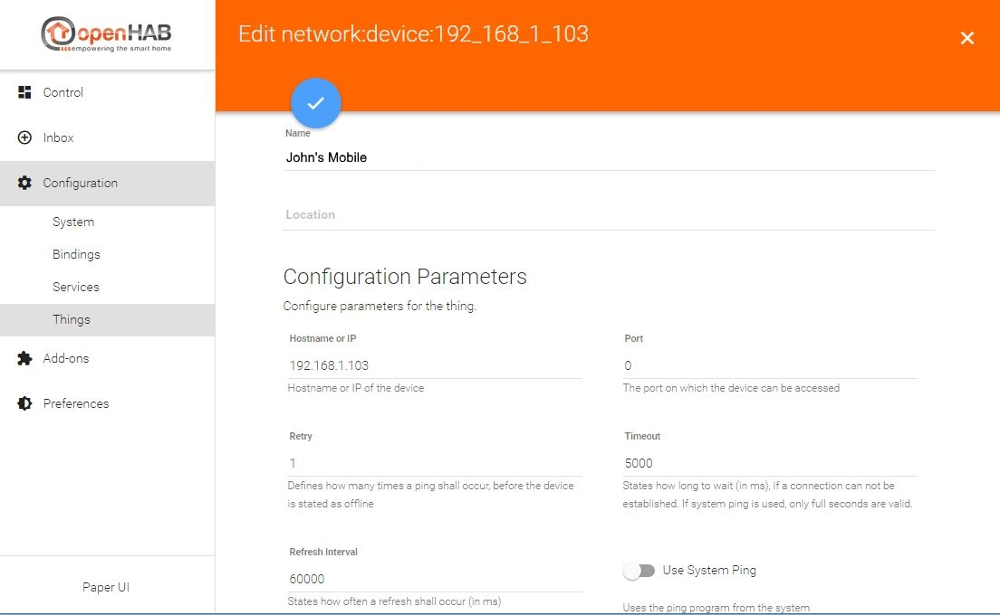

You can save changed values by clicking the check icon at the top.

Now that we linked the two channels in the previous step, we can have a look at the "Control" menu item at the top left.
On the "Control" page you can see all your linked items.
So far we added only one thing ("John's Mobile") and linked it's two channels, so that's all we see:

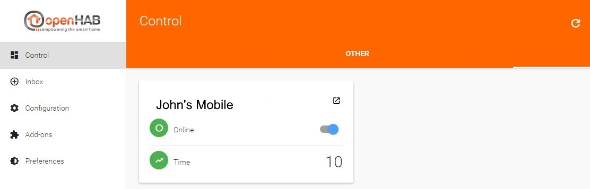

Items which are linked to channels of the same thing are displayed together, represented by the thing's name.
Here you can see the state of the "Online" and the "Time" channel.
John's mobile is online, and the ping time is 10ms.
As you can see in the screenshot with the configuration parameters of the thing above, the refresh interval is set to 60000ms by default.
This means that openHAB pings the device every 60 seconds.
If you want to set a lower value there, feel free.

**These are the basics to configure openHAB via Paper UI, meaning that the process is pretty much the same with other bindings.**

To demonstrate that, we'll proceed and install the Zwave binding in order to add Zwave things to openHAB.

**If you do not own a Zwave controller you won't be able to follow the next steps.
However, this is a demonstration about how to install and configure add-ons.
As mentioned before, the pure procedure to install and configure add-ons is mostly the same with other addons.**

**More information about the Zwave binding and the other available bindings can be found [on the bindings page of the user manual]({{base}}/addons/bindings.html)!**

The installation is just like the example with the network binding above.
Use the "Add-ons" menu item, search for the "Zwave" binding, click "INSTALL" and go directly to the "Inbox" afterwards.
There, we click the "+" icon again and can now choose between the "Network Binding" and the "Zwave Binding".

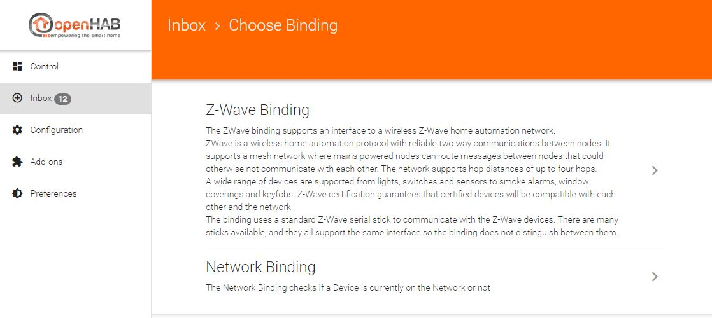

The difference to the network binding is, that we have to configure the Zwave controller first.
So we are taken directly to the Zwave controller config page after clicking on the "Zwave Binding" link.
Here we configure the port and basic settings and click the check icon afterwards.

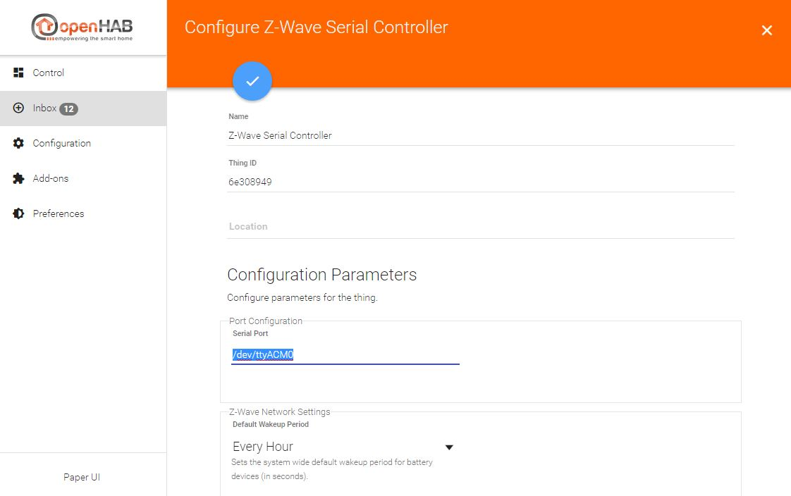

openHAB immediately starts discovering Zwave things via the Zwave controller and shows them in the inbox.
This only happens if they already have been included.
If this is a completely new Zwave controller, you'll have to include your Zwave things first.
To set the controller into incusion mode, press the "+" icon again.
Please refer to the manual of your Zwave device in order to find out how the inclusion works there (most of the time it's pressing the tamper button thrice).

Let's assume we bought a new wallplug and included it, it's "Node 30".
For a simple sitemap and rule example on the next page, we'll configure this thing now:

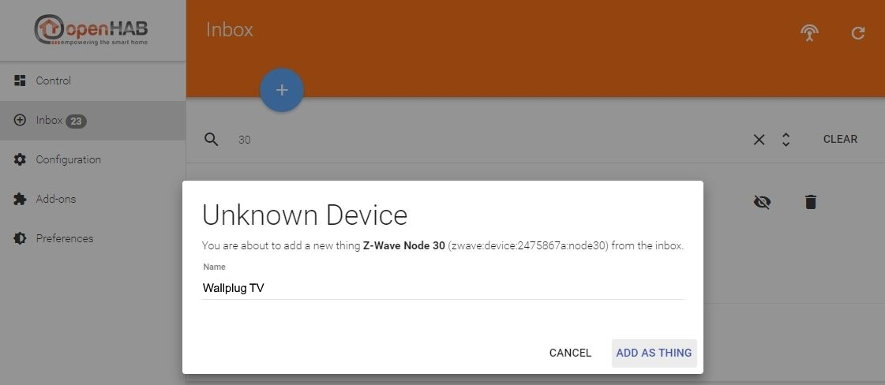

Basically we gave the thing a name ("Wallplug TV") and linked the "Switch" channel.
Now we can see the wallplug (and the Zwave controller) on the "Control" page, too.
Its switch is currently turned off:

If you activate the slider of the wallplug, it will start routing power :)

**Your first action with openHAB!**

[On the next page]({{base}}/tutorials/beginner/sitemap.html), we will define a sitemap to create your own view of things and items.
