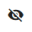



# Configuration of openHAB

We left at the [start page]({{base}}/tutorials/beginner/1sttimesetup.html) before showing you the differences of the UIs.
Now click on the "PAPER UI" link and you will be taken to the ```Inbox```.


The ```Inbox``` is the place where you can discover/add new "things" such as Z-Wave devices, Hue lamps, network devices and many more.


## Install bindings
In order to be able to add new things, at first you must install the corresponding binding for that type of thing.  
If you want to control your Z-Wave devices, you have to install the Z-Wave binding.
If you want to control your Hue lamps, you have to install the Hue binding etc.

The installation is done on the ```Add-ons``` page in the navigation menu on the left.


There are different sections  within the __Add-ons__ page.
- ```ACTIONS``` contains add-ons that enable you perform actions such as sending a telegram message or a twitter message.
- ```BINDINGS``` contains add-ons that integrate physical hardware, external systems and web services in openHAB.
- ```MISC``` contains add-ons that "link" openHAB to other services. Like the openHAB cloud connector or the HUE emulation
- ```PERSISTENCE``` contains add-ons for data persistence. With this openHAB stores data over time which then can be retrieved later or you can display those data in a chart
- ```TRANSFORMATIONS``` contains add-ons that enable you to transform incoming or outgoing data from an item. e.g. if your sensor sends "1" when the door is open and "0" when the door is closed, you can use a transformation service to translate this so that "1" becomes "OPEN" and "0" becomes "CLOSED"
- ```USER INTERFACES``` contains add-ons for different user interfaces.
- ```VOICE``` contains add-ons for TTS (text-to-speech) services

For now we continue with the section ```BINDINGS```.\
You will see that this list offers a wide variety of different bindings.

Let's continue with the __Network Binding__, as this binding can be used in every setup from the start and will show you the basic configuration possibilities.
With the network binding, you can define some of your network devices as things in order to use them in a rule for example, or just to see if they are online or offline and for how long.

Scroll down or use the __search field__ to find the __Network Binding__.<br/>
Click on __install__, and the binding will be downloaded and installed automatically.


## Add things
Now that the binding is installed, switch back to the ```Inbox```.
If you click the "+" button, you now are able to choose the binding which you want to use for discovering new things.
Because we only installed the network binding so far, it's the only binding to choose.


As soon as you click on "Network Binding", the binding will start an automatic discovery of all reachable network devices which are in the same subnet as the system running openHAB.


The discovered "things" are now displayed in the inbox, and you can decide what to do next:

|    Icon     	|     Meaning       
| ------------- | ------------- |
| 		| add the device as a thing |
| 	| Ignore the device. The device will not be shown in the inbox anymore. By clicking on	__SHOW IGNORED__ all ignored devices will be shown again	| 
|  | Delete the device. The device will appear on the inbox with the next scan  	|    


In this example, we only have one item with the IP ```192.168.139.130``` available. Click on the blue check icon to add the device.

Let's assume this is John's mobile phone which we want to use for presence detection.
We change the name of the thing - which was automatically added during the discovery -  on the next page to "John's Mobile" and click on the ```ADD AS THING ``` button.
::: tip Note
If your network devices use a DHCP server to obtain the IP addresses automatically, please make sure to define a DHCP reservation for a device which you want to use in openHAB.
Otherwise its IP address may change in the future and your thing definition won't work any more.

*Information about how to define a DHCP reservation can be normally be found in the manual of your network router.*
:::


## Create items in simple mode
After creating the thing, you can access it via the  ```Configuration --> Things``` page
There you will find all created things 


You can already see the status, "__ONLINE__", of the thing, so it's currently reachable by openHAB.
If you click on the name, you'll get to the next page showing the available channels of the thing.
Channels represent the different functions provided by the things and can be linked to items. 
Those items then can be used to interact with the thing or read data from the things.
In our case you see 


On a fresh installation,  __simple mode__ is enabled by default. 
That means all available channels of the thing get automatically linked to items. 
You can see that by the icon of each channel:

|    Icon     	|     Meaning       
| ------------- | ------------- |
| 		| this channel has already at least one item linked |
| 		| this channel has currently no linked item|

Since on our system, the simple mode is enabled, all our channels directly get linked to newly created items and thus you're finished creating your thing. 
Navigate to the ```CONTROL``` section and you should see the following:


::: tip Note
PaperUI is purely for administration purposes. 
You see all things in the control section and can interact with them, but there's no customization possibility. 
To create your own beautiful UIs you need to switch to the chapter [Creating a sitemap]({{base}}/tutorials/beginner/sitemap.html)
:::

## Creating items manually
If you want to have more control over your items like 
- item name
- item type (switch / contact /...)

you need to disable __simple mode__ first. 
To do this, navigate to ```Configuration --> System``` (1) and scroll down to the __Item Linking__ section. 
Disable simple mode (2) and click on __SAVE__ (3) to apply the changes. 
You also see that the navigation bar shows a new element called ```ITEMS``` (4)


With that, we can create now the items on our things manually. 
To do that, go back to "John's Mobile". 
You see that the previous items - which were created manually - remain untouched by disabling simple mode.

If you now click on the blue button before the channel name the you will see all items that are linked to this channel. 
The highlighted item is the automatically created item when simple mode was switched on.


You can also change this item by using the icons next to it:

|    Icon     	|     Description       
| ------------- | ------------- |
| 		| edit item profile |
| 		| delete the item|

To add a new item click on the blue (+) icon next to the text __Linked items__. 


The popup asks you for a profile (leave it to __Default__) and by clicking on the empty line after *Please select the item to link*, you will have the possibility to create a new item by clicking on __"+ Create new item"__


Fill out all the necessary data:

|    Field     	|     Description       
| ------------- | ------------- |
| Name		| The name of the new item. This name must be __UNIQUE__ |
| Label		| This is the text label for the item. It will be used to display the item on the UIs.|
| Category	| This can be chosen freely and will change the icon. e.g. if you select __faucet__ you will see a faucet instead of the power icon. See [Classic icons](https://www.openhab.org/docs/configuration/iconsets/classic/) in order see which icons you can use by default|
| Type | On some channels you can select different types. In this case you only __Switch__ is available. For more information see [Items]({{base}}/configuration/items.html)

After clicking ```LINK```, your item will be created and you will see it immediately on the control tab:


Items which are linked to channels of the same thing are displayed together, represented by the thing's name.
Here you can see the state of the "Online" and the "Time" channel.
John's mobile is online, and the ping latency is 10ms.


## Changing parameters of the thing

For most of the bindings each thing can be configured further by clicking the pen-icon.
There you can edit the name again, choose a location (this is only for the "Control" menu item later) and, of course, change binding-related options.
With the network binding for example, you can change the IP address, the timeout, the refresh interval etc.


You can save changed values by clicking the check icon at the top.

## Conclusion
Congratulations! In this chapter you have learned
- how to install a binding
- how to create a thing
- how to create items to interact with the thing
- the difference between items in simple mode and in manual mode


[On the next page]({{base}}/tutorials/beginner/sitemap.html), we will define a sitemap to create your own view of things and items.
