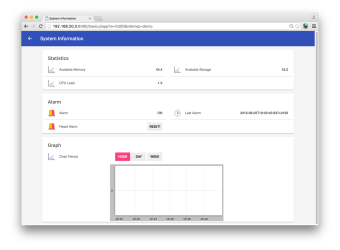



# Overview

This beginner tutorial covers the basic use of openHAB. It is following a step-by-step approach and the goal is to enable a new user to perform some first configuration tasks. It is based on the [demo installation](http://docs.openhab.org/tutorials/demo.html#choosing-demo-as-a-base-package-and-further-add-ons-to-be-installed) and will add more functionality offered by the [System Info](http://docs.openhab.org/addons/bindings/systeminfo/readme.html) binding.

The result of the additional configuration will look as follows:

* A section with performance metrics
* An alarm functionality, which is constantly monitoring one of the metrics
* A diagram showing the historical values of the metrics

The tutorial is divided in five parts:

## Overview of the User Interfaces

The standard openHAB installation offers several [User Interfaces](uis.html). In the course of this tutorial the _Paper UI_ and the _Basic UI_ will be used.

## Step-by-step implementation of new functionality

The main part of the tutorial follows a workflow which is common when adding new functionality:

1. [Installing an Extension](installing.html)
2. [Configuring Functionality](configuring.html)
3. [Defining User Interface](persistence.html)

## Looking at the logs

In addition, a basic introduction of the [logging functionality](logs.html) will help identifying problems which may come up.
