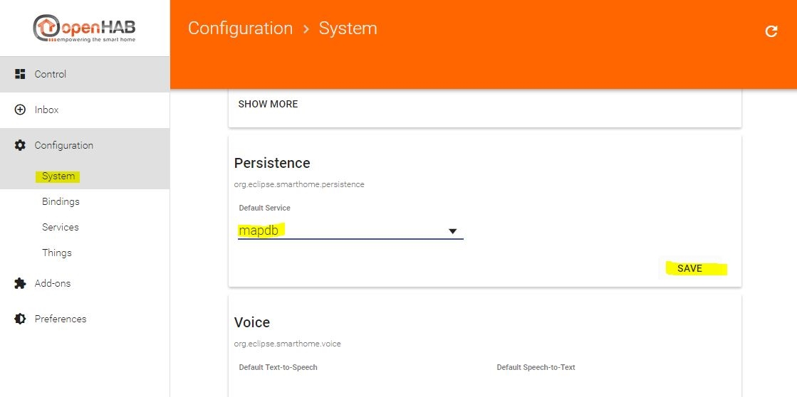



# Working with persistence

Let's assume that we didn't activate the above rules and you have to control the wallplug manually. You can turn it on or off.

If you restart openHAB, the system has to determine the current state of the wallplug, but this process can take some time. Some devices have a defined wakeup cycle every 7200 seconds (like many battery powered devices to save energy), network devices have to be pinged to get their online state, and so on.

This is where the persistence comes into play. The persistence service will store the current states of your items and restores the values upon starting up openHAB.

There are many different persistence services. you can find them all on the openHAB [documentation page]({{base}}/addons/persistence.html)

There are database persistence services available for the most common databases. If you have an up and running MySQL database, you could use the MySQL persistence service. The main benefit of database persistence services are that they store the state values for as long as you like, so you could use them for creating availability reports.

If you just want to restore the state values after restarting openHAB, you can use file based persistence services like rrd4j or mapdb.

Let's use the mapdb persistence. It creates a simple key-value store on your drive and you don't need to set up a database with all it's overhead.

Now for the installation: go to the "Add-Ons" page, switch to the "Persistence" tab and install the "MapDB Persistence".


Now, set the MapDB Persistence as the default persistence service in your system configuration (**you have to click the SAVE button to the right afterwards!**):



Next, you have to configure the two config files needed for the persistence service:

**conf/services/mapdb.cfg** - the main service configuration file

```
# the commit interval in seconds (optional, default to '5')
commitinterval=5

# issue a commit even if the state did not change (optional, defaults to 'false')
commitsamestate=true
```

**conf/persistence/mapdb.persist** - in this file you define the settings of your persistence (file has to be created!)

```
// persistence strategies have a name and a definition and are referred to in the "Items" section
Strategies {
  // if no strategy is specified for an item entry below, the default list will be used
  everyMinute   : "0 * * * * ?"
  every5Minutes : "0 */5 * * * ?"
  everyHour     : "0 0 * * * ?"
  everyDay      : "0 0 0 * * ?"
  default = everyChange
}

/* 
 * Each line in this section defines for which item(s) which strategy(ies) should be applied.
 * You can list single items, use "*" for all items or "groupitem*" for all members of a group
 * item (excl. the group item itself).
 */

Items {
    // persist all items on every change and every minute and restore them from the db at startup
    * : strategy = everyChange, everyMinute, restoreOnStartup
}
```
The different strategies follow the [Quartz scheduler syntax](http://www.quartz-scheduler.org/documentation/quartz-2.1.x/tutorials/tutorial-lesson-06), the default is saving the value with every change of the item's state.

In the "Items" definition you can assign different strategies to different item groups. I just don't care and store the values on every change, every minute and - **the most important setting of all** - restore the values during startup! :) 

Now you're set up for persistence! Enjoy! if you want to know more about advanced persistence configuration, have a look [here](https://github.com/openhab/openhab1-addons/wiki/Persistence)

