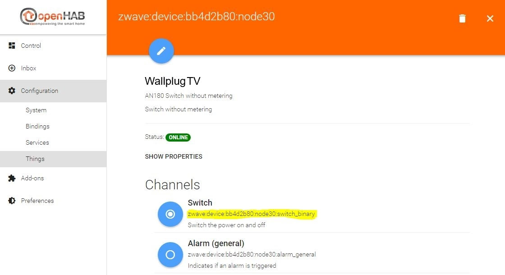
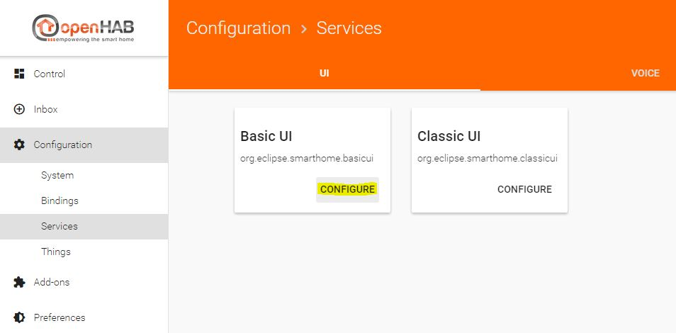
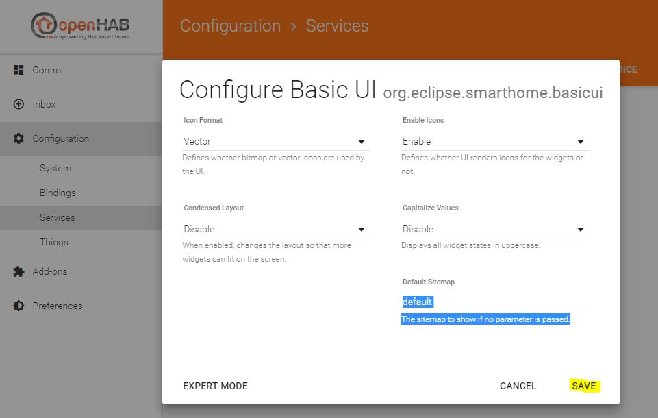
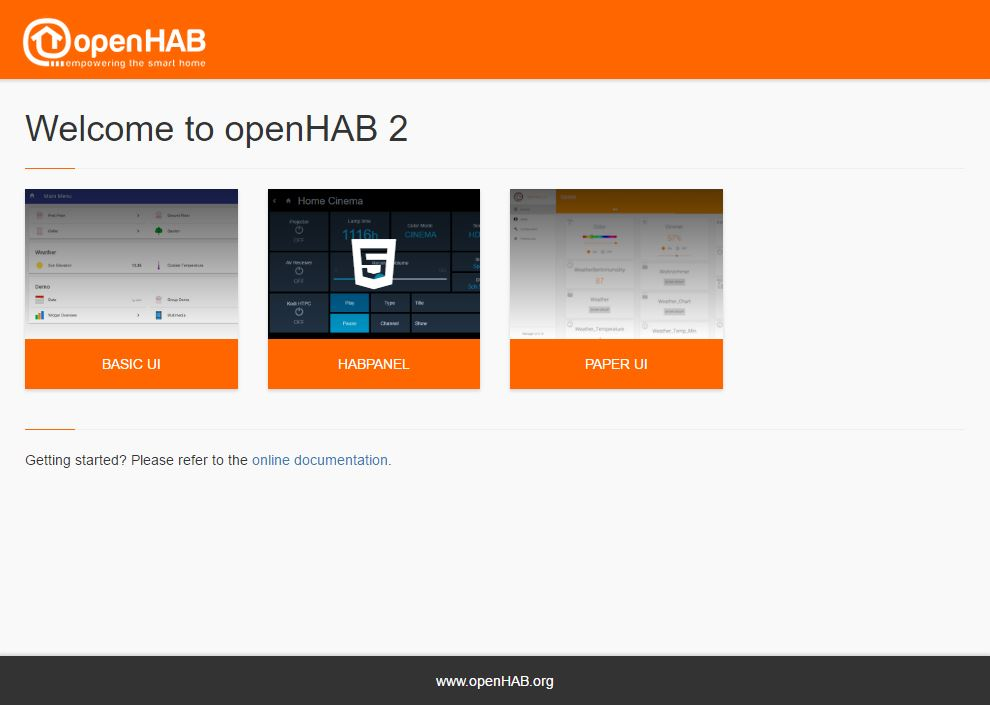
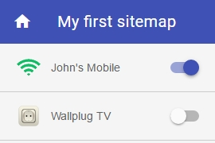



# Creating a sitemap

Controlling your things via Paper UI is nice, but currently you can sort them only by editing the "Location" in the thing configuration.
If you want to create your own view you can use a so called "sitemap" which can be displayed in the Basic UI (you remember, it was automatically installed at the beginning).

But before that, you have to create an items file.
Both the items and the sitemap files are edited in your editor of choice.
The files' location is in the `$OPENHAB_CONF` directory, which is different on different operating systems.
See the linux installation instructions for the [file locations]({{base}}/installation/linux.html#file-locations) specific to linux, or the Windows [file locations]({{base}}/installation/windows.html#file-locations) specific to Windows.
Mac OSx files are located in the same place as Linux files.

```bash
conf/items    <-- *.items files
conf/sitemaps <-- *.sitemap files
```

After a fresh installation these directories are empty (except for the readme files), so you have to create a file there. We'll use "default.items" as the items file and "default.sitemap" as the sitemap file in this tutorial.

**In fact, you can have multiple .items files to sort your items logically, for example lamps.items, contacts.items, network.items etc.**
**As long as the file extension is .items, it's definitions will be loaded in openHAB. The same applies to .sitemap and .rules files as well**

So we create the files:

```bash
conf/items/default.items
conf/sitemaps/default.sitemap
```

Let's start small.

Open the default.items file and define your first item:

```java
Switch Presence_Mobile_John "Johns Mobile" <network> { channel="network:device:192_168_1_103:online" }
```

*Note: Item names have to be unique! You should follow a certain naming convention concerning your items.
In this example, we used the purpose of the item, "Presence", followed by the device type, "_Mobile", and finally the owner's name, "_John", to construct the final item name.

Another suggestion for different items, for example a wallplug which is plugged-in in the living room in the first floor providing power to a TV, is to use the type, the floor, the room and the usage of the item.
In this case it would be "Wallplug_FF_LR_TV".*

The syntax is as follows:

```java
ItemType ItemName "ItemDescription" <ItemIcon> { ItemToThingChannelLink }
```

You can find a detailled overview of the different item types [here]({{base}}/configuration/items.html)

In this example we use "Switch" as the item's type. This results in a slider which is either turned on or turned off.

**Important: the item's name has to be unique!**

Feel free to choose an appropriate description for your item.

**More information about available icons can be found [here]({{base}}/configuration/items.html#icons)**


Now to the item-to-thing-channel link: the channel id is always visible in Paper UI when you edit a thing.
As you can see in the screenshot from above where I linked the two channels of the network thing, I used the channel id of the "Online" channel in the definition above:

```java
network:device:192_168_1_103:online
```

*Again, for most of the bindings this is the way of adding an item in the .items file:*

*browse to your Paper UI, go to "Configuration -> Things", click on the thing you want to add, find the channel of the thing you want to add, copy the channel id and use it in your .items file*

To see the status of the wallplug, you have to add it to default.items too. First you have to look for the channel id in Paper UI:



Then we add the item to default.items, this is what it looks like afterwards:

```java
Switch Presence_Mobile_John "John's Mobile" <network> { channel="network:device:192_168_1_103:online" }

Switch Wallplug_FF_LR_TV "Wallplug TV" <poweroutlet> { channel="zwave:device:bb4d2b80:node30:switch_binary" }
```

This means that you'll get a slider for the wallplug, indicating if it's turned on or off, with the poweroutlet icon.

To be able to actually see it in the "Basic UI" we have to create a sitemap. The sitemap basically defines the layout of the UI page. The syntax is quite easy, here is a simple setup of the previously created default.sitemap file:

```bash
sitemap default label="My first sitemap"
{
    Switch item=Presence_Mobile_John label="John's Mobile"
    Switch item=Wallplug_FF_LR_TV label="Wallplug TV"
}
```

A sitemap file always starts with "sitemap", followed by the sitemap's internal name (if your sitemap file is "default.sitemap", the sitemap name has to be "default"! Otherwise openHAB will complain in the log).
The "label" is the title of the sitemap, it's shown in your browser's titlebar/tab and on the sitemap page itself.
Next comes the block with the actual items you want to show on your sitemap. Here you can see the two items we added to the default.items file earlier.
The syntax is again pretty straight:

```bash
ItemType item=ItemName label="Description of the item shown on the webpage"
```

where ItemType and ItemName must be the same as defined in default.items

One last thing to do is setting the default sitemap for the "Basic UI" via "Paper UI".
Browse to "Configuration -> Services" in Paper UI and click the "Configure" button of Basic UI



Now set the default sitemap to "default", which is the sitemap name we defined earlier in default.sitemap and click the "SAVE" button.



To finally see the result, browse to the initial openHAB start page <http://IP-of-your-machine:8080> and click on the "Basic UI" link.



Enjoy your first sitemap :)



On the next page, we want to create a simple rule. Please proceed to [the rules page]({{base}}/tutorials/beginner/rules.html)
