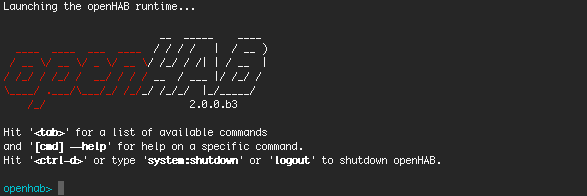
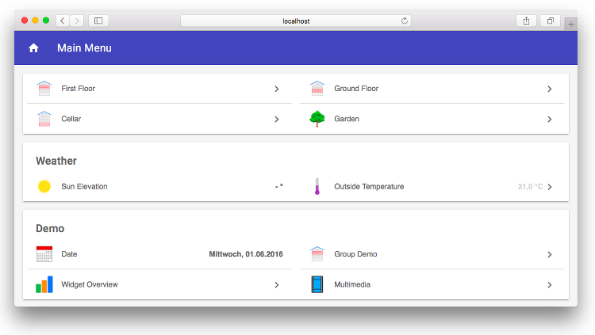



# Quick Start with a Demo Setup

The 'Demo' is a quick and easy way to see the user interface for a virtual home and examples of the different widget types that exist.

## Prerequisites

Make sure that you have a [JDK 8]({{base}}/installation/index.html#prerequisites) installed.

## Installation

openHAB comes as a [platform independent zip file](https://openhab.ci.cloudbees.com/job/openHAB-Distribution/lastSuccessfulBuild/artifact/distributions/openhab/target/openhab-2.2.0-SNAPSHOT.zip), which you only need to extract to some folder.

You will find the following folders:

 - `conf`: This contains all your user specific configuration files.
 - `runtime`: This contains the openHAB binaries, there should normally be no need to touch anything in here - the whole folder can be considered to be read-only.
 - `userdata`: Here you will find all the data that is generated during runtime: log files, database files, etc. In theory this should be the only folder where openHAB needs write permission on.
 - `addons`: Here you can drop add-ons (or any other OSGi bundles) that you want to be deployed in your instance. These can be add-ons for openHAB 1.x and 2.x likewise. Note that all "normal" add-ons are already included in the openHAB distribution and all you need is to name them in your 'addons.cfg' file (see below). Hence the `addons` folder is mainly useful if you have received jars from other sources and want to install and test them.

## Choosing Demo as a Base Package and Further Add-ons to be Installed

The demo package consists of example configuration files and samples of add-ons and UIs. In order to install the demo, you must edit the file 'conf/services/addons.cfg'.
Uncomment the line `package=` and set it to `demo` as shown below:

```
# The base installation package of this openHAB instance (default is "standard")
# Valid options:
#   - minimal  : Installation only with dashboard, but no UIs or other addons
#   - simple   : Setup for using openHAB purely through UIs - you need to expect MANY constraints in functionality!
#   - standard : Default setup for normal users, best for textual setup
#   - expert   : Setup for expert users, especially for people migrating from openHAB 1.x
#   - demo     : A demo setup which includes UIs, a few bindings, config files etc.
#
package = demo
...
```  

## Starting the Runtime

Once you have configured your runtime as above, start the openHAB runtime from the terminal by calling `./start.sh` (`start.bat` on Windows):



Point your browser to ```http://<hostname>:8080``` (allow the runtime some time to start before the HTTP server is available, especially on the very first start) and you will be welcomed by the openHAB Dashboard, which is the entry point to the different web UIs:


Selecting the _Basic UI_ will give you a virtual home and examples of the different widget types that exist:



The files that are used by these demo setup are available in the `conf` folder.
To understand their meaning and how you can tweak them all, please refer to our [beginner tutorial](beginner).

## Using the Shell

openHAB uses Apache Karaf and thus comes with a very powerful shell for managing the installation. Please check the [Karaf command reference](https://karaf.apache.org/manual/latest/#_commands) for details. Useful commands e.g. include:

 - `log:tail`: Show the live logging output, end it by pressing ctrl+c.
 - `log:exception-display`: Show the last exception of the log file.
 - `log:set DEBUG org.openhab.binding.sonos`: Enables debug logging for a certain binding.
 - `feature:list`: Lists all features available and shows there status. openHAB add-ons are made available as such Karaf features.
 - `feature:install openhab-binding-knx`: Installs a certain add-on (here KNX).
 - `bundle:list -s`: Lists all installed bundles with their symbolic name.
 - `logout`: Shuts down openHAB.
