# Automatically Generated Overview Tabs

MainUI will automatically generate an Overview page (id:overview). 
This page will have four tabs:

- Overview: user defined page
- Locations: populated based on the model showing your Items based on their physical location
- Equipment: populated based on the model showing your Items based on their Equipment type
- Properties: populated based on the model showing your Items based on their semantic Properties tag.

{::options toc_levels="2..4"/}

- TOC
{:toc}

## Overview Page

This is a page that is automatically create as soon as openHAB is installed.
It cannot be deleted but it can be customized.

### Overview Tab

When first starting with openHAB this page will initially be blank with a link to documentation and this tutorial.
This is the very first page your users will see when first accessing openHAB.
It is a great place to put the most commonly accessed controls and information.
However, this tab is completely custom built so how to do that is covered on the next pages of this tutorial.

### Location Tab

The model is really starting to pay off now!
All of the Locations from your semantic model that have Equipment or Point Items directly in them will have their own card presented.
For some types of roperties, a badge with a summary of that property at that location is shown on the card itself.
Clicking on the card will bring up a list showing all the Equipment and Properties at that location.
Equipment is represented as a gray bar with the name of the Equipment each Point/Property is shown with its default list widget.

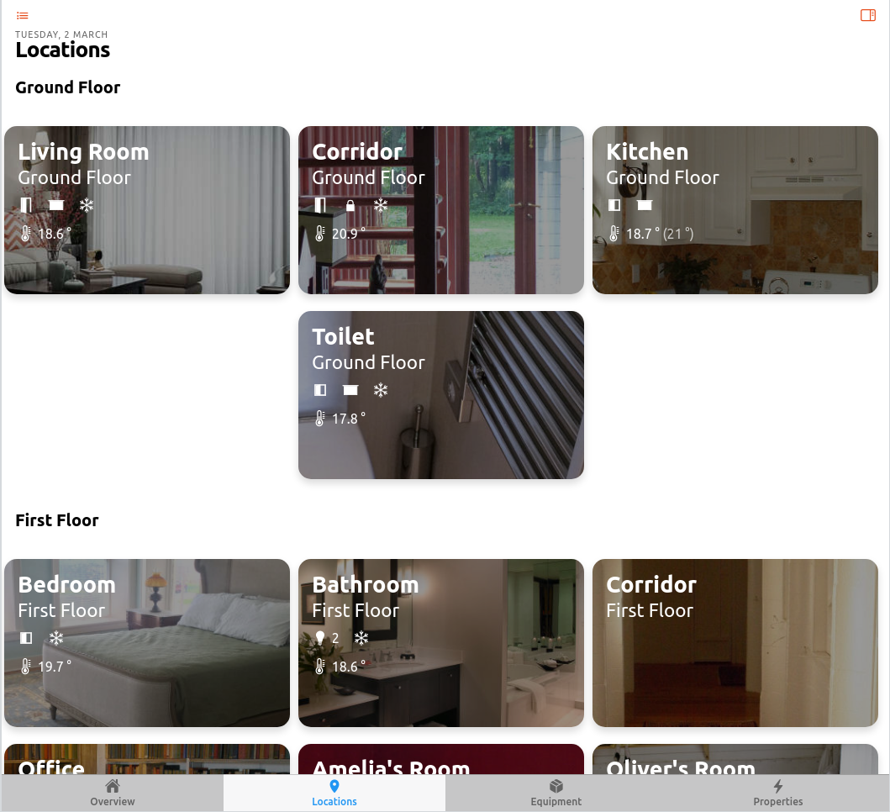

A Location's card is separated into two tabs, Equipment and Properties.
The Properties tab shows those Point/Property Items from the model that are direct members of this Location and not a part of an Equipment.

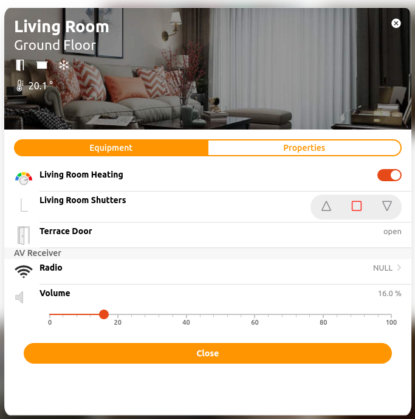

The badges shown on the card summarize all the link properties in that card and present it as a single badge.
When there is nothing to present the badge is not shown.
For example, if no lights are on, the lights badge will not be shown.
When one light is on the light badge will be shown.
When two or more lights are on, the light badge will be shown with a number indicating how many lights are on.
For other types of sensors like temperature, the average of all the Items tagged with a Temperature property tag will be shown.

### Equipment Tab

Each equipment type is represented by a card showing a list similar to that shown on the Locations card.
Each instance of the equipment is shown with a gray bar and the equipment name and each Point/Property is shown in a list under that title.

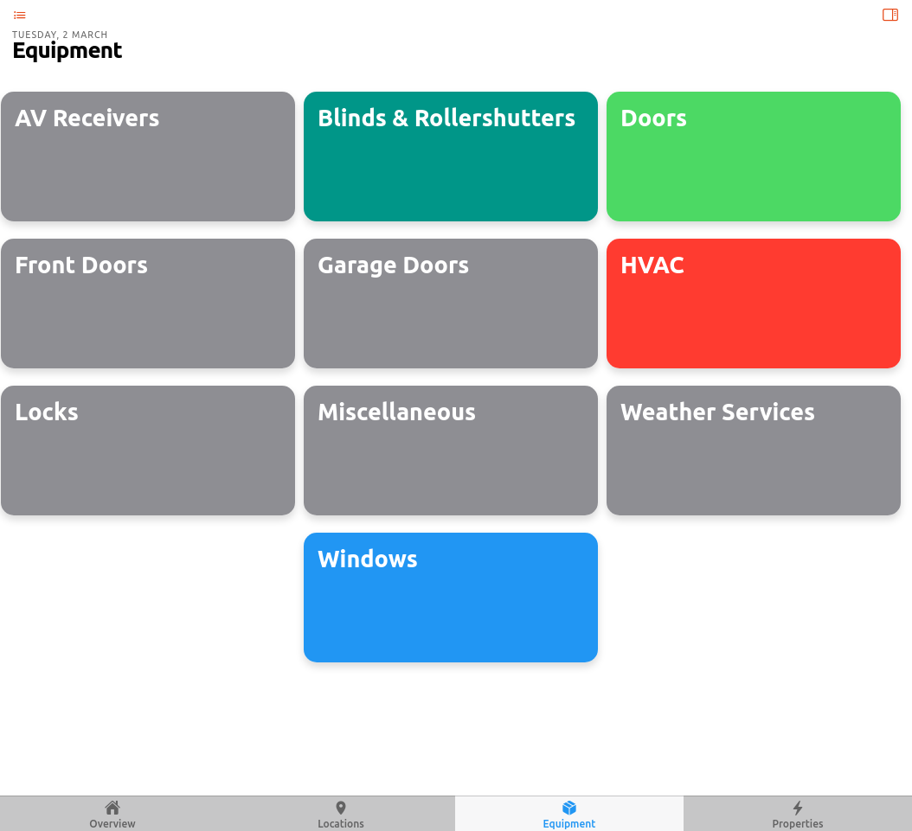

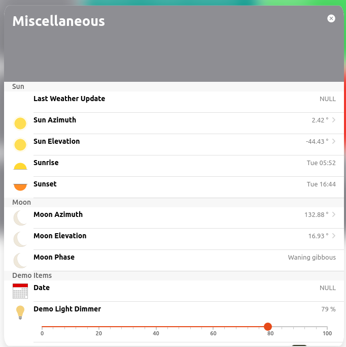

Also notice how an Equipment can be an abstract concept where necessary.
In this case the sun is modeled as an Equipment.

### Properties Tab

Each Point Item that has a Property tag is represneted by a card showing each instance of that Property in the list.
Unlike the other tabs, the gray bars here represent the Point tags and each Item with that Point is listed under that.
What this means is for something like the Temperature Property, one will have a set of all the temperature Measurements grouped together and then all the temperature Setpoints grouped together all on the same Temperature card.

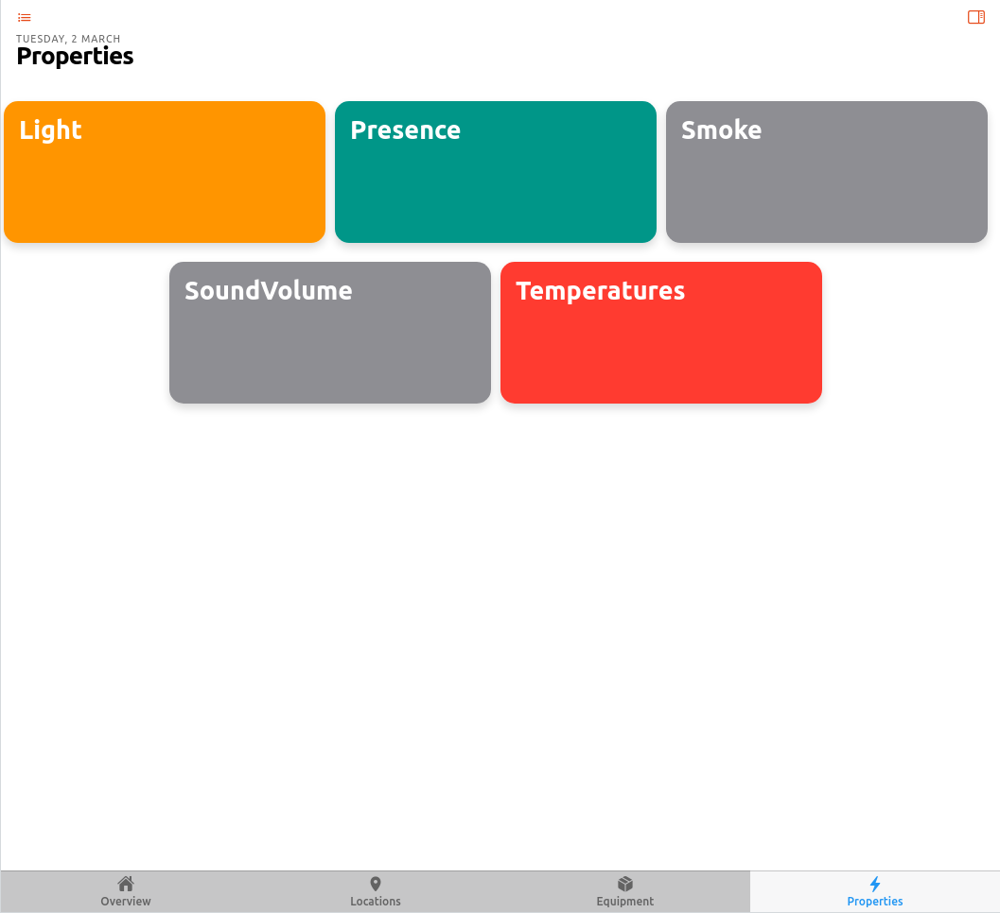

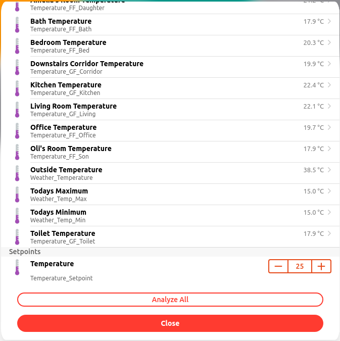

On the bottom of each card in the properties tab there is an "Analyze All" button.
Clicking on that will bring up a chart showing the history of all the Items on that card over time.
You can hide Items from the chart if it's to busy and change many other chart settings in the control tab under the chart.

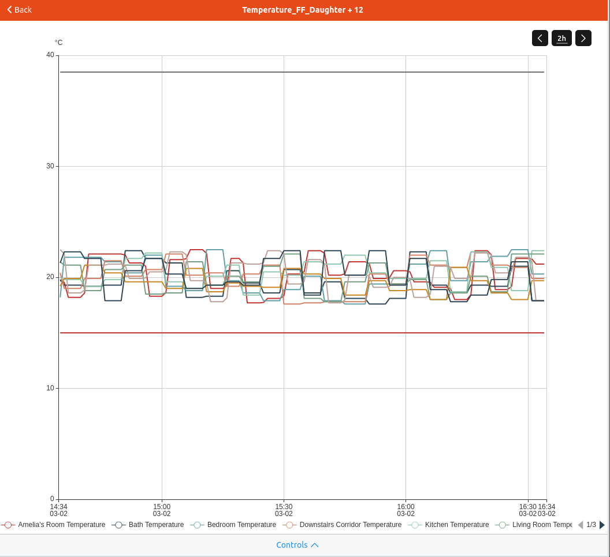

Now persistence is starting to pay off!

If you've customized the chart and want to return to the same chart again, you can save it and a new Chart Page will be created showing those Items with those settings.


## Customization / Page Configuration

MainUI does a pretty good job of guessing a decent default method to present the information to you. 
But what's the fun in just accepting the default? 
Luckily there are a lot of opportunities for customization.
You've already seen some customizations to the Locations tab above.

### Page Layout

On any given tab the order of the cards can be adjusted and spacers inserted to group like cards together.
For example, in the Locations tab screen shot above, all the rooms on a floor are grouped together and a spacer added to indicate which floor is represented.

To adjust those settings, while logged in as an administration user, click on the pencil icon in the upper right corner of the Locations tab.
This will open the customization page.

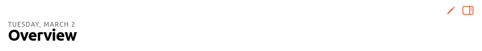

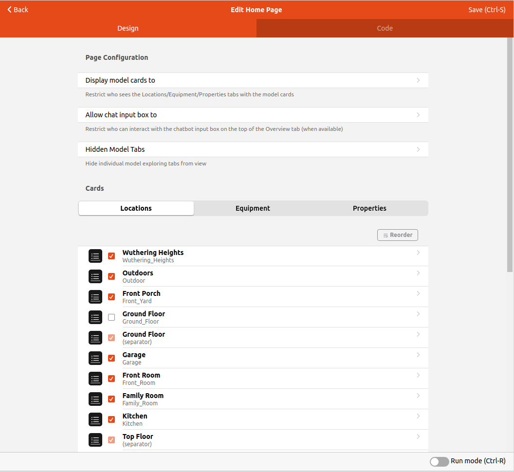

There are a few global settings for the overview pages itself and then each of the three auto generated tabs have their own settings.

Field | Purpose
-|-
Display model cards to | Conmtrols what type of user can see the cards. If Administors is checked only an administrator user can see the cards tabs.
Allow chat input box to | If HABot is installed, this controls what sort of user can access the HABot chat box.
Hidden Model Tabs | Allows the Locations, Equipment, and/or Properties tabs to be hiddin to all users in case they are not used.

Below these settings one can select one of the three tabs to customize.
This will list all the possible cards that can be shown on that tab based on your model.
MainUI will only show those cards that have something in them even if that card is checked to be shown.
Unchecking a card will remove it from being shown on that tab even if it does have entries in it.

Next to each card entry there is a black and white icon that will open that card's customization form when clicked.

#### Reorder

To change the order of cards, click the "Reorder" button (upper right corner of the list of cards) and drag and drop the card you want to move via the handle (=) to the very right of that card.

#### Separators

To visually group cards on the Page insert a separator. In the screen shot above you can see a separator for Ground Floor has been inserted.
To insert a separator, click on the menu icon of that card you want to be the first one below the separator and select "Add Separator Before."

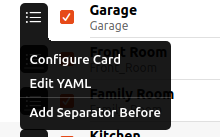

Give the separator a name and on the page you will no see a section heading with the entered name and all the Items below the separator grouped under that section heading. 

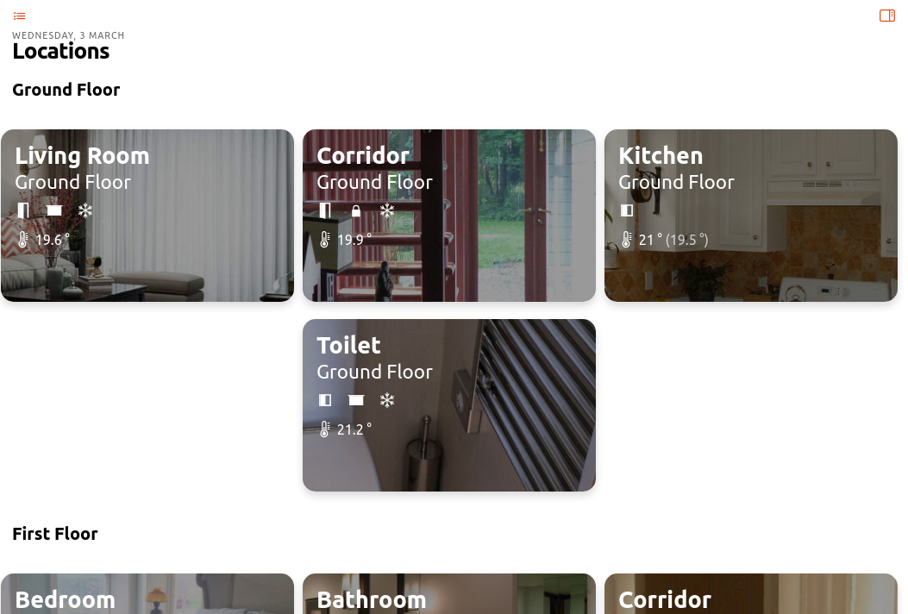

Tip 1: Make sure to save before clikcing "Back" or otherwise leaving the page.

You will have to reload the page to pick up the changes.

Tip 2: Open two separate tabs in your browser where you edit and view your page. Alternative, hit CTRL-R to force a reload and show the changes.

#### Card Customization

There are a number of customization options for a card through the customization menu.
More advanced customizations can be added by editing the card's YAML directly.

To customize a given card clikc on the menu icon and select "Configure Card".
This will open a form with customication options.

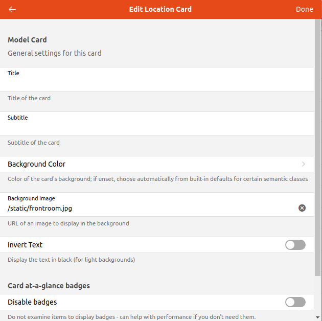

##### Basic Settings

Instead of using the Item's Label and parend Group as the Title and Subtitle of the card, these can be overridden and manually set.
[Expressions]({{base}}/ui/building-pages.html#dynamically-configuring-components-with-expressions) can be used to have the Title and Subtitle change based on the states of Items or other conditions.

By default a background color is chosen based on the semantic tag.
This default can be overridden here.

##### Background Image

This feature may require a bit more work.

If you find a picture that allows cross linking to all you need to do is put in the URL of that picture in this field and MainUI will load it and make it used as the background for the card. 
However, text and icons will be displayed on top of the image so one might need to modify the original image to work. 
Or one may have their own images they want to use instead of something downloaded from the internet.

For example, one might use high contrast images (e.g. architectural drawings and water color paintings) as the background images. 
However, those images tend to be very light with very high contrast which makes both white and black text unreadable in many cases. 
There are two approaches you can use to deal with this.
You can edit the image to lower the contrast and/or brightness or crop the image to a less busy portion.

Alternatively, you can open the YAML for a given card and adjust the brightness down in the settings.
Click the config icon and choose "Edit YAML".
Here I show adjusting the image brightness down to 60%.

```yaml
component: oh-location-card
config:
  backgroundImage: /static/garage.jpg
  backgroundImageStyle:
    filter: brightness(60%)
  invertText: false
```

Once you have your custom images, place them in $OH_CONF/html. 
Once they are there, you can use the relative path `/static/image.name` as the URL to the image.
For example, I placed the file `garage.jpg` in `/etc/openhab/html` and reference it as you see in the YAML above.
This is how to use a custom image as teh background of a card. 
You can see some stock images used as teh backgrounds for the cards on the Locations tab in the demo and screen shots above.

Note: even though it is theoretically possible and tempting to just link to an absolute URL on the internet as it doesn't require to save the image file to openhab's server it is highly discouraged for security, link dependency, image sizing and other reasons.

##### Badges

Badges are only available on the Location cards.

If one want to not show any badges at all toggle "Disable badges".

If one wants to only suppress certain badges, select those that you want to show under "Enable badges". 

##### Advanced Configuration

For an individual card or to edit the Page itself one can switch to or show the YAML code. 
Many actions like reordering the cards and inserting separators will be faster to do through the code. 

Any advanced customization of the cards themselves through editing of the code directly is beyond the scope of this tutorial.
See the [UI Docs]({{base}}/ui/index.html) for a detailed reference.
