---
layout: documentation
title: Item Widgets

# Custom Default Item Widgets

As mentioned on the previous page, MainUI allows for the creation of custom widgets.
These custom widgets can be reused for multiple Items in a given openHAB setup or they can be shared with the community.
A growning number of very impressive custom widgets have been posted to the [Add-ons -> UI](https://community.openhab.org/c/add-ons/uis/30).
This page is going to provide a couple of examples of custom widgets.
For a complrehensive reference on creating widgets, please see the [Building Pages]({{base}}/ui/building-pages.html) guide in the docs.

{::options toc_levels="2..4"/}

- TOC
{:toc}

## Where to Create Custom Widgets

In MainUI under Developer Tools there is a Widgets option.
Opening this will present a page with a list of all the custom widgets.
Clicking the + icon will open the editor which is a window split in half with a text entry area on the left and a preview on the right.

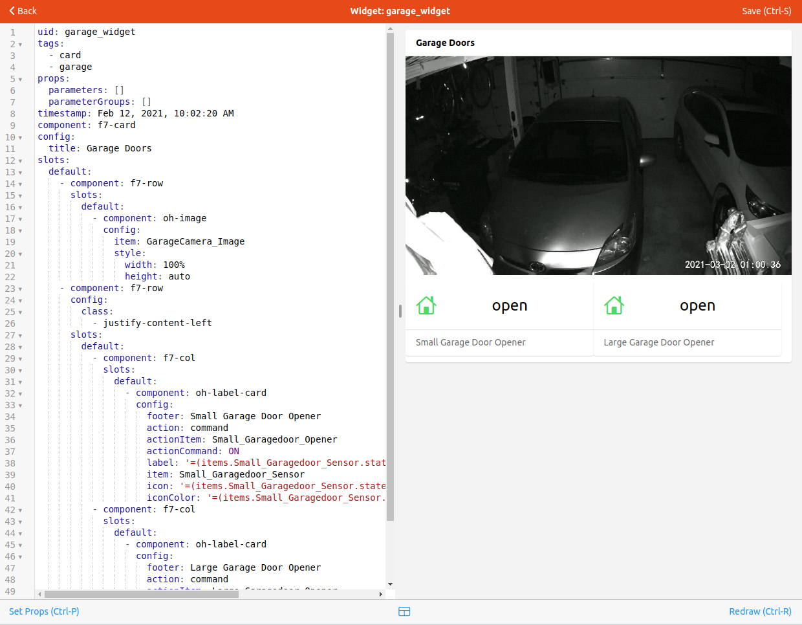

Note that when creating a custom list widget, the preview page will not render the widget in progress.
One will have to apply the widget to an Item and refresh a page after saving the changes for that type of Item.

## Building Custom Widgets

As you are learning how widgets work and all the options available, it might be easier to create the widget using the form presented when adding the Item metadata and then copying the YAML from the code tab to the Custom Widget editor.
When doing this, make sure to fill out *all* the fields because when using the defaults, no value is added to the YAML in the code tab.
So, for example, be sure to enter in the Item field.

Here is a filled out form customizing a list Item widget for a light.

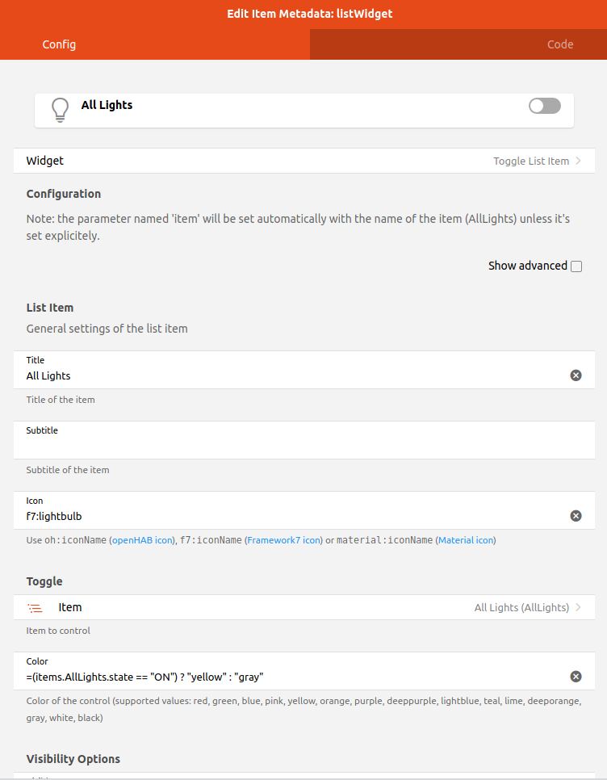

Clicking on the code tab shows the following YAML.

```yaml
value: oh-toggle-item
config:
  icon: f7:lightbulb
  iconColor: '=(items.AllLights.state == "ON") ? "yellow" : "gray"'
  title: All Lights
  color: '=(items.AllLights.state == "ON") ? "yellow" : "gray"'
  item: AllLights
```

Now go to Widgets under Developer Tools and create a new custom widget.
The YAML will be prepopulated with a skeleton configuration.

```yaml
uid: widget_5c7a60b74f
props:
  parameterGroups: []
  parameters:
    - name: prop1
      label: Prop 1
      type: TEXT
      description: A text prop
    - name: item
      label: Item
      type: TEXT
      context: item
      description: An item to control
tags: []
component: f7-card
config:
  title: '=(props.item) ? "State of " + props.item : "Set props to test!"'
  footer: =props.prop1
  content: =items[props.item].displayState || items[props.item].state
```

Give your new widget a meaningful name and tags.
Each widget needs to have a unique name and that name is how it will appear in the list when you apply it to an Item.

Now repalce the value of "component" in the custom widget with the "value" from the YAML you generated above.
then replace everything under "config" in the custom widget with everything under "config" from the YAML you generated above.

```yaml
uid: test_light_list
props:
  parameterGroups: []
  parameters:
    - name: prop1
      label: Prop 1
      type: TEXT
      description: A text prop
    - name: item
      label: Item
      type: TEXT
      context: item
      description: An item to control
tags: 
  - lights
  - list
component: oh-toggle-item
config:
  icon: f7:lightbulb
  iconColor: '=(items.AllLights.state == "ON") ? "yellow" : "gray"'
  title: All Lights
  color: '=(items.AllLights.state == "ON") ? "yellow" : "gray"'
  item: AllLights
```

Now we want to create some properties so that the widget can be customized for the any light Item.
We can lave the Item property alone as that's what we want so we will change prop1 to be used for the title.
Then we will change the config to use the properties instead of the hard coded values.

```yaml
uid: test_light_list
props:
  parameterGroups: []
  parameters:
    - name: title
      label: Widget Title
      type: TEXT
      description: Used as the label for the widget.
    - name: item
      label: Item
      type: TEXT
      context: item
      description: The item to control
tags: 
  - lights
  - list
component: oh-toggle-item
config:
  icon: f7:lightbulb
  iconColor: '=(items[props.item].state == "ON") ? "yellow" : "gray"'
  title: =props.title
  color: '=(items[props.item].state == "ON") ? "yellow" : "gray"'
  item: props.item
```

Save the widget and return to one of the Items that should use this widget.
Select "test_light_list" as the widget type and you will be presented with a form to enter the title and select the Item.

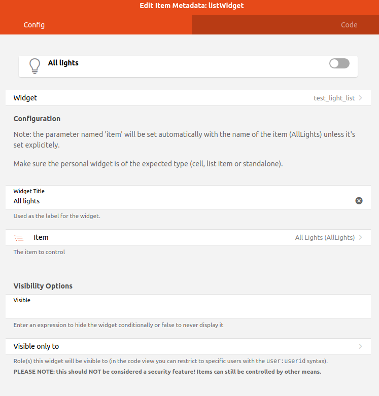

When ever the custom widget is changed, every Item that uses the custom widget will be updated with the change.
This is a powerful tool to create and maintain the look and feel of your UIs.

## A More Complex List Item Widget

Here is an example widget that combines two Items into one widget.
In this case it's a widget that represents a garage door and combines the sensor that indicates the opened/closed status of the door and the actuator to trigger the garage door opener.

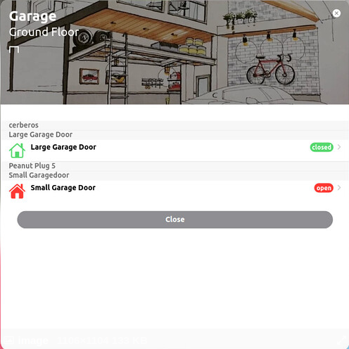

```yaml
uid: garagedoor_list
tags:
  - list
  - garagedoor
props:
  parameters:
    - description: Door name
      label: Name
      name: name
      required: false
      type: TEXT
    - context: item
      description: Control Item
      label: Control Item
      name: control_item
      required: false
      type: TEXT
    - context: item
      description: Sensor Item
      label: Sensor Item
      name: sensor_item
      required: false
      type: TEXT
  parameterGroups: []
timestamp: Feb 5, 2021, 2:01:31 PM
component: oh-list-item
config:
  icon: '=(items[props.sensor_item].state == "CLOSED") ? "f7:house" : "f7:house_fill"'
  iconColor: '=(items[props.sensor_item].state == "CLOSED") ? "green" : "orange"'
  title: =props.name
  action: command
  actionItem: =props.control_item
  actionCommand: ON
  badgeColor: '=(items[props.sensor_item].state == "CLOSED") ? "green" : "orange"'
  badge: '=(items[props.sensor_item].state == "CLOSED") ? "CLOSED" : "OPEN"'

```

Notice how the sensor_item prop is used to control the icon, badge and color and the control_item is used as the Item that gets commanded by the Action.

## Custom Stand Alone Widgets

Up to this point the tutorial has focused on list item widgets because as someone who is just getting started, making minor tweaks to what is automatically generated will likely be the primary focus.
However, there is that Overview tab that needs to be manually populated too.
This page will be populated with stand alone widgets, or card widgets.

Often, one will want to have one single stand alone widget to represent a single Equipment, for example a thermostat or a Chomecast.
These will be a single card that provides the display and interaction with many Items.
If one has more than one Equipment that will use the same widget, or the widget is complex create a custom widget for these.
Once created, apply the custom widget to the Equipment Group Item in the model.
Then on your Overview tab, or any other page, you can select "Add from Model", select the Equipment and it will drop the unified widget onto the page.

## Example Stand Alone Widget

This is a widget to represent a Chromecast.

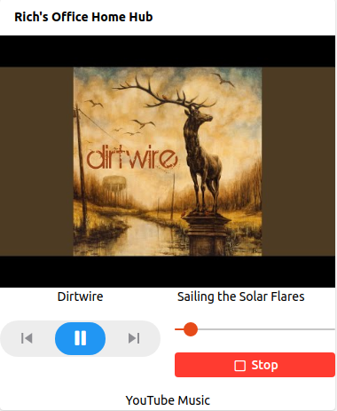

```yaml
uid: chromecast_widget
tags:
  - card
props:
  parameters:
    - description: How all the Items associated with this chromecast starts
      label: Item prefix
      name: prefix
      required: false
      type: TEXT
    - description: Title for the widget
      label: Static Title
      name: title
      required: false
  parameterGroups: []
timestamp: Feb 2, 2021, 12:15:54 PM
component: f7-card
config:
  title: =props.title
slots:
  default:
    - component: f7-row
      slots:
        default:
          - component: oh-image
            config:
              item: =props.prefix+"_Image"
              style:
                width: 100%
                height: auto
    - component: f7-row
      config:
        class:
          - justify-content-left
      slots:
        default:
          - component: f7-col
            slots:
              default:
                - component: Label
                  config:
                    class:
                      - text-align-center
                    text: =items[props.prefix+"_MediaArtist"].state
          - component: f7-col
            slots:
              default:
                - component: Label
                  config:
                    class:
                      - text-align-center
                    text: =items[props.prefix+"_MediaTitle"].state
    - component: f7-row
      config:
        class:
          - padding-top
          - padding-bottom
      slots:
        default:
          - component: f7-col
            slots:
              default:
                - component: oh-player-controls
                  config:
                    item: =props.prefix+"_MediaControl"
          - component: f7-col
            slots:
              default:
                - component: oh-slider
                  config:
                    item: =props.prefix+"_Volume"
                    min: 0
                    max: 100
                    step: 10
                    unit: "%"
                    label: true
                - component: oh-button
                  config:
                    text: Stop
                    iconF7: stop
                    fill: true
                    color: red
                    action: command
                    actionCommand: ON
                    actionFeedback: Media Stopped
                    actionItem: =props.prefix+"_Stop"
                    class:
                      - margin-top
    - component: f7-row
      config:
        class:
          - justify-content-center
      slots:
        default:
          - component: Label
            config:
              text: =items[props.prefix+"_App"].state
```

A full explanation of the widget is outside the sope of this tutorial but there are a few take aways.
As with the list widget, it might be easier to create the widget on the Page editor first and then copy that to the custom widget as described above.
First notice that not all the components used start with "oh".
When building a complicated custom widget, one has more flexibility when using the base "f7" widgets instead.

Notice how the only property related to Items is a prefix. If one is consistent in their Item naming, one can define a prefix and the widget can build the Item names for each relevant Item using the prefix.
This can greatly simplify the configuration of a widget. In this case the widget uses seven different Items that can all be obtained from that one property.

As you create a widget that uses properties you will notice that the preview does not get rendered correctly.

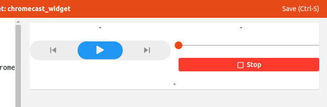

At the bottom of the widget editor there is a "Set Props" option, which can also be accessed by typing CTRL-p. 
This will bring up a form where the props can be set for the preview.

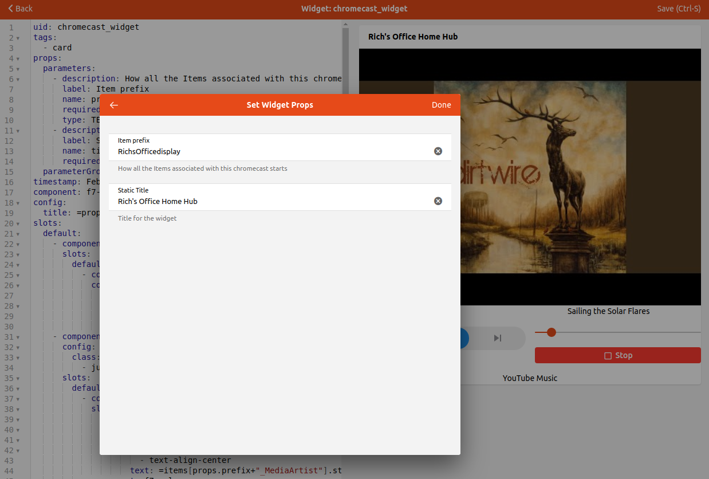

Once created, apply the custom widget to the Equipment Group Item in the model.

## Dynamic Widgets

It is also possible to create widgets that are dynamically populated from the model.
This is particular useful to present a functional widget such as one widget to controll all the lights in the house.
For this the [oh-repeater]({{base}}/ui/components/oh-repeater.html) component will be very useful.
This component allows one to set up a loop to iterate over a bunch of things such as all the Items with a given semantic properties tag and create a widget element for each one.

For example, here is a widget that shows all the Items with a Switch and Light tag, filtering out those that have "Christmas" in the name unless the TisTheSeason Switch is ON.

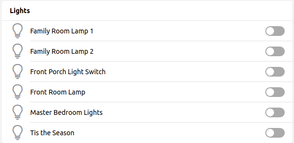

```yaml
uid: all_lights
tags:
  - card
  - lights
props:
  parameters:
    - description: A text prop
      label: Prop 1
      name: prop1
      required: false
      type: TEXT
    - context: item
      description: An item to control
      label: Item
      name: item
      required: false
      type: TEXT
  parameterGroups: []
timestamp: Feb 11, 2021, 3:03:59 PM
component: f7-card
config:
  title: Lights
slots:
  default:
    - component: oh-list
      slots:
        default:
          - component: oh-repeater
            config:
              fragement: true
              for: item
              sourceType: itemsWithTags
              itemTags: Switch,Light
              filter: loop.item.label.includes("Christmas") == false || items.TisTheSeason.state == "ON"
            slots:
              default:
                - component: oh-toggle-item
                  config:
                    icon: f7:lightbulb
                    iconColor: '=(loop.item.state == "ON") ? "yellow" : "gray"'
                    color: '=(loop.item.state == "ON") ? "yellow" : "gray"'
                    title: =loop.item.label
                    item: =loop.item.name
```

There are a number of options for looping. 
Please see the docs for more details.

## Adding Widgets to Pages

Now that the widgets are created it's time to put them on a Page.
We will focus on the Overview tab of the Overview page.

To edit any Page go to Settings -> Pages in MainUI. There will be a grayed out entry which represents the customized Locations, Equipment, and Properties tabs and there will be an Overview entry.
That represents the Overview tab.
Clicking on that will brgin up a configuration page that allows one to configure the Overview tab with your custom widgets.
You can build the widgets here but it's more flexible to create custom widgets and add them to this page.

A full description on how to build the page is beyond the scope of this tutorial.
See the [Layout Pages docs]({{base}}/ui/layout-pages.html) for details.

You will be presented with a page similar to the following.

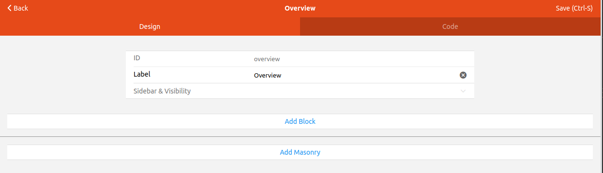

Because this is the first thing your users will see when accessing openHAB, the most commonly use actuators and widgets should be on this page.

To get started, click "Add Block", then "Add Row" and finally add how ever many columns you want.
Repeat for additional rows.
For this tutorial we will have two row and three columns.

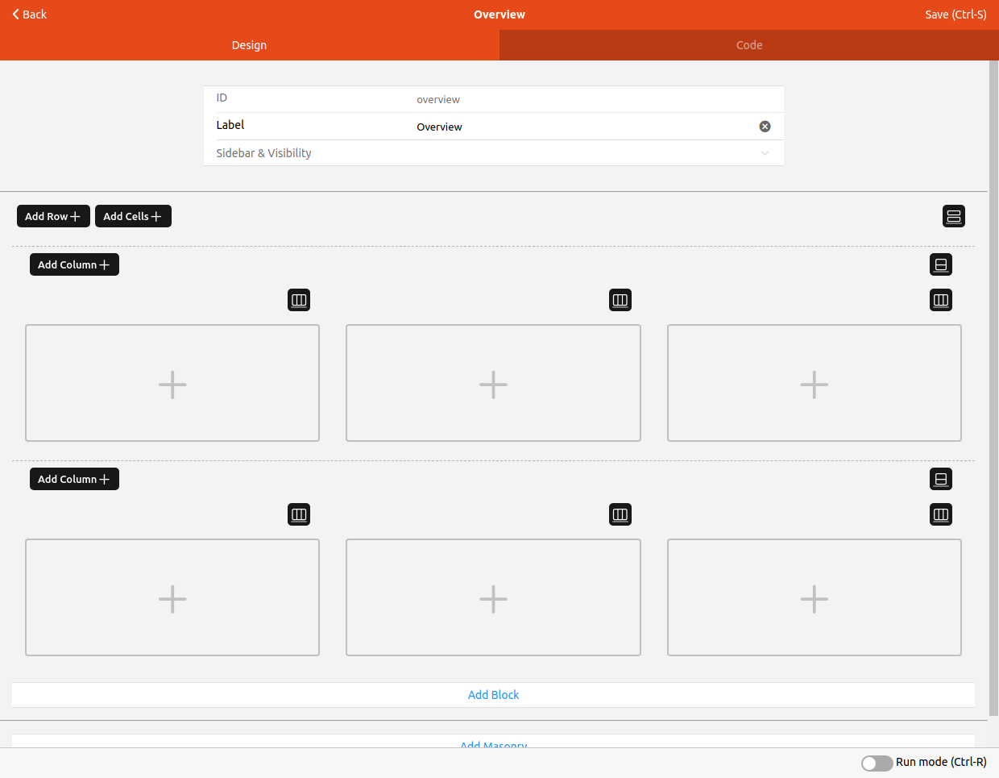

Now we will add a custom widget to that first columnn.
In this case we will add a garage door widget that includes a camera feed and shows the status and allows triggering two garage doors.
Click on the + in that first cell and select the desired widget from the list.
This is a simple widget that doesn't use any properties so we are done.

Next we'll add the all lights widget from above.
Click on the second cell and select the desired widget from the list.
This is a dynamic widget but also doesn't have any properties so we are done with it.

Finally we will add a services status widget which shows any home automation related devices or services that are offline.
This one is also a dynamic widget without properties.
The Page currently looks as follows.

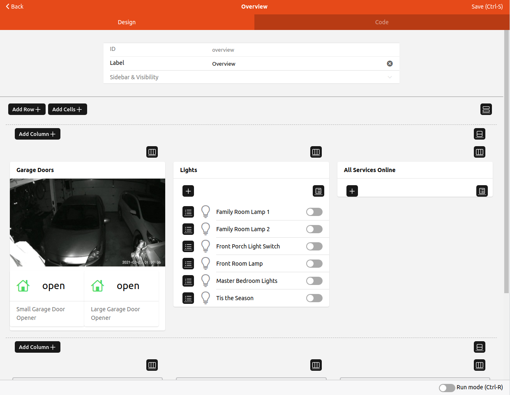

Now we will fill out the bottom row with some widgets from the model.
The Chromecast widget was applied to all the Chromecast Equipment Group Items as the default stand along widget.
Click on the first cell in the second row and this time select "Add from Model".
Navigate to the Equipment Item desired and "Pick" it.

Alternativly you can select the custom widget from the list and set the properties instead of adding from the model.
When you add the widget this way, the widget will look just like it does in the preview when the properties are not yet set.
To set the properties here click on the edit icon and select "Configure Widget".
You will be presented with a form to enter the values for the properties, in this case the Item prefix and title.

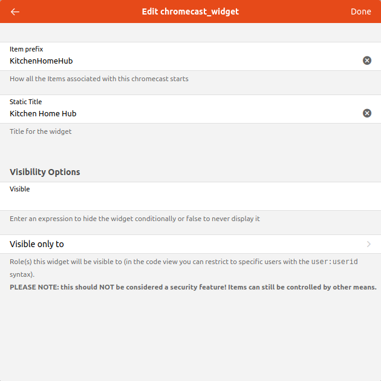

To preview the configuration in progress there is a toggle at the bottom of the page for "Run mode" or you can press CTRL-R.

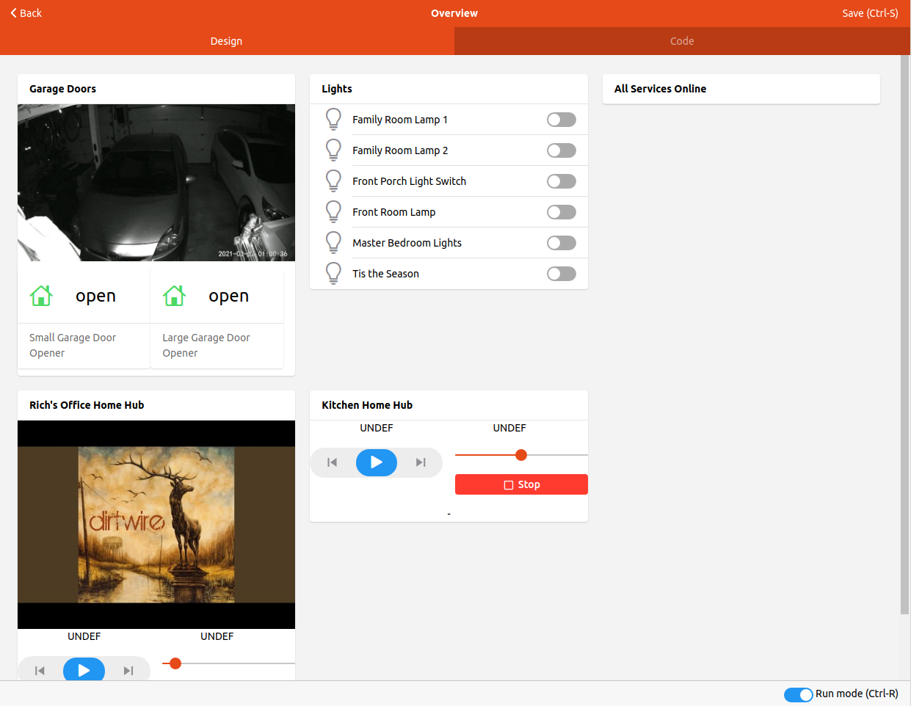

Once you are happy, save the page and that will become your Overview page.

## Additional Pages

You can create any number of additional pages as desired.
Layout Pages like the Overview tab on the Overview Page are not the only types of pages that can be created.
[Chart pages]({{base}}/ui/chart-pages.html), [Floorplan pages]({{base}}/ui/floorplan-pages.html), [Map pages]({{base}}/ui/map-pages.html), and [Tabbed pages]({{base}}/ui/tabbed-pages.html) are also availabe.