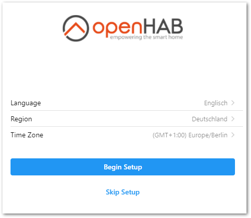
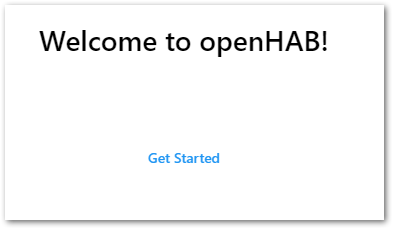



# First Steps

The following instructions will guide you through the initial steps after first installing openHAB.

{::options toc_levels="2..4"/}

- TOC
{:toc}

## Create the Admin User
Once openHAB is installed and started, launch the user interface by navigating to [http://localhost:8080]() (if not running locally, replace localhost with the server's address or hostname accordingly).
If you installed from the openHABian image, you can use [http://openhab:8080]().

By default, the administration pages can only be accessed if you are logged in with an administrator account.
Since there are no users yet, openHAB will ask you to create an administrator account.

### Add geographic information

After creating an admin user, you will be guided through a first-time setup wizard. Start by setting your language, region, and time zone. You can also set your location, or skip this step and complete it later.

### Install add-ons

You now have the option to install openHAB add-ons. Do this if you already know that you'll need specific add-ons (e.g. if you're upgrading from an older openHAB system), or skip this step if you prefer to install add-ons individually. You can always install/remove add-ons in the future, enabling you to modify and improve your system over time.

After finishing the wizard you will get a welcome message and be redirected to your dashboard.

### Log into the dashboard with an existing user

To log in with an existing user, you can do the following.
Click on the shield icon in the lower-left corner of the sidebar:

If you don't see it, click on the menu icon  located at the top-left corner to reveal the sidebar.
Once you have successfully created the admin account, you will be taken back to the previous screen, except the Administration area will now be accessible in the sidebar:

Currently the only way to add additional users or manage existing ones (including changing passwords and attributing roles) is with the [Console]({{base}}/administration/console.html).

If you need to sign out, or check what sessions are open with this account with the option to terminate them, click on the account option which has replaced the "Unlock administration" shield:

Note that by default, using openHAB doesn't require you to sign in.
Only administrative operations require a user with an administrator role to be logged in.

## Modify Settings

You already completed the required steps of choosing your language, region, and time zone in the setup wizard, and are now logged in as an administrator. If you didn't add a geographic location during setup, you can do so via the Settings. You can also set your preferred measurement system (openHAB defaults to the Metric system).

### Set your geographic location (latitude and longitude) and measurement system

1. In the left-hand menu under Administration, select Settings to open the Settings page.

2. Under System Settings, select Regional Settings.

3. Under Location, click the Map button to add your geographic coordinates.

4. If you also want to set your measurement system, click "Show advanced" and choose between Metric and Imperial.

## Additional Settings
The following settings are available but not covered by this tutorial.

Setting | Purpose
-|-
Network Settings | Configure the default networks OH listens on and broadcasts on, IPV6, etc.
Audio | Configure the default microphone and audio destination
Ephemeris | Configure day types (e.g. which days of the week are weekends) and import your locale's holidays. Can be used in rules.
API Security | Allows Basic Auth to be used for accessing protected parts of the openHAB API. By default an authorization token or OAuth2 is required.
Addon Management | Choose whether to download add-ons when they are installed or use a locally stored collection of all the add-ons.
Persistence | Set the system-wide default persistence engine.
Json Storage | Settings for the automatic backup of UI generated configs.
Inbox | Settings that affect how Items are shown and approved in the Inbox where discovered Things appear.
Charts | Default settings for generated charts.
Voice | Settings for voice-to-text, text-to-voice and human language processing.
Other Services | The items that appear here will changed based on the set of add-ons installed. These are places to configure those bindings and capabilities (e.g. set up the connection for InfluxDB Persistence).
