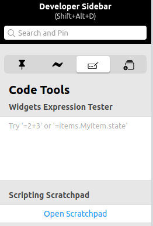

# Custom Default Item Widgets

Just like the Overview Page and individual cards, the way individual Point Items are presented can be customized as well.
In general the steps will include navigating to the Item in the Model tree or the Items Settings, clicking on "œAdd Metadata"€, and selecting "€œDefault List Widget"€ to customize how the Item appears in the automatically generated cards on the Overview Page.
One can also set the "Default Stand Alone Widget" and "Default Cell Widget" to change how an Item appears in other parts of MainUI.

{::options toc_levels="2..4"/}

- TOC
{:toc}

## Expressions

Many portions of a widget can be configured to change dynamically based on the states of Items.
This can be a powerful way to combine multiple Items into one widget (e.g. an oh-label widget showing the current state of a garage door that sends a command to a Switch Item to trigger the garage door opener when the widget is clicked).
Common things one might use an expression for is to change an icon or color based on the state of an Item, hide a widget entirely if an Item isn't in a given state, colors of the widget elements, etc.
For full details on expressions see the [Expressions docs]({{base}}/ui/building-pages.html#dynamically-configuring-components-with-expressions).

Note that when working with Units of Masurement, the state of the Item needs to be parsed into a number for comparisons.
For example -

```javascript
=(Number.parseFloat(items.MainFloor_Humidity.state) < 35) ? "red": "blue"
```

When creating anything but the simplest of expressions, the Widgets Expression Tester is a very helpful tool.
This is the third tab of the Developer Sidebar (accessible from Developer Tools or by pressing ALT-SHIFT-d).
Note that the sidebar will only appear if the browser window is wide enough.



For complicated expressions, gradually build up the expression in this tool until it works as required and then paste it into the config for the widget.

## Visibility

Each custom defined widget has a "Visibility" and "Visible to" property.
The "Visibility" option takes a boolean `true` or `false` (without quotes) or the result of a boolean expression to determine whether or not to render the widget.
The "Visibile to" property controls which type of user can see the widget.
Take heed of the warning, this is not a security feature, but it can be used to limit what a regular user can see in the automatically generated parts of the Overview Page.

There are other ways to hide an Item from the automatiaclly generated parts of the UI page.

### Exclude the Item from the Model

There may be times where a piece of Equipment may have one or more Items that simply do not matter in the UI.
Perhaps that Item is already displayed as part of another Item's custom list widget or it presents information or a control that the human users do not need.
Instead of setting the visibility property, simply exclude the Item from the model by removing the Item's semantic tag.
If the Item isn't used anywhere else, consider removing the Item entirely.
Do not keep Items around just because you can.

### Conditional Visibility

There may be times when certain Point Items are not relevant or interesting unless it is in a certain state or some other Item is in a certain state.
For example, a smart plug may have a bunch of sensor readings indicating how much energy the device plugged in is using.
Those Items are only interesting when the plug itself is ON.
Therefore hide the sensor readings Items by using an expression to only show it when the plug Switch Item itself is ON.

Here are a set of widgets for a Chromecast.
When the Chromecast isn't doing anything (Idling Channel is ON) the widgets are hidden.


And when the Chromecast is playing something a number of widgets become visible.


Note that even though the points for an equipment are hidden, the Equipment itself still appears in the card with that gray row in the list.
The screen shots above are an extreme case where there are a lot of Equipment with hidden Points.

## Configure a Custom Widget

By default MainUI will make a best guess on how to represent an Item.
If it fails to allow the interactions desired or doesn't look the way desired, a custom widget can be defined as metadata on the Item.
To change how the Item appears in the automatically generated parts of the Overview Page, set the "Default List Widget".
You can do so from the Model settings page or from the Item's settings page by clicking on "Add Metadata".

See the [UI docs]({{base}}/ui/building-pages.html) for details on how to create custom widgets.
There is some discussion on this on the next page of this tutorial as well.

There are a number of widget types to choose from for a List Widget.
See the [widget reference docs]({{base}}/ui/components/index.html) for details.
Pay particular attention to the Standard Widget Library (List Items) section.

Some customization fields are only shown when the "Show advanced" checkbox is checked.

An important note about widgets.
If one has more than one Item that should look and behave the same, create a custom widget under Developer Tools -> Widgets and reuse that for your Items.
Once a custom widget is created, it will appear in the list of widget types.
Properties can be used to customize the widget to work for each Item.
See the docs linked to above for details and the next page of the tutorial for some generic advice and approaches.
Look in the [Add-Ons - UI Category on the forum](https://community.openhab.org/c/add-ons/uis/30) for lots of examples.

## State Representation

By default the state of the Item will be displayed on the right hand side of the widget.
Sometimes the binding will provide hints on how to display the state but most of the time this default will be just the string from `MyItem.state.toString()`.

Note, the `label` field of an Item'™s definition in a .items file or the label set on the Item is *not* used by MainUI.

To customize the state of the Item the "State Description" metadata must be configured.
This metadata lets you define the format and any transformations to apply to the Item's state before it is displayed.
When this metadata is defined, it will be used by default everywhere in MainUI.

Field | What it does
-|-
Read Only | A toggle when set tells MainUI that the Item is not controllable (e.g. a Switch used to represent a sensor state) so a text/label widget will be used instead of a toggle.
Pattern | Defines the pattern used to display the state. This is where you will define the transformation and any other formatting information according to the same [syntax as used by sitemaps]({{base}}/configuration/items.html#state-presentation). Everything that can go between the `[ ]` in an Item label as described by that doc (excluding the `[ ]` themselves) can go here.
Min/Max/Step | Hints to MainUI used for slider, setpoint, and knob type widgets.
Options | Can be used with Actions (see below) to provide a mapping between the state of the Item and a command to issue.

There may be times when you want to suppress the state of the Item entirely.
In those cases, enter a space as the pattern and the Item's state will not be shown.


The above shows the state description for a `Number:Time` Item formatted to show the value as `HH:MM:SS`.

## Actions

There will be times when you want an entry in the card to perform some action when clicked on even when it's a sensor value.
For example, one might send a command to the garage door opener Item when clicking on the garage door sensor's Item on the card (you can then hide or remove the opener's Item from the model so it doesn't show up at all, two for one).

By default the action will usually be "Analyze item(s)" which will open up a chart of the historic state of the Items (see previous chapter).
But there are many other Actions that can be performed.
Some example use cases might be to pop up a weather widget when clicking on the Item with the outside temp on a page, combining Items into one widget when the sensor and actuator are separate (e.g. garage door), etc.

See the [UI Docs for Actions]({{base}}/ui/building-pages.html#actions) for details on all the Actions that can be performed.
