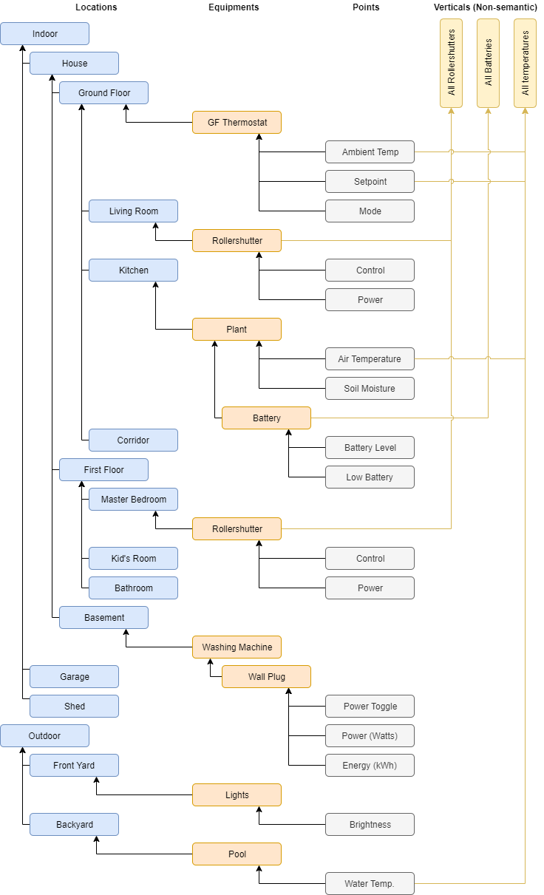



# Semantic Model

Things represent devices and the sensors and actuators of those devices.
But one of the purposes of openHAB is to abstract away the specifics of each of the hundreds of supported technologies and APIs so that a light switch is a light switch whether it's controlling a Hue light bulb, a KNX wall switch, or a custom DIY relay that speaks MQTT.
To provide that abstraction openHAB uses Items.

There are a fixed set of Item types representing all the different ways that a sensor reading can be represented or a device can be interacted with.
The configuration of your Items is where meaning is applied to your devices.
For example, instead of dealing with `zwave:1231242:node12:switch` we can deal with "Livingroom_Lamp".

Items are the main entities that the rest of openHAB works with including Pages, sitemaps, rules, and persistence.

There are many ways to organize your items, one of which is to make use of the semantic model (descriptions for location, type of equipment and more).
openHAB 3 makes extensive use of the semantic model to automatically create Pages (see next section) and to provide natural language interaction.
Therefore we recommend creating the semantic model right from the start and sticking to it.
This will make your life easier in the long run.
Taking the time to understand and choose a logical structure for your home will save you from needing to re-do the work in the future.

This section gives a good example of one way to model your home with locations and equipment descriptions.
The semantic model, when set up correctly, will allow openHAB to turn all lights off in the kitchen when asked, as the framework can understand the kitchen location and what items are lights in that location.

{::options toc_levels="2..4"/}

- TOC
{:toc}

## Introduction to the Ontology and Relationships

The above drawing shows the relationship between the four main concepts in the model.

- A Location is a Group Item that can contain sub-Locations, Equipment, and Points, and represents a physical location (building, room, etc.).
- An Equipment is normally a Group Item that can contain sub-Equipment, and Points.
- A Point is not a Group, but represents any other type of Item and is usually linked to a Channel.
- A Property is an additional tag on a Point Item that indicates what sort of point it is. For example, a thermometer might be a Point of type Measurement with a Property of type Temperature.

Example of an advanced model:

<!--(made with https://www.diagrameditor.com - file here: [Semantic Model.txt|attachment](upload://qEPmmmDomSr4F5dRBHMXajOzO0c.txt) (3.3 KB) change extension to .drawio) -->

We have an Indoor location which has a House.
The House has a Ground Floor and the Ground Floor has rooms including a Living Room.
The Living Room has a Rollershutter equipment which in turn has a Control and Power point Item.
The locations and equipment are Group Items and Control and Power are other types of Items.

One key feature of this example model is that you are not required to *only* use the semantic model.
It is possible and encouraged to create Groups and Items that are outside of the model where necessary.
In this example, the Rollershutter in the Living Room is a member of the AllRollershutters Group which could be used to determine if any are OPEN and send commands to all the rollershutters in the house at once.

You can use as few or as many layers of Locations as you wish to model your home.
For instance if you live in a flat (apartment) your root Locations might just be the rooms.
If you only have one building, you can omit the indoor/outdoor layer and the building layer to only have a hierarchy of floors and rooms, etc.

Equipment are often mapped to Things, but not always.
You can represent a single Equipment with several Things.
For instance, a computer might have points to switch it on (send a wake-on-lan packet), off (shell command), determine if it is online (network polling), and how much power it consumes (Z-Wave wall plug).
All of these multiple Things from different bindings can be combined to model a single piece of Equipment.

The `Computer` is the equipment and it could be located in a room called the `study` location.
The computer is made up of multiple Things, some of which are not physical devices.

A front door can have points to determine if it is open or closed (with a sensor) or locked (with a smart lock), and a camera/motion detector.

Finally, an Equipment can be made up of multiple Equipment.
Using the example above, the Z-Wave plug might be modeled as a subequipment of the `Computer` equipment.

## Building the Locations Model

From the Settings screen, click on Model.

Let's start with a hierarchy of Locations. Click on Add Location.

Add your first item, a Group representing the ground floor.
Give it a name, but choose carefully as you cannot change it afterward.
Choose a label, a category (it mostly defines the default icon), and then specialize the item by choosing a more accurate semantic class than "Location".
Here we use "GroundFloor".

Once it's created, make sure it's still selected on the left, and click on "Add Location" again.
This will add another location _within_ the ground floor.
Typically rooms are directly under floor locations.
Add an item representing the living room, calling it `LivingRoom`.
Set the `sofa` category and the `LivingRoom` semantic class.

Now let's add the kitchen. Make sure to select Ground Floor again and choose Add Location to add the third item (name: `Kitchen`, category: kitchen, semantic class: Kitchen).

To add the first floor to the root level, we need to clear the selection first.
Click on the white space in the tree, or Clear in the bottom toolbar.
Add the ground floor and its rooms (master bedroom, bathroom, etc...) to your model.

You should end up with something resembling this:

## Modeling Equipment

Now let's add some Equipment and Points.
You could proceed as you did for the Locations and create them by hand, but there's an easier way.
If the Equipment you're adding is one of the Things that you have already added, you have two options.

### From the Model Page

Select where in the model you want to add the Equipment, for instance the kitchen, and click on Create Equipment from Thing.

Select the Thing you want to create the Equipment from, and alter the details of the Equipment item that will be created.
If you don't find an appropriate Equipment class, choose **Equipment**.

Below are all the Channels defined by the Thing.
Sometimes Things will have hundreds of channels, so here you have the opportunity of choosing which ones will be linked to new Points items.
Check the channels you're interested in and only those.

For the plant sensor Thing added earlier, we have an opportunity to change the default basic Number types and make them quantifiable.
Quantity types (Number with a dimension) provide conversion facilities between Units of Measurement, and the default persistence is more granular.
For percentages like humidity or battery levels, use `Number:Dimensionless` which is a quantity type without a dimension.

Also set the semantic class to Measurement and choose an appropriate related property.

When you're finished, click Add in the title bar.
The Equipment and Points should be added to the model where you wanted.

The "Plant Sensor" Equipment has now been created under the Kitchen location, and all the selected Points represent the selected Channels of the Thing.

### From a Thing's Page

From the Settings, click on Things and then click on the Thing you wish to add to the model.
Switch to the Channels tab.

Click on Add Equipment to Model below the list.
You'll encounter a similar screen to the one above.
The difference is, rather than selecting the Thing, you have to select where in the model you want to add the Equipment.

Select Pick From Model in the Parent Group section, and the tree view of the Locations and Equipments will appear.
Select the parent group, for instance Living Room, then choose Pick in the top-right corner of the dialog box.
If this equipment is a part of another equipment, choose that equipment as the parent instead of a location.

Then do the same as above, configure the Equipment item and the Points, then click Add.

Go back to the Model by choosing Model in the sidebar and verify that the Equipment added to the model from the thing page is effectively there as well as, its Points.

Note how the Channel Links section lists the link to the Thing/Channel, and you also have a control widget to control the item.
Since it's linked to the Color channel of the Hue bulb, the light will reflect the state of the item.

Finish adding Equipment and Points from your Things.

## Retrofitting Existing Items to the Model

There may be times where a user needs to add existing Items to their model.
Perhaps they are migrating from an older version of OH, they did not follow the advice above to start with the model to begin with, or they are following a tutorial or example that doesn't include the model.
In this case all is not lost.
Existing Items can be added to the model.
Browse to the Item in the Items settings, click on Edit and choose an appropriate Semantic Class and Semantic Property.
Then add the Point as a member of the appropriate Equipment or Location Group.
If the Equipment Group doesn't exist yet, create a Group and use the appropriate Equipment semantic tag first and add the Equipment to the appropriate Location Group.

## Modifying the Model

As illustrated here, the model consists mainly of Group membership and tags on Items.
To change the location of an equipment or room, simply change the parent Group.
To change the type of an equipment or point, simply edit the tags.
Some of these edits are possible from the Model Page itself.
Where that's not supported, you can make the changes through the Item's Page.

## Controls and Sensor types

This is a table descibing the Equipment types and point class and type to enable display of badges and measurements on the location cards.
This is based off the sources linked below.

- <https://github.com/openhab/openhab-webui/blob/master/bundles/org.openhab.ui/web/src/components/cards/glance/location/status-badge.vue#L63>
- <https://github.com/openhab/openhab-webui/blob/master/bundles/org.openhab.ui/web/src/components/cards/glance/location/measurement-badge.vue#L48>

### Badges

| Type      | Equipment | Equipment subtypes allowed | Point Class | Point Type | Point Subtypes allowed |
| ----------- | --- | ---- | ----------- | ---- | ----- |
| Lights | ANY | NA |Control | Light | yes |
| Windows  | Window | no | Status | OpenState | no |
| Doors | Door or FrontDoor | no | Status | OpenState | no |
| Garage Doors | GarageDoor | no | Status | OpenState | no |
| Blinds | Blinds | no | Status | OpenState | no |
| Presence | ANY | NA | Status | Presence | yes |
| Lock | Lock | no | Status |  OpenState | no |
| Lock | Lock | no | Status |  ANY | no |
| Lock | Lock | no | Control |  ANY | yes |
| Climate | HVAC | yes | Status | ANY | no |
| Climate | HVAC | yes | Control | ANY | yes |
| Screens | Screen | yes | Status | Power | no |
| Screens | Screen | yes | Control | Power | yes |
| Speakers | Receiver or Speaker | Status | Power | no |
| Speakers | Receiver or Speaker | Control | Power | yes |
| Projectors | Projector | no | Status | Power | no |
| Projectors | Projector | no | Control | Power | yes |
| Alarms | ANY | NA | Alarm | ANY | yes |

### Measurements

 These don't care about equipment and just look at points

 | Type      |  Point Class | Point Type | Point Subtypes allowed |
| ----------- | ----------- | ---- | ----- |
| luminance |  Measurement | Light | yes |
| temperature |  Measurement | Temperature | yes |
| humidity |  Measurement | Humidity | yes |
