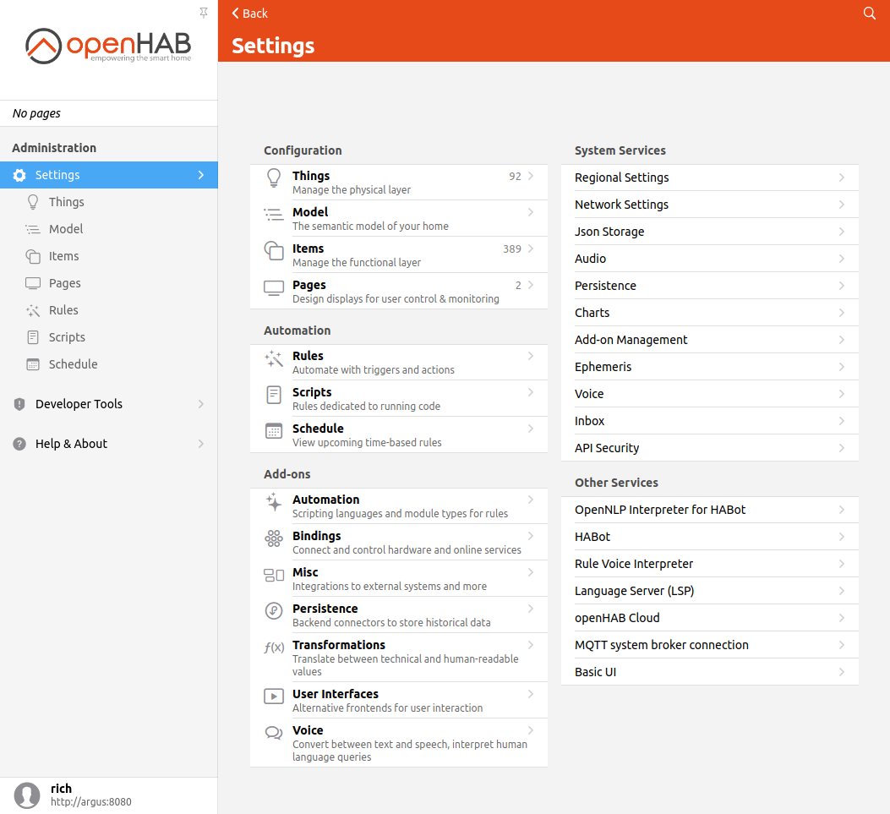

# Introduction to Pages

openHAB 3 introduces a new unified user interface called MainUI.
Almost everything that can be configured in openHAB can be configured through MainUI.

In addition to being used for the administration of openHAB, MainUI can serve as the interface presented to the users of your home automation system.
You can find an example of the MainUI on the [demo page](https://demo.openhab.org/#!/).

{::options toc_levels="2..4"/}

- TOC
{:toc}

## Role Based Access

MainUI presents two different views to users depending on the type of user they log in as.
The two types of users are regular users and administrators.

### Regular Users

Regular users are those who have either not logged in or who have not been configured to be administrators.
These users can see all of the interactive parts of the UI (i.e. Pages) and can open other apps (icon at the upper right hand corner of the screen), but they cannot see any of the administration interfaces nor can they access the administration functions through the REST API.

Notice that none of the administration menus are shown, only the user Pages defined to interact with your home automation.

The sidebar menu can be hidden by clicking the push pin icon right above the openHAB logo.

By default, these menus can be accessed by anyone on your network whether or not they are logged in.

### Administration Users

You will recall that back in "First Steps" the first thing you did was create an administration user.
These users have full access to all parts of openHAB.
Their list of available menu options includes Settings, Developer Tools, and the Developer Sidebar.
These are most of the parts of openHAB that you have been interacting with thus far.

Notice the new Settings and Developer Tools menus are accessible to administrators.

## Other User Interfaces

Every openHAB deployment is unique.
Consequently every administrator of an openHAB instance will need to create a custom interface for the users of their bespoke home automation system.
openHAB 3 provides a number of options to supports this in addition to MainUI Pages.

Interface | Purpose | How the UI is Defined | Notes
-|-|-|-
[Sitemaps]({{base}}/ui/sitemaps.html) | A simple declaritive way to define a simple user interface | Created using .sitemap files or through MainUI. | Used by BasicUI and the phone apps by default.
[HABPanel]({{base}}/ui/habpanel/habpanel.html) | UI designed for fixed wall mounted tablets and similar touch screen displays using a blocks interface (e.g. the Windows 10 start menu) with a lot of customization options. | Built graphically though the browser. A number of custom widgets are defined and installable.
[HABot]({{base}}/ui/habot/) | Provides a basic chatbot interaace to interact with your home automation through natural langauge. | Requires the configuration of the semantic model.
[Pages]({{base}}/ui/index.html) | Built into MainUI. Allows for a rich set of options to present your home automation. | Can be built automatiaclly through the semantic model as well as cutomized.

Once installed, any non-Pages UI can be accessed in the "Other Apps" menu that pops up when clicking on the square icon in the upper right corner of the MainUI Overview page (the first page you see when first accessing openHAB).

In addition, HABot will add a text box to the top of your Pages where one can start a conversation with openHAB.

The rest of this tutorial will focus on Pages.
