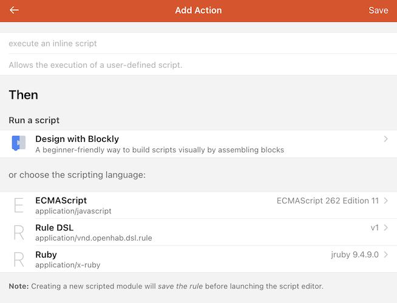

# Advanced Rules

Blockly is super powerful and relatively easy to use but at some point there will be some nuance or use case that cannot be achieved through Blockly.
Or perhaps the graphical representation is too limiting.
For what ever reason, openHAB has you covered with text based Script Actions and Script Conditions.

[[toc]]

## Languages

openHAB supports a growing list of programming languages in which rules can be written.
openHAB comes with the following languages to choose from:

| Language                                           | Details                                                                                                       | Intended Audience       |
| -------------------------------------------------- | ------------------------------------------------------------------------------------------------------------- | ----------------------- |
| [Blockly]({{base}}/configuration/blockly/)         | See the previous page                                                                                         | Non-developers          |
| [Rules DSL]({{base}}/configuration/rules-dsl.html) | A programming language developed specifically for openHAB based on [Xtend](https://eclipse.dev/Xtext/xtend/). | Long time openHAB users |

In addition to these default choices, one can install a number of different languages as an Automation add-on.
Such diverse languages as [JavaScript](/addons/automation/jsscripting/), [Ruby](/addons/automation/jrubyscripting), [Python](/addons/automation/jythonscripting/), [Groovy](/addons/automation/groovyscripting/), Java, and more are available with more to come.
See the add-on docs for the reference guide and specific information for how to use each individual add-on.
Take note, not all automation add-ons support writing rules in the UI.

For the rest of this tutorial we will show how to use the [JavaScript Scripting add-on](/addons/automation/jsscripting/) which implements ECMAScript 2021, and [JRuby Scripting add-on](/addons/automation/jrubyscripting) for Script Actions and Script Conditions in UI rules.
See the add-on's reference for how to write rules in text files which is outside the scope of this tutorial.

## Installation

To install a new rules language navigate to Settings -> Automation and install the add-on desired.
The next time you create a Script Action or Script Condition, if it's supported, the new language will be selectable.

## Helper Libraries

All of the rules languages will run inside the Java Virtual Machine.
This gives all these languages access to all of the Java standard library of classes.
Furthermore, all direct interactions with openHAB itself is done through Java Objects and Classes.
What does this mean?
It means that sometimes an `int` isn't just an `int`.
If you are going to write rules to directly interact with openHAB, you will have to be very conscious of where the data comes from and what its type is.

In order to make that process easier, most of the automation add-ons offer a Helper Library.
These libraries come in various forms and are installed in different ways but they all endeavor to do the following:

- make writing rules in text files easier, less verbose, and more natural to the native language
- provide utility functions and ways to interact with openHAB using language native Classes, Objects and types
- abstract some of the sometimes verbose series of steps requires to do something (e.g. access an Item's metadata) into a single function call.

See the automation add-on's reference for how to access and install the Helper Library for your language of choice.

:::: tabs

::: tab JS

In the case of JavaScript Scripting, the Helper Library comes with the add-on (nothing to install separately) and it is automatically imported into your rules for you (advanced users can turn off that auto import in MainUI Settings -> JS Scripting).
To get the latest version of the Helper Library instead of waiting for the next release of OH, it can be installed using `npm`.

:::

::: tab JRuby

The Ruby scripting is implemented using JRuby Scripting add-on.
It will install its helper library by default, and it is automatically imported into your rules.
This can be configured or disabled in Main UI Settings -> JRuby Scripting.
Additional Ruby Gems can be installed by specifying them in the `gems` configuration.

:::

::::

Again, see the add-on's reference for details.

## Creating a Rule

See the previous pages of this tutorial for details on creating a rule.
The steps are the same no matter what language is to be used.
Consequently this tutorial won't talk about the rule triggers at all.

One can combine and use multiple languages in the same rule, for example using a simple UI Condition and a Blockly Script Condition along with a Script Action written in Rules DSL and second one written in ECMAScript 2021.

For consistency and the ability to compare approaches, this part of the tutorial will use the same set of requirements as was used in the Blockly tutorial.
As a reminder, we want to turn on a light when motion is detected and keep that light on for 30 minutes after the last motion was detected.
But it should only do this between sunset and 23:00.

### When: Triggers

See the previous pages.
Triggers are set up the same way for all UI rules.
We will use the same trigger from the Blockly tutorial.

### Then: Actions

Just like in Blockly, we will create a new Action but instead of choosing Blockly, we will choose `ECMAScript` or `Ruby`.



This will open a blank text field where you can start typing your code.
This text field provides text highlighting and some code completion which helps with coding.

As with the Blockly example, we want to start the rule using a log statement we can see in openhab.log when the rule runs.

:::: tabs

::: tab JS

As previously mentioned, the Helper Library for this language comes with the add-on and is imported by default, so see the [JavaScript Scripting add-on's reference](/addons/automation/jsscripting/) for the full guide on how to do anything you might want to do.
For help with general JavaScript coding, there are tons of tutorials and reference documents on the web a search away.

One can either use the [log actions](/addons/automation/jsscripting/#log) but most will find it easiest to use the more JavaScript native [`console`](/addons/automation/jsscripting/#console).

```javascript
console.info('Motion was detected');
```

:::

::: tab JRuby

If you are new to Ruby, check out [Ruby Basics](https://openhab.github.io/openhab-jruby/main/file.ruby-basics.html) for a quick overview of the language.
The Ruby language and the [JRuby Helper Library](https://openhab.github.io/openhab-jruby/) offers a streamlined syntax for writing file-based and UI-based rules, making it easier and more intuitive than RulesDSL, while delivering the full features of the Ruby language.

```ruby
logger.info "Motion was detected"
```

:::

::::

Save and test the rule by running it manually and verify you see this statement in the logs.

Next we want to send a command to the light to turn it on.

:::: tabs

::: tab JS

Reading the docs we see that access to the Item registry is provided through [`Items`](/addons/automation/jsscripting/#items) where we can get access to a JavaScript Object that represents the Item.
This Object has a `sendCommand()` function that takes the command.

```javascript
console.info('Motion was detected');
items.getItem('FrontPorchLight').sendCommand('ON');
```

:::

::: tab JRuby

In JRuby, openHAB Items are represented directly by their names.
You can also access them through the [items](https://openhab.github.io/openhab-jruby/main/OpenHAB/DSL.html#items-class_method) registry so you can find them using a string.
The Item object has a generic [#command](https://openhab.github.io/openhab-jruby/main/OpenHAB/Core/Items/GenericItem.html#command-instance_method) method and also command methods specific for each item type in openHAB.

```ruby
logger.info "Motion was detected"
FrontPorchLight.on # this sends the ON command to the Item

# The following lines do the same thing
# FrontPorchLight.command ON
# items["FrontPorchLight"].on
# items["FrontPorchLight"].comand ON
```

:::

::::

Save and test and verify you see the log statement and the Item receive an ON command.

Now we want to create a Timer to go off in 30 minutes.

:::: tabs

::: tab JS

We find the Timer creation documented under [ScriptExecution](/addons/automation/jsscripting/#scriptexecution-actions).
A Timer will execute a block of code passed to it as the second argument at the time specified by the first argument.

In JavaScript this block of code would be defined in a function.
There are _lots_ of ways to define functions in JavaScript including inline anonymous, and more.
See one of the many tutorials on JavaScript functions for details (e.g. search "JavaScript functions" on Google).
I'll define a separate variable to hold the function here.

```javascript
console.info('Motion was detected');
items.getItem('FrontPorchLight').sendCommand('ON');
var lightsOut = function() {
  console.info('No more motion, turning off the light');
  items.getItem('FrontPorchLight').sendCommand('OFF');
};
```

To define date times, the [JS Scripting Helper Library](/addons/automation/jsscripting/#time) includes the JS-Joda library which provides a very robust set of classes to create and manipulate dates and time.
We need to use this library to specify the time when the timer should run.

```javascript
console.info('Motion was detected');
items.getItem('FrontPorchLight').sendCommand('ON');
var lightsOut = function() {
  console.info('No more motion, turning off the light');
  items.getItem('FrontPorchLight').sendCommand('OFF');
};
actions.ScriptExecution.createTimer(time.ZonedDateTime.now().plusMinutes(30), lightsOut);
```

:::

::: tab JRuby

Timers are created by calling the [after](https://openhab.github.io/openhab-jruby/main/OpenHAB/DSL.html#after-class_method) method.
It accepts a [Duration](https://openhab.github.io/openhab-jruby/main/OpenHAB/CoreExt/Java/Duration.html), a Ruby [Time](https://docs.ruby-lang.org/en/master/Time.htmll), or a java [ZonedDateTime](https://openhab.github.io/openhab-jruby/main/OpenHAB/CoreExt/Java/ZonedDateTime.html) object to specify when the timer should execute.
Most of the time, a Duration is used, and the helper library offers a [convenient syntax](https://openhab.github.io/openhab-jruby/main/index.html#durations), e.g. `30.minutes`, to create a Duration object.

```ruby
logger.info "Motion was detected"
FrontPorchLight.on

after 30.minutes do
  logger.info "No more motion, turning off the light"
  FrontPorchLight.off
end
```

:::

::::

Save and test that you see the log statement and the Item receive the `ON` command and 30 minutes later the second log statement and the `OFF` command.
(hint, change the time passed to the timer to something smaller to make testing easier then change it back once things are working).

Now all we are lacking is the ability to reschedule that timer if motion is seen again in the 30 minute period.

:::: tabs

::: tab JS

Looking back at the docs we find the [cache](/addons/automation/jsscripting/#cache).
This is a map of key/value pairs that exists outside of the rule.
Given that position it is able to share data between different rules or between runs of the same rule.
We will use it to save that Timer so we can reschedule it later when needed.

```javascript
console.info('Motion was detected');
items.getItem('FrontPorchLight').sendCommand('ON');

timerId = 'FrontPorchLight_timer';
var lightsOut = function() {
  console.info('No more motion, turning off the light');
  items.getItem('FrontPorchLight').sendCommand('OFF');
  cache.private.put(timerId, null);
};

var timer = cache.private.get(timerId);
if(!timer) {
    cache.private.put(timerId, ScriptExecution.createTimer(time.ZonedDateTime.now().plusMinutes(30), lightsOut));
}
else {
    timer.reschedule(time.ZonedDateTime.now().plusMinutes(30));
}
```

Also notice a line was added to `lightsOut` to delete the entry in the `cache` when the timer ran.
That will cause the rule to create a new timer the next time the rule runs.
It could be coded to reuse the Timer instead which is an exercise for the reader.

Another benefit of saving the timer in the `cache` is that it will be cancelled when the last script that references the cache is unloaded or reloaded.
This will prevent the timer from executing after the original script had been removed or reloaded.
Care must still be taken within the timer function not to reschedule itself if it has been cancelled.

:::

::: tab JRuby

In JRuby, an easy way to reschedule the same timer is done by providing a unique `id` to the timer.
This is called a [reentrant timer](https://openhab.github.io/openhab-jruby/main/OpenHAB/DSL.html#reentrant-timers).

The most convenient ID to use is the Item object for which the timer is operating, but you can use anything as the ID, e.g. a String, a number, the rule uid, etc.

```ruby
logger.info "Motion was detected"
FrontPorchLight.on

after 30.minutes, id: FrontPorchLight do |timer|
  logger.info "No more motion, turning off the light"
  timer.id.off # We can do this because the Timer's id was set to the item object
               # It is the same as FrontPorchLight.off
end
```

While it may seem straightforward, the JRuby helper library manages the timer and rescheduling internally to reduce the need for repetitive code.
Full flexibility to work and manipulate the timer is available for more advanced use.

:::

::::

Save and test that the rule sends the on and off commands as described.

### But only if: Conditions

Now we want the rule to only execute between sunset and 23:00.
Create a new Condition and choose `ECMAScript` or `Ruby` as the language.
This doesn't have to be the same language as the one chosen for the Script Action above.
Just like with the Script Action, the Helper Library is available by default.

As discussed in the Blockly tutorial, the last line of a condition must evaluate to `true` or `false`.
When `true` the rule will run, otherwise it's skipped.

Sunset is available in an Item called `Sunset` and we need to test to see if `now` is between then and `23:00`.

:::: tabs

::: tab JS

In order to do that we need to convert the `Sunset` state to a JS-Joda date time.

Looking at the docs for [`Item`](/addons/automation/jsscripting/#items) we see that the Helper Library `Item` Class will return the String representation of the Item's state by default.
Luckily the Helper Library also has an extension that makes it so JS-Joda can parse that String by default.

```javascript
var sunset = time.ZonedDateTime.parse(items.getItem('Sunset').state);
```

Next, we need to create a `ZonedDateTime` for 23:00 today.
Looking at the JS-Joda docs we see how to do that.

```javascript
var sunset = time.ZonedDateTime.parse(items.getItem('Sunset').state);
var endTime = time.ZonedDateTime.now().withHour(23).withMinute(0).withSecond(0).withNano(0);
```

Now all we have to do is see if `now` is between those times.

```javascript
var sunset = time.ZonedDateTime.parse(items.getItem('Sunset').state);
var endTime = time.ZonedDateTime.now().withHour(23).withMinute(0).withSecond(0).withNano(0);
now.isAfter(sunset) && now.isBefore(endTime)
```

:::

::: tab JRuby

```ruby
Time.now.between? Sunset.state.to_s.."23:00"

# Alternative code:
# ZonedDateTime.now.between? Sunset.state.to_s.."23:00"
# Time.now.between? Sunset.state, Time.parse("23:00") # Two arguments of date/time objects
# Time.now >= Sunset.state && Time.now <= Time.parse("23:00")
# etc.
```

[#between?](https://openhab.github.io/openhab-jruby/main/OpenHAB/CoreExt/Between.html#between%3F-instance_method) helper method is available on all Ruby and Java date, time, and Duration objects.
It takes a Ruby [Range](https://docs.ruby-lang.org/en/master/Range.html) as its argument, or two Date/Time objects to perform an inclusive range comparison.

Note that in JRuby, Date/Time and also DateTimeType objects (in the above example, the item's state) can all work interchangeably without any explicit conversions.
See [Working with Time](https://openhab.github.io/openhab-jruby/main/index.html#time) for more details.

:::

::::

## Advanced Topics

### Libraries

Most of the languages support installation and importing of third party libraries.
Many of the languages will have special tools to download and install these libraries and there might be extra requirements to use them in openHAB.
See the add-on's docs and the forum for details on the automation add-on chosen.

:::: tabs

::: tab JS

For JS Scripting, `npm` is supported for the installation of third party libraries.
Run the `npm` command from the `$OH_CONF/automation/js` folder.
This will create a `node_modules` folder (if it doesn't already exist) and the library will be installed there.
Use `var name = require('name_of_lib');` to import the library into your Script Actions and Script Conditions.

Any language that supports such libraries will also allow you to create your own personal library where you can create functions, data structures, and classes that can be reused across your Scripts Actions/Conditions.
For example, some functions to centralize alerting is a good idea.

For JS Scripting, look up tutorials for how to create an `npm` module for how to write your own personal libraries.
I find it easiest to write the library in a separate folder, tar it up and use `npm` to install your library from the `tar` file.
That keeps it from being modified or overwritten by `npm` when upgrading or installing/removing other third party libraries.

There are several third party openHAB specific libraries on `npm` already.
Search the forum for details.

:::

::: tab JRuby

You can install JRuby-compatible Gems from [rubygems.org](https://rubygems.org) by listing them in the JRuby Script add-on [configurations](https://openhab.github.io/openhab-jruby/main/index.html#configuration).
Alternatively, the inline bundler is available from inside your script.

```ruby
gemfile do
  source "https://rubygems.org"
  gem "faraday", "~> 2.12", ">= 2.12.2"
end
```

[Personal libraries](https://openhab.github.io/openhab-jruby/main/index.html#shared-code) that contain your custom reusable constants, functions, data structures, and classes can be created and used inside your Script Actions and Conditions.
Simply save a `.rb` file that contain your code in `$OH_CONF/automation/ruby/lib/` folder, then `require` it in your script.

For example, a personal library file in `$OH_CONF/automation/ruby/lib/mylibs.rb`:

```ruby
DESTINATION_EMAIL = "myemail@gmail.com"

def broadcast_alert(msg)
  Notification.send msg, title: "Alert!"
  things["mail:smtp:local"].send_mail(DESTINATION_EMAIL, "OpenHAB Alert", msg)
end
```

Usage in Script Action:

```ruby
require "mylibs"

if event.open?
  after 30.minutes, id: event.item do
    broadcast_alert "The Garage Door has been left open!"
  end
else
  timers.cancel(event.item)
end
```

:::

::::

### Debugging

All the same advice from Blockly applies here too.
Gradually build up your rule, testing at each step. Use logging liberally.
Break up your code into functions you can test independently. Simplify complicated lines by breaking them up.
Watch the logs for errors.

## Tips and Tricks

- If you find yourself duplicating rules or code, consider ways to extract that into a function or library.

- When posting to the forum, post the contents of the "Code" tab instead of screen shots.

- Rules can call other rules which can be another way to break out common code.

- Use the `cache` to hold things that need to survive the running of a script or be shared with other scripts.
The `cache` will be cleared out during a restart.
