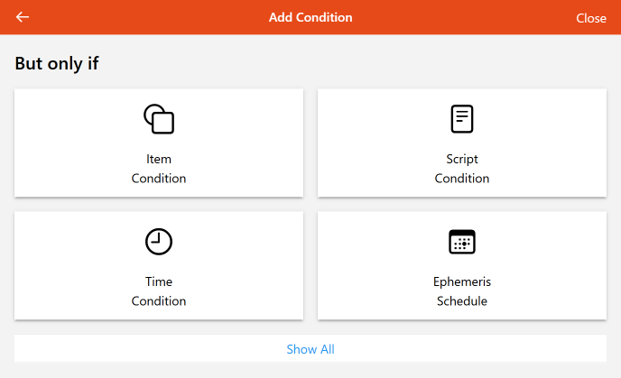

# Basic Rules and Rule Templates

Rules do not always require coding.
This section describes two ways to build and configure rules without code.
Even though you may not be interested in such simple rules, do not skip this section.
The concepts presented here will be referred to later on, and the same concepts apply even for text file based rules.

{::options toc_levels="2..4"/}

- TOC
{:toc}

## Basic Rules

Very basic rules can be defined in the UI without the need for code.
These rules will follow a `when X event occurred if Y is true do Z` format.
For example, when a member of the Temperatures Group changes, if it changed to a value over 70 °F, command the AlertLight Item to "red".

For this example we will be creating two rules, one that sets a Switch Item to `ON` when the cloudiness reading goes above 50% and another to `OFF` when it falls below 50%.

### Create the Rule

Navigate to Settings and Rules and click on the **+** icon in the lower right corner.

#### Metadata

Each rule has four pieces of metadata.

| Metadata    | Purpose                      | Notes                                                                                                                                                                                                                                            |
|-------------|------------------------------|--------------------------------------------------------------------------------------------------------------------------------------------------------------------------------------------------------------------------------------------------|
| Unique ID   | uniquely identifies the rule | must be completely different from all other rule's UIDs, initialized with a random value but I strongly recommend entering your own UID                                                                                                         |
| Name        | "title" of the rule          | This will be the name under which the rule is shown in MainUI and is the primary field used for search and sorting                                                                                                                               |
| Description | describes what the rule does | do not skip, provide information about what the rule does and what it does it to; leave breadcrumbs you can use later to associated rules with Items and Channels                                                                                |
| Tags        | arbitrary tags               | Another place to leave breadcrumbs or to group rules together. Note the `Script` and `Schedule` tags have a special meaning (see previous page), and although Semantic tags are available, rules are not yet integrated into the Semantic Model. |

Here is how this rule appears in the list of rules (note the use a couple of tags):

All but the Unique ID can be changed later.
In my system this rule is used to drive my lights and it's based on weather readings so it's tagged to indicate that.

#### Triggers

Under triggers, click on the green + icon labeled "Add Trigger" to define what events should cause this rule to run.
This brings up a form that lets you choose the type of the trigger and enter some information about the trigger.

The title and description are optional and will be automatically populated with meaningful information when you select the trigger.
However pay attention and if there is more information that might be useful to you later add that.

We need an Item changed event to trigger this rule so it runs when the cloudiness percentage Item changes.
So I select "Item Event" and select my Item and click "Pick" in the upper right corner.

Choose "changed" since we only care when the Item changes.
Notice the title and description is filled out with reasonable information.

You will notice that there are "from state" and "to state" fields.
These can be used to further narrow down when the rule triggers, but do not confuse these with conditions.
You can only include a single state here (e.g. from state: ON to state: OFF).
You cannot use comparison operations here (e.g. < 70) and need a condition for that.
Therefore these are mostly useful with `Switch`, `Contact`, `Player`, and sometimes `String` Items.
Any Item that has a range of values rather than a few discrete values will not use these.

#### Conditions

In this case we have two conditions.
We only want the actions to run when the Item is at or above 50% and the status Item vIsCloudy isn't already ON.

Click the green + icon under "But only if" labeled "Add Condition".

Choose Item Condition because we want to check the state of an Item and select the Item.
Note, sometimes if the Item not part of the model it can be hard to find.
If that happens to you, select any Item to start and then you can get a flat list of all your Items on the next screen.

In this case we want to check if the `vCloudiness` Item is >= to 50 %.

Notice the `%`.
This Item is a `Number:Dimensionless` representing a percentage.
So I've used the units here.
This will work with any supported units of measurement and there will be a warning in the logs if your Item has units but the "State" does not.

Next we don't want to run the actions if vIsCloudy is already ON.

#### Actions

Finally, we want this rule to send the ON command when triggered and the conditions are met.

Click the green + icon labeled "Add Action" under the "Then" section and choose "Item Action".
By now the steps should be familiar, select the Item, in this case `vIsCloudy` and you are presented with the Item action form.
In this case we want to send command ON.

The rule is now done!
Click Save and watch the log for errors and to see if the rule is working (more on that later).

### Copy a Rule

We now have a rule that sets `vIsCloudy` to ON and we need a corresponding rule to trigger it when OFF.
Since this second rule is very similar to the one we just created, we can copy/paste/edit.

First, open the code tab for the rule we just created.
This will show a text version of the rule.
You should see a section corresponding to each of the parts of the rule (but note that the order of the configured pieces may not match.

Copy the text shown here to the clipboard.

Create a new rule (see above), enter the metadata for the rule (this time we are commanding the Item to OFF) and then open the code tab for this new rule.
Paste the contents of the clipboard to the code tab and make the edits as necessary.

In this case we want to change the operator for the first condition to <, the state for the second condition to OFF, and the command for the action to OFF.
The code would look like this:

This will work for any UI Rule, not just basic rules.

Note, when asking for help on the forum, the experts will want to see this code version pasted as text rather than a screen shot of either the Design tab or the Code tab.

## Rule Templates

At some point basic rules will not be sophisticated enough to reach your goal.
The first place to look when that is the case are the rule templates posted to the Marketplace.
You can find them under Settings and Automation.

### Installation and Configure

Under the "Languages & Technologies" section there are "Rule Templates" and "Blockly Libraries" sections (discussed on the next page).
These are community created capabilities posted to the [Marketplace](https://community.openhab.org/c/marketplace/69).
Someone may have already written the code for you so all you have to do is install and configure it.

In MainUI click on a rule template that seems to do what you want.
This will open it's documentation page which explains how the template works, configuration parameters, dependencies, etc.

To install the template, click on "Add" next to the template's logo.
If installation was successful, you can now create one or more rules based on the template.

### Rule Template Instantiation

Navigate to Rules and click the blue + icon to create a new Rule.

Fill out the Rule's metadata as usual.
However, now you will see a "Create from Template" section listing all the installed templates.
Choose the template you want to base this rule on.

The bottom of the form will change from the three sections described previously to a form showing the parameters the rule template defines.

In this case, the parameters are selecting a DateTime Item to trigger the rule and which defines the "alarm time" and a "Script" to call when at the date and time in that DateTime Item.

### Updates to Templates

Your rule, once instantiated becomes its own thing separated from the template, just as if you had cut and paste the code as in the first example.
Therefore, it will not change even if the rule template is changed or removed.
This means the rule will not update based on changes to the template automatically.
To update a template and a rule use the following process.

1. Notice that there has been an update to a template that you want to use (keep checking back).
1. Select the template in MainUI and click "Remove". 
Then click "Add" to refresh the template with the new changes.
1. Go to Settings and Rules and navigate to the rule you want to update. 
Click the pause icon to disable that rule. 
Or if you don't want to keep a backup, delete it. 
Note, if you just disable you won't be able to use the same rule UID for the new rule.
1. Create the rule following the steps from above.
1. Once the new version of the rule is tested, delete the disabled version of the rule.

### Customization of Rules Created From Templates

What if a rule template does almost what you need but not everything?
Since the rule, once instantiated, becomes severed from the template, you can modify the end rule as much as you want.
Don't be afraid to take a rule template as a starting point and further refine it.

If you make additions to a rule template that you want to share, work with the original poster of the template to add your updates to the original template (posting a new template with only minor differences is against the marketplace rules).
