# Blockly

What should one do if the simple "when-then-but only if" rules are not enough?
This is where the Script Actions and Script Conditions come into play.
Both of these are a way for you to write code that can be as long and complex as it needs to be to achieve your goals.

As you recall from the previous page, one of the four types of conditions are Script Conditions and one of the four types of actions are Script Actions.
Choosing either of those presents you with a choice of language to use.
By default there are only three choices: Blockly, ECMAScript, and Rules DSL.
If you've installed other automation add-ons, those might be listed as well.

This tutorial is not going to be a full tutorial on how to write code in Blockly.
See the [**Blockly Reference**]({{base}}/configuration/blockly/index.html) for a detailed tutorial and reference for doing that.
Instead it's a higher level example of building a rule step-by-step using Blockly.

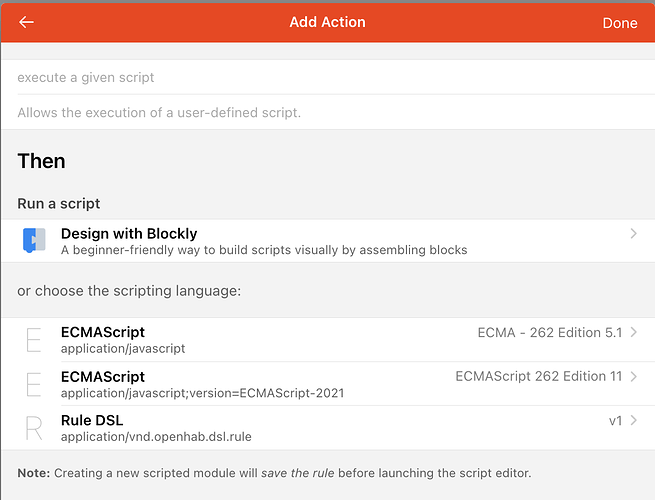

For this part of the tutorial we will choose "Design with Blockly".

{::options toc_levels="2..4"/}

- TOC
{:toc}

## Introduction to Blockly

[Blockly](https://developers.google.com/blockly) is a visual coding language consisting of blocks that fit together like building blocks.
For people who prefer visual over text or those who are new to programming, Blockly can be a good choice.
It even allows you to learn how write your own JavaScript by looking at the code that Blockly generates in the background and this code could be even copy and pasted into a pure ECMAScript rule as a starting point.
If you have been around kids you may be familiar with [Scratch](https://scratch.mit.edu/).
Blockly is a similar environment customized for writing openHAB scripts.

For those who do better with video, there are a few videos introducing Blockly on the openHAB [Youtube feed]({{base}}/configuration/blockly/index.html#blockly-youtube-tutorials)

A typical Blockly script might look something like this:

Before continuing, see if you can figure out what that does.
This shouldn't be too hard because one of Blockly's intents is to provide visual code that is easy to comprehend.
The flow is from top to bottom.

### Blocks Categories

Statements in Blockly are defined using blocks.
Compatible blocks can attach to each other to build up your program.
Incompatible blocks will not fit together making it harder to come up with impossible logic.
The code also reads a little bit more like natural language.

There are a number of categories of blocks which you will find along the left hand side.
All but the openHAB and Library categories are generic programming concepts and are where you will find the blocks to create variables, loop through lists, comparisons and conditionals, etc.

The openHAB category is where all the blocks that interact with openHAB are listed.
These are where you'll access Items, call actions, get data from persistence, create Timers (a way to schedule some code to run in the future), etc.

The Library category is where Blockly Libraries installed from the Marketplace will appear (see below and the previous discussion on Rule Templates).

Some sections will be short.
If you are missing details, see the previous section for details as most of the steps are the same for creating *all* rules in the UI.

## Building a Rule

For this example, we will build a rule that turns on a light when a motion sensor triggers and leaves it on until thirty minutes after the last motion is detected.
But it will only do so from sundown to 23:00 and not do anything the rest of the day.

### When: Triggers

The event that we care about in this case is when the motion sensor Item indicates that it has detected motion.
How this is represented can vary from one device to another.
For example, one might use a Switch Item and send an ON command to that Item every time motion is detected.
Others might use a Contact Item and update it to OPEN when motion is detected.
Still others might use an Event Channel to trigger a rule without an Item at all.
Some motion sensors will keep the Item ON while motion is detected and then set it to OFF, others will only send it to ON and the Item never returns to OFF.

There can be differences in behavior too.
For example some will have a timeout where they won't report newly detected motion for a configured amount of time has passed.
You must understand how your motion detector works to choose an appropriate trigger and write an appropriate action.
For example, if the motion sensor has a timeout of five minutes (i.e. it only reports motion every five minutes), the timer in your action for the rule must be five minutes or longer.
Shorter and the rule will turn off the light even when there is motion.

See the previous page for details on how to create the trigger you need.
In this example we will use an `ON` command to the `MotionSensor` Item as the signal that there is motion.
The motion sensor will timeout for 30 seconds before reporting motion again.
There are three options to choose from which are explained very well [here](https://www.openhab.org/docs/configuration/rules-dsl.html#manipulating-item-states).
In simple terms "changed" means the rule only triggers if the state *has changed* for example from OFF to ON while "was updated" would even trigger the rule if "OFF" was set to an item state that was already OFF.

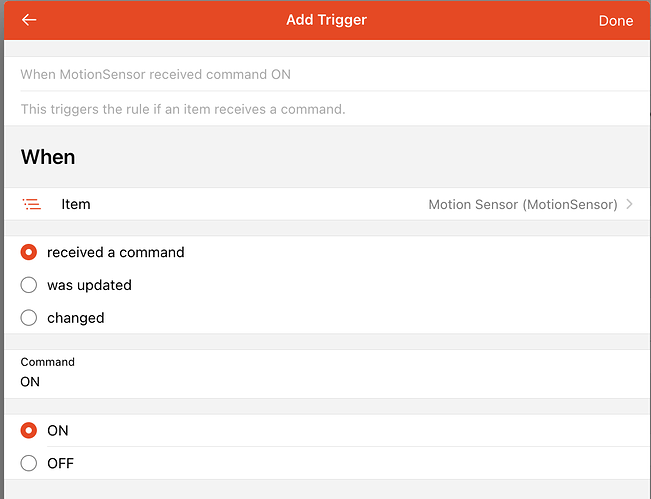

### Then: Actions

Now let's work on what we want to have happen when the rule triggers.
As mentioned above we want to turn the light on and leave it on until thirty minutes after the last motion is detected.

First create a new Action and choose Script Action and Design with Blockly.

To start, we want to be able to see that this rule is running.
So we will first add a log statement which you will find in the openHAB -> Logging & Output section.
We will choose "info" for the level and type a message we want to see in `openhab.log` when this action is executed.

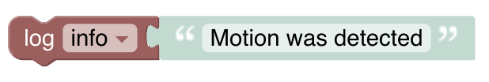

Next we want to command a light to turn `ON`. Under openHAB -> Items & Things you'll find a "send command" block.
Drag that over and dock it under the log statement.
We want to send `ON` to the Porch Light Item.
If the light is already `ON` nothing will happen but, if your device behaves differently you might need to check to see if the light is already `ON` before sending the command.

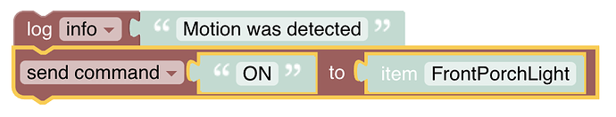

Next we want to set a timer.
A timer is a way to schedule some code to run later on.
The rule will continue and exist after the timer is created (i.e. it doesn't wait around) and the timer will execute in the background at the scheduled time.

In this case we want to wait thirty minutes.
But we want to wait for thirty minutes after the last motion.
This rule gets triggered every time motion is detected so we need to reschedule the timer every time motion is detected.
A reschedule will tell the timer to run at a different time.
Only when there has been thirty minutes of no motion will the blocks inside the Timer block be executed.

Under openHAB -> Timers & Delays drag the "after" block that includes "reschedule" at the bottom.
We need to change the time to thirty minutes.
Notice the little triangle next to "seconds".
Clicking on that will bring up a list of options to choose from.
Anywhere you see that triangle there are options (e.g. clicking on "info" for the log can change the logging level, clicking on "send command" lets you change to "post update").

Give the Timer a meaningful name.
It's good to be in the habit of naming everything with a meaningful human readable name.

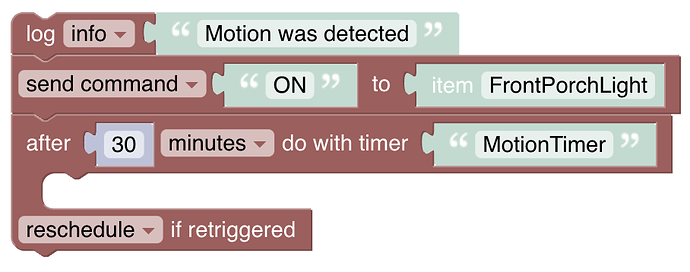

Now we need to add the block to run thirty minutes after the last motion was detected.
We want to send an OFF command to the light.
But, for testing and debugging we also want to log something out so add a log statement too.

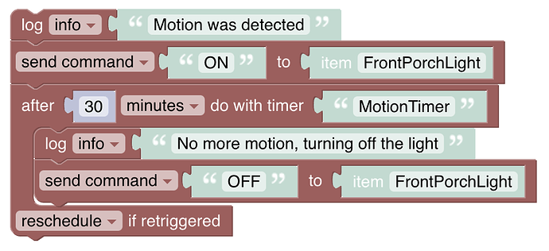

Trigger the rule a few times and watch the logs to make sure you see the commands and logging events as expected.
When testing, consider using a smaller timer time (e.g. three seconds) and change back to the desired time once you know it is working.

### But only if: Conditions

We have the when and the then so now we need the "But only if" to limit when the rule can run to between sundown and 23:00.
Add a condition and choose a Script Condition and select Deign with Blockly as the language.

A script condition is just like an action except the last statement execute must evaluate to a boolean (`true` or `false`).
When `true` the actions will execute.
When `false` it won't.

So we need to have a way to compare the current time with a hard coded time (23:00) and a time held by an Item linked to one of the Astro binding's sunset channels.

Looking around the available blocks will show us that there are no such blocks built in (as of this writing).
The first thing to do in this situation is to check the Marketplace to see if there is a Blockly library that does what we need.
Indeed there is one for comparing times!

#### Install a Library

Navigate to Settings -> Automation and scroll down to "Block Libraries".
Browse around to see if there are relevant libraries, in this case the "Date and Time" one looks most promising.

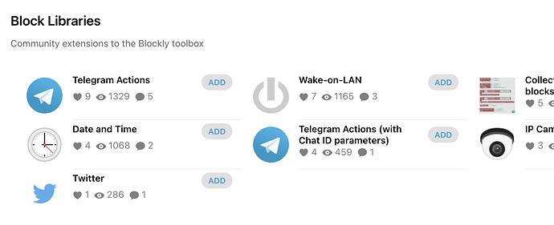

Click on it and add it and return to your rule.
Now you will find that there is a dateTime entry under "Libraries".
It looks like we will be using the "now" (the current time), "ZDT from item" (sunset time from the Astro binding), the ZDT with date" (hard coded time), and the "is" block to make the comparisons.

#### Build the Condition

Now that we have the blocks we need, let's build the Condition.
First notice that we have the same operation that needs to be executed twice.
Often, when one encounters this situation, a function is a way to save duplicated effort.
Let's try that here.

Under "Functions" drag the "to do something" block with the return statement.
Next to "to" give it a meaningful name, we'll use "compareDTs".
In this case, in order to do something useful we need to pass arguments to the function, two date times.
To do this click the cog icon.
This will bring up a way to add or remove features to any block that has the cog.
In this case we want to add two "inputs".
Drag them from the left to the right and give them names.
You will now see the two inputs listed on the block.

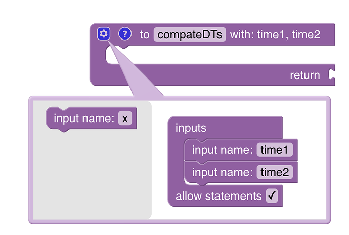

Now we want to compare the two passed in date times and return a value to indicate whether time1 is before or after time2.
We will use `1` to indicate that time2 is after time1 and -1 to indicate that time2 is before time1.
So first we need to create a variable so under Variables create a new variable called "tcomp" for "time compare".
Then drag "set tcompt to" and dock it inside the function.
Go to Math and drag the "123" block to plug into the "set" block.
Change the value to "0".

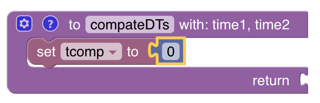

Now we will add an if statement to compare the times.
We have two conditions to we will use the cog to add an "else if" to the if statement to.
You can find the "if" block under "Logic".

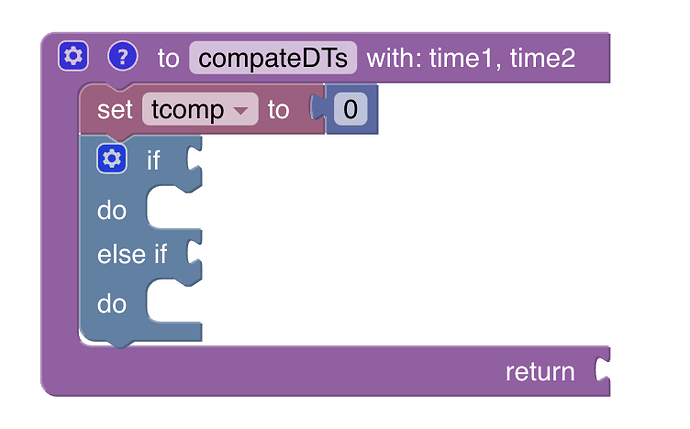

Now we will use the new "is" block from the library to see if time1 is before time2 and set tcomp to 1.
Drag the 'is" block and plug it into the first if socket.
Then under "Variables" drag the "time1" variable and plug it into the first slot after "is".
Drag time2 to the the slot after "before".
We only care about the time so change the config after "use" to "time" and keep the resolution at "seconds".

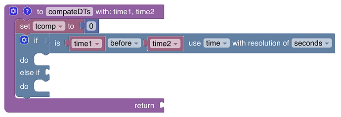

In this case we want to return `1` so right click on the "set tcomp" to block and choose "duplicate".
This will create a copy of that set of blocks.
Set the value to to 1.
Drag the block next to the first "do".

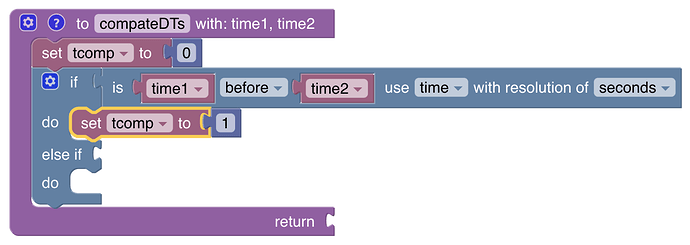

Duplicate the "is" and "set" blocks again to populate the "else if", this time setting to -1 when time1 is after time2.

Finally, drag the "tcomp" variable and plug it into the "return" socket.

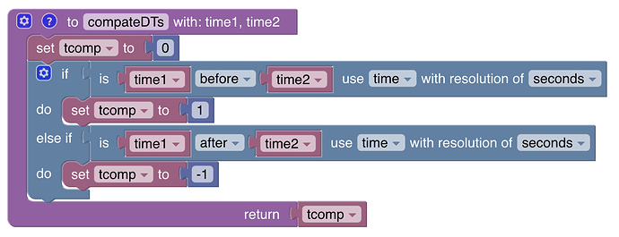

The hard work is now done.
Now we just need to create a statement when `now` is between sunset and 23:00.
To keep the blocks from getting too long and complicated, let's create some variables: "start" for the sunset time and "end" for 23:00.
Set "start" to the "ZDT from item", selecting the Sunset Item.
Set "end" to the ""ZDT with date" block.
Set the time to "23:00:00" (we don't care what the date is set to).

Notice how the statements are not connected to our function.
They represent a completely separate block of code.
As previously mentioned, the flow of execution is top to bottom so it is a good idea to put functions above the code that calls them.

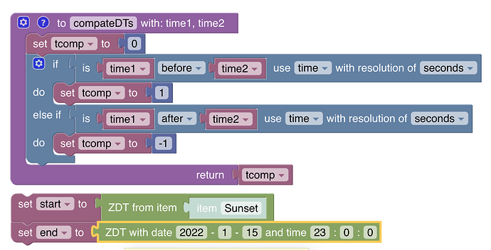

Now all we need is the condition that evaluates to true or false when now is between start and end.
From "Logic" drag the block that has "and" in it to just below our setting of the end variable.
Normally a condition like this would dock to an if statement but we are going to use it on it's own.

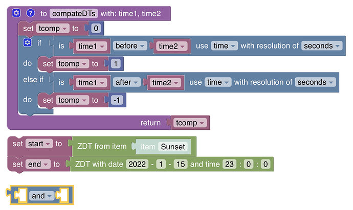

In the first slot, from the "Logic" category drag the block with "=".

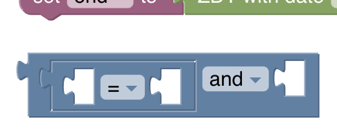

From "Functions" drag the block named "compareDTs" to the first open slot.
This is our function.
Plug in "start" from variables for "time1" and "now" from the dateTime library for "time2".
From Math plug in "1" in the slot after the "=".

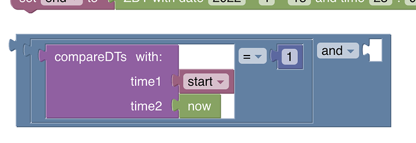

Click under the "=" to select the whole comparison and duplicate it.
Plug the duplicate into the slot after the "and" and change "time1" to "now" and "time2" to "end" and the number to "-1".

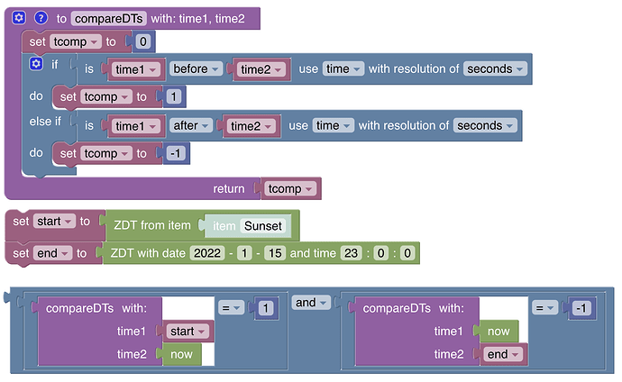

That's all there is to it.

Notes:

- The function probably doesn't add much here and it's use is somewhat contrived to demonstrate how to create and use one.
However, it does keep there from being too much all in one set of blocks which can become challenging to read and understand.

- What if the end time is after midnight?
Edge cases like that happen all the time and it will make your code much more complicated.
But don't be afraid to deal with them. Take it slow and gradually build up to them.

- That script condition could use some logging too.
What do you think it makes sense to log out?

## Debugging and Troubleshooting

No one writes perfect code all the time the first time.
So what is one to do when it doesn't work as expected?

- Add logging and make sure to log out meaningful information such as the values of variables.
Look in the "Text" category for operations to combine strings together for logging.

- Watch the logs for errors, your log statements, and relevant events  (see the [Blockly Reference]({{base}}/configuration/blockly/index.html) on how to easily access log information)

- When asking for help on the forum, don't *just* post a screenshot of the blocks.
Also post the code the blocks generate or, even better back out of the script to the rule and post the contents of the "Code" tab which gives the helpers on the forum the full picture.

Note that you can even add comments to your blocks to document the intention of a block of code.

These comments are reflected in the generated code.
Right click on a block and choose "add comment".

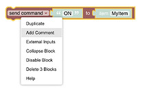

Comments are a great way to document reminders and give future you a hint on what you were thinking as you wrote this code.

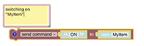

- Simplify when a rule doesn't work and gradually rebuild it.

## Tips and Tricks

- Build the rule gradually, testing each step of the way.

- Make heavy use of logging and watch the logs when testing.

- Create functions rather than repeat functionality.

- Functions can also be a way to break up big and complicated blocks into easier to manage and understand chunks.

- Use right-click and duplicate to create copies of blocks that are close to what you want.

- Look at the code that the blocks will render into to learn more about how the blocks work.
Click on the blue file icon in the lower right corner. 
You can also use the <kbd>Ctrl-B</kbd> keyboard shortcut to switch between the blocks and the code preview.

- In a pinch, under the "Run and Process" category there is an "inline script" block (since 3.1).
That will let you write your own custom few lines of ECMAScript 5.1 code.
This is a great way to deal with missing features in the Blockly blocks or to do something more efficiently than can be done with the blocks.
