# Scenes

Similar to Blockly rules,  _Scenes_ are rules that do not require coding.
Scenes allow you to define an item and its respective state very easily and combine multiple of them as a collection of item actions to be run.
Note that the _Scenes_ do not support triggers or conditions and need to explicitly triggered on a page e.g. via a widget or a marker on a floor plan run to that _Scene Rule_.

[[toc]]

## Create the Rule

Navigate to Settings and Scenes and click on the **+** icon in the lower right corner.

### Metadata

Each rule has four pieces of metadata.

| Metadata    | Purpose                      | Notes                                                                                                                                                                                                                                            |
|-------------|------------------------------|--------------------------------------------------------------------------------------------------------------------------------------------------------------------------------------------------------------------------------------------------|
| Unique ID   | Uniquely identifies the rule | Must be completely different from all other rule's UIDs, initialized with a random value but it is strongly recommended entering your own UID                                                                                                    |
| Name        | "title" of the rule          | This will be the name under which the rule is shown in MainUI and is the primary field used for search and sorting                                                                                                                               |
| Description | Describes what the rule does | Do not skip, provide information about what the rule does and what it does it to; leave breadcrumbs you can use later to associated rules with Items and Channels                                                                                |
| Tags        | Arbitrary tags               | Another place to leave breadcrumbs or to group rules together. Note the `Script` and `Schedule` tags have a special meaning (see previous page), and although Semantic tags are available, rules are not yet integrated into the Semantic Model. |

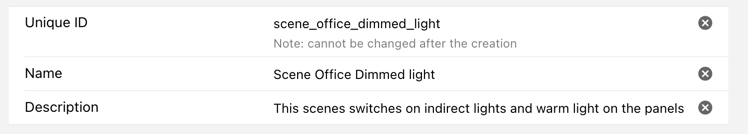
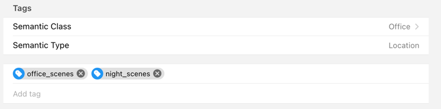

Here is how this rule appears in the list of rules (note the use a couple of tags):

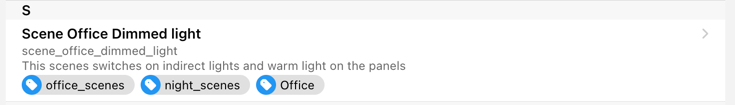

All but the Unique ID can be changed later.

### Configuration (Actions)

Finally, we want this rule to send some commands our items which is very convenient to configure in this editor.
First, it is recommended you put all of your items in to the state that you want to store as scene.

After your scene of all the devices in your room (or house) has been set up, you assign these in the following section:

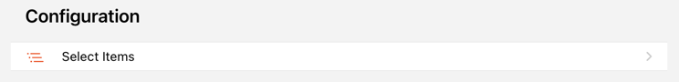

Choose the item either by clicking on  to select it via the semantic model or on 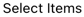 via an item list.
Note that you can select multiple items at the same time.

The item will then appear in the list together with the current state shown next to it.
This state will later be sent when the rule is executed.

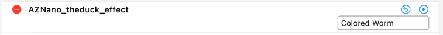

In the above case the effect "Colored Worm" would be sent to the light panels.
If you are not happy with that state either overwrite it manually or set the item to the state you want and the press the arrow to refresh to the current state:

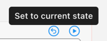

The  allows you to test the item state value that is currently chosen.

Add as many items until you end up with the scene that you wish to create:

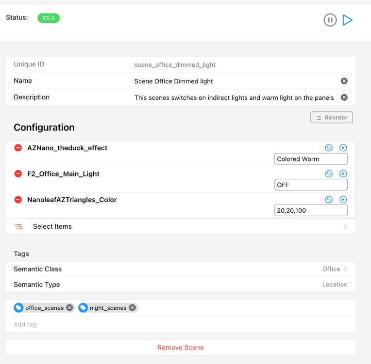

You can reorder the items via the 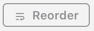 button.
This also defines the sequence within which the commands are sent to the device's items.

Similarly to all other rules the play button  allows you to run the rule and test it out that way and the pause button allows you to halt the rule in case you want to prevent it to be executed.
Saving can be done via Cmd/Ctrl-S and will automatically be done in case you press the play button.

#### Delete an item command action / the whole scene

To delete an item command press  on the left-hand side and then  on the right-hand side.
This does not, of course, delete an item from openHAB but only the command action for that scene.

On the bottom of the screen you can remove the whole scene rule by clicking on "Remove Scene".

### How to trigger a scene

Triggering a scene has to be done via a widget / card / marker or another rule.

#### Widget / Card or Marker on a floor plan

Create a label card on a page, give it a title and then open up the configuration dialog.

Choose the type of action to perform

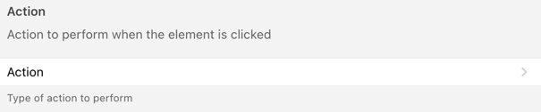

then select "Run scene, script or rule"

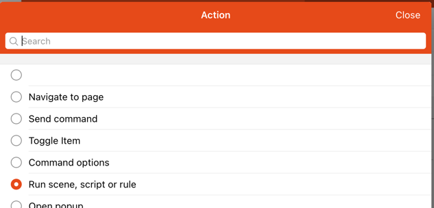

then click on "Scene, Script or Rule to run" and select from your list of scenes:

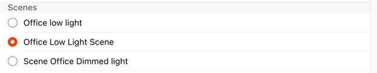

When you now click on that label card, the scene rule will be triggered and all of your item states will be sent as a command to these items.

#### Rule

If we want to use triggers that are known from other rule types we can write such a rule, define that trigger and let that rule call the scene rule.
See the details there on how to create a trigger (e.g. a cron trigger that will call the blockly rule at 22:00 in the evening) to execute that rule.
The section below provides examples for Blockly and various rule/script languages.

:::: tabs

::: tab Blockly
Use the following block and add the _scene id_ to the block to call the scene

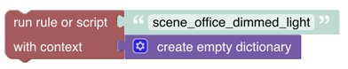

Save it and that's it.
:::

::: tab JS

```javascript
 rules.runRule('scene_office_dimmed_light', {});
```

:::

::: tab JRuby

rules[“id”] gives you the rule object for the given id, which supports the [trigger method](https://openhab.github.io/openhab-jruby/main/OpenHAB/Core/Rules/Rule.html#trigger-instance_method) (aliased as run).

```ruby
  rules["scene_id"].run
```

::::
