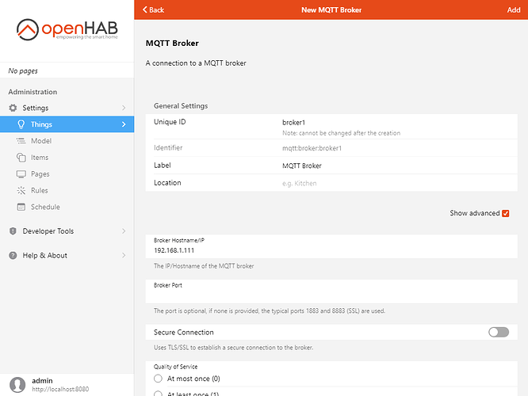



# Adding Things - Advanced

Some bindings and technologies simply do not support automatic discovery.
These technologies tend to be the most complicated to understand, configure, and use.
You the user will need to have at least a working understanding of the underlying technology to be successful.
For example, if you will use the Exec binding with openHAB running on Linux, you will need a working understanding of how to run commands on the terminal, file permissions, users, etc.

This tutorial will use the MQTT binding as an example.
Important note, the MQTT Binding also supports automatic discovery of Things for devices that use the Homie or Home Assistant standards in their topic structure and messaging.
In those cases, the MQTT binding works more like the Intermediate Thing example.

Scenario: You have a [MQTT-enabled plant sensor](https://github.com/ThomDietrich/miflora-mqtt-daemon), and for the purpose of this tutorial let's assume it doesn't respect the Homie or Home Assistant convention, so it cannot be detected and configured automatically by the MQTT binding.
Instead, it's publishing metrics regularly in a simple JSON structure like the following on a preconfigured MQTT topic:

```json
{"light": 5424, "moisture": 30, "temperature": 21.4, "conductivity": 1020, "battery": 100}
```
{::options toc_levels="2..4"/}

- TOC
{:toc}

## Prerequisites
- A basic understanding of how MQTT works (HiveMQ provides a good [tutorial](https://www.hivemq.com/blog/mqtt-essentials-part-3-client-broker-connection-establishment/)
- An installed and configured MQTT Broker (e.g. Mosquitto which can be installed through openHABian if that is how you installed openHAB)
- A MiFlora device configured to connect to the MQTT Broker, or an MQTT client application (e.g. [MQTT Explorer](http://mqtt-explorer.com/), [MQTT.fx](http://mqttfx.org/) that allows one to publish and subscribe to MQTT topics

## Install the Binding and Transformation
This device publishes JSON formatted messages so we need to install an add-on that can process JSON: the JSONPath Transformation.
A Transformation takes incoming data and transformes is somehow.
In this case it will extract certain fields from the JSON.
From Settings, click on Transformations under Add-ons.


Click on the blue "+" button, and find JSONPath Transformation. Click on it, then Install.


Wait for it to disappear from the list, then click back twice to go back to Settings.

Next, install the MQTT binding: click on Bindings, then the "+" button, find the MQTT Binding, click on it than Install.
Wait for it to disappear from the list, then go back twice to return to the main Settings screen.

## Create the Bridge Thing
First, we need to add the broker, which is a Bridge.
Click on Things.

Click on the blue "+" button.

Choose "MQTT Binding", then choose "MQTT Broker".


Fill in the details to connect to the broker, you may also alter its ID and name.
If you need credentials to connect to the broker, click on "Show advanced" to reveal additional options, including Username and Password.



## Create the Generic MQTT Thing
Now we have to add the plant sensor itself as a generic Thing.

On the Things page, first verify that the broker is indeed present and online; if so, click on the blue "+" button then MQTT Binding.

Note that you might have results under "Discovered things" already appearing if you happen to have auto-discoverable devices publishing messages to the broker.

In our case, click on Generic MQTT Thing under "Add manually".

Change the ID and label if you wish.

The important setting is to choose the Bridge that the new Thing will work with.
Click on Bridge and choose the broker that you configured above in the list.
Then click "Add" in the top-right corner.

Back on the Things page, choose the Thing you created.
It should be marked online, but it will not have any Channels on the Channel tab - you have to configure them yourself.


Click on Add Channel.

Let's add the temperature first.
Fill in the "channel identifier" and "Label" fields accordingly: for instance, `temperature` as the identifier and `Air Temperature` as the label.

This channel will provide numbers, therefore choose the Number value channel type for the new channel.
Scroll down and enter the MQTT topic receiving the JSON message in the MQTT State Topic field.
However, we don't want this channel to provide the whole message, only the temperature part.

Click on "Show advanced" above MQTT State Topic to reveal more settings.

Scroll down, find the "Incoming Value Transformations" setting, and specify the transformation to apply there:

```
JSONPATH:$.temperature
```


Click Done in the title bar to add the channel, it should now be added to the Channels tab.


Repeat the procedure for the other channels:

Value | Label | Type | Incoming value transformation
-|-|-|-
light | Light Intensity | Number value | `JSONPATH:$.light`
moisture | Soil Moisture | Number value | `JSONPATH:$.moisture`
conductivity | Soil Conductivity | Number value | `JSONPATH:$.conductivity`
battery | Battery Level | Number value | `JSONPATH:$.battery`

All channels should specify the MQTT topic where the JSON message is published.

If you want to check the configuration for a channel, or made a mistake while adding it, open the channel details by clicking on it, and choose Configure Channel.


Note that you cannot change the channel type if you picked the wrong one, in that case, remove the channel by clicking on Remove Channel and add it again.

This concludes the Thing discovery and creation examples.
Next Items and the model.

Next: [The Semantic Model]({{base}}/tutorials/getting_started/model.html) -->
Previous: [Adding Things - Intermediate]({{base}}/tutorials/getting_started/things_intermediate.html)