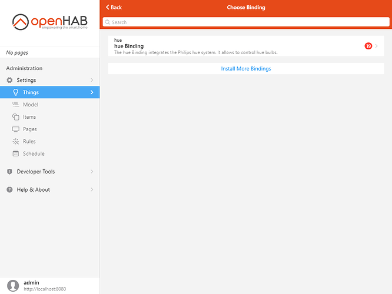
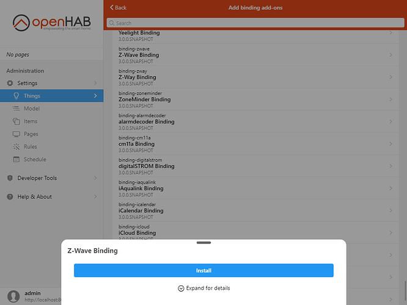
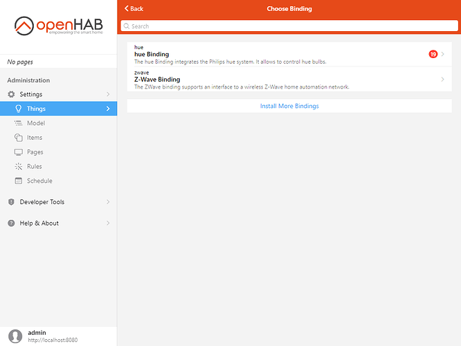
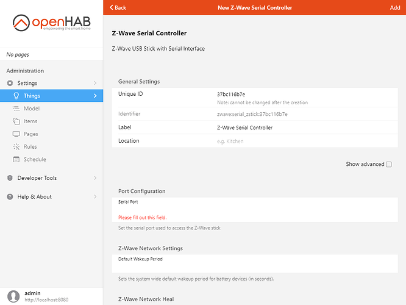
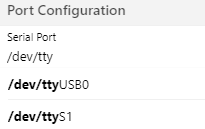


Previous: [Adding Things - Simple]({{base}}/tutorial/things_simple.html)

# Adding Things - Intermediate

This section will show an example for dealing with a binding where the bridge Thing cannot be automatically discovered.

Scenario: you have some Z-Wave devices, including a wall plug and a rollershutter module, and a Z-Wave controller stick connected to the computer running openHAB.

{::options toc_levels="2..4"/}

- TOC
{:toc}

## Install the Binding
From Settings, go to Things, then click the blue "+" button.

We need to install the Z-Wave binding.
Click "Install More Bindings".

Find the Z-Wave binding, click on it then click Install.

Wait for it to disappear from the list then go back.

## Create the Bridge Thing
Click on the new option: Z-Wave Binding.

Click on Z-Wave Serial Controller to add the controller.

We need to specify one required parameter, the serial port.
In certain cases, depending on your system, you will be provided with a list of options for this setting.

Choose the correct port, alter the name and/or ID of the controller Thing, then click Add in the top-right corner.

## Discover Things
Once back on the Things screen, click on the "+" button then Z-Wave Binding again.
Click scan and all the devices already paired with the Zwave controller will be discovered and appear in the Inbox.
To pair a new device, while on this screen, perform the procedure specific to the device to include it in your network.
Go to the add-ons section of [this site]({{base}}/addons/bindings/zwave/doc/things.html#things-supported-by-the-z-wave-binding) and search for for the device model in the search bar.
The page should give you details on the inclusion procedure.
Alternatively, look in the device's documentation from the vendor.

Once included the device should appear in the Inbox, and on the "Add a new Thing: zwave" page.

Approve it the usual way.
Repeat the procedure for every Zwave device.

Note: Battery powered devices will be discovered but may remain as an "unknown" type until the device has woken up enough for the binding to discover what it is.
On it's own this process can take days.
To speed up the process activate the device several times until the Thing shows the correct device.

As shown, some technologies like Zwave and Zigbee require additional manual steps to add them to openHAB.
However, there are some technologies and bindings that simply do not support automatic discovery at all.
