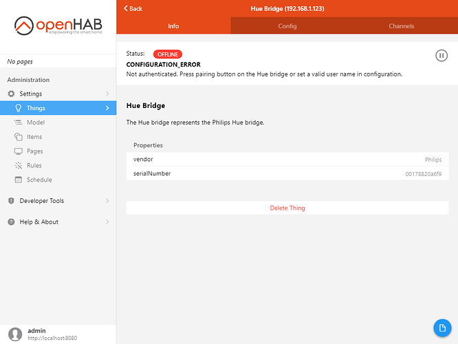



# Adding Things - Simple

As covered in the [concepts section]({{base}}/docs/concepts/index.html) of the openHAB Docs, a binding is an add-on to openHAB that understands how to communicate with a specific home automation technology or API.
A Thing represents a single device in openHAB.
Each sensor (information provided by the device) or actuator (control on the device that causes it to do something) is represented by a Channel on the Thing.
Things are the connection between openHAB and your external device or API using the binding.

Some technologies require a special type of Thing called a "bridge".
A bridge is a device or connection through which openHAB connects to other devices.
For example, in this tutorial light bulbs are accessed through a hub device.
That hub device is represented by a bridge Thing.

This tutorial covers an example of the easiest and most common method for adding Things: using automatic discovery.

Scenario: You have some Philips Hue light bulbs connected to an official Hue bridge.
In this case, the Hue binding supports auto-discovery of both the bridge and the bulbs and other devices attached to it.

{::options toc_levels="2..4"/}

- TOC
{:toc}

## Install the Binding

After logging in as an administrator, click on `Settings` from the sidebar, then click on `Things`.

Click on the blue "+" button located at the bottom-right corner.

Since you have no bindings, this screen will appear:

Click on `Install Bindings`.

Look for the Hue binding.
Note the search bar at the top can help find bindings quickly by filtering the long list.
Click on the binding, then on Install.

It will take from a few seconds to a minute for the binding to install...

Wait for it to disappear from the list, then click < Back (or use the browser controls).
The Hue binding will now appear on the previous screen.
You will notice that the auto-discovery has already detected something (note the red "1" badge).

## Accept the Discovered Bridge Thing

Click on the binding.

The bridge has indeed been detected and appears under Discovered Things.
If not, you can try again by clicking the `Scan Again` button.

 Thing

Click on the discovered `Hue Bridge`.

openHAB will ask you to confirm or change the label/name.
Click OK after naming the new Thing.

You will be taken back to the Things page, where the Hue Bridge should now appear.

However, we can see that it's marked offline.
To find out why we can click on the `Hue Bridge`.

The error description below the status gives some more information: You have to press the physical button on the device to let openHAB authenticate to it.
Once you've done this, the Thing will become online.

## Accept the Light Bulb Things

Go back to Things.
You will notice a new red button on that screen.

This means that there are newly discovered devices that you can add.
Since the Hue bridge is now working, the binding has detected all the Hue devices (bulbs, switches and so on) attached to it.

The Inbox shows a consolidated view of all the discovery results.
Alternatively, you can also click on the "+" button to get a per-binding view and the ability to perform a new scan.

Click Inbox.

You can either click on an individual thing to see actions related to it, or you can click on Select in the top-right corner to add check boxes beside items, which will allow you to perform actions on several inbox entries at once.

These actions are:
- Approve: To promote the candidate from the Inbox to a Thing.
- Ignore: To hide the candidate from the list (you will be able to see it again and un-ignore it by clicking on "Show ignored" above the list).
- Remove: To remove the candidate from the Inbox (it might be detected again later).

Now go back to Things.
The newly approved Hue Things should appear on the list.

You now have the Bridge Thing and the two light bulbs added to openHAB.
Thankfully most of the bindings you will work with in openHAB will work in this simple way.
However, there are some technologies that require a bit more manual configuration.
