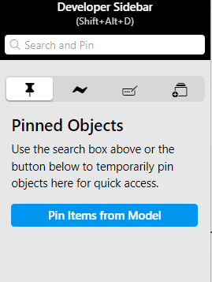
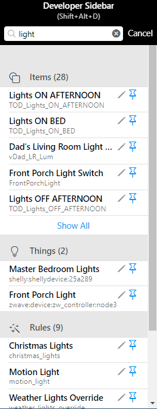
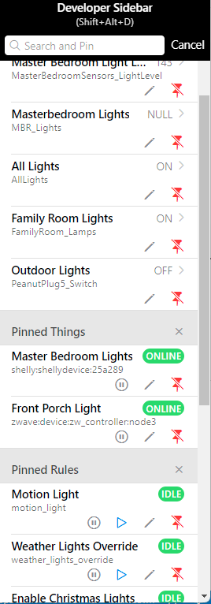
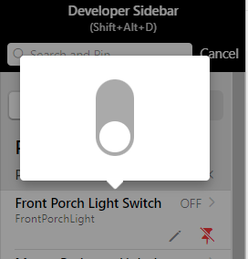
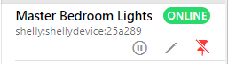
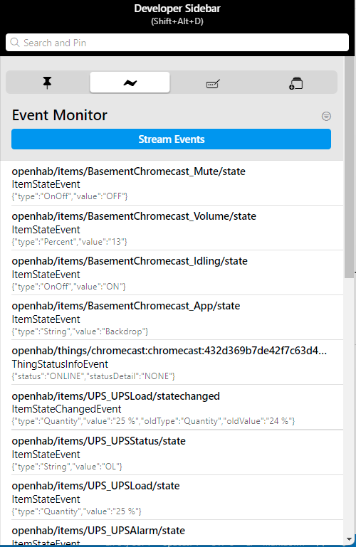
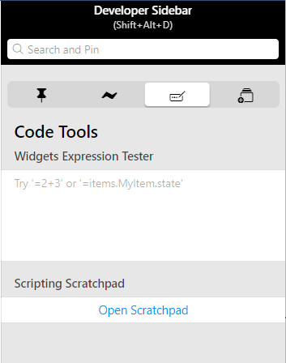
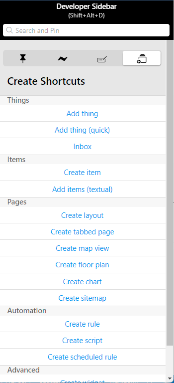

# Tips and Tricks

This section is dedicated to generic tips and tricks to make your use and configuration of openHAB easier.
They are discussed in no particular order.

[[toc]]

## Backups

Always create and maintain a recent backup of your openHAB config.
When installed on Linux there will be an `openhab-cli` command line tool that supports backup and restore.
For other systems, under `$OH_HOME/runtime/bin` you will find `backup.sh` and `restore.sh` (or `.bat`).
Note that these will back up both text based configs and anything done through the UI.
However, it only does backup and restore for openHAB, not external services.

When you maintain backups, you have the freedom to explore and experiment without risking breaking everything.

## Don't Wait, Try it Out!

If you know what you want to try but you just don't know what will happen, don't post a new thread on the forum or spend hours reading through the docs and the forum.
Instead, try it out and see what happens.
If you have backups, there is little you could do that will actually break things.

## Developer Sidebar

MainUI has a tool called the Developer Sidebar.
Bring up the sidebar through Developer Tools or the key combination <kbd>Alt</kbd><kbd>Shift</kbd><kbd>D</kbd>.

Note that the sidebar will not come up if your display is too narrow.
It will not work on a phone nor in portrait mode on most tablet displays.

There are four tabs on the sidebar, and the search field at the top.

### Search

Imagine you need to find all usages of an Item in rules or pages.
You could open all your rules and pages to check them, or just use the developer sidebar search.
Enter your Item name, and you will see in which rules, scenes, scripts and pages that Item is used.

For more information about the search and which entities are searchable, please refer to the [Developer Sidebar docs]({{base}}/mainui/developer/sidebar.html#developer-sidebar-search).

### Pinned Objects

Let's say you are working on your lighting automations which involves Things, Items, and Rules.
Instead of keeping a dozen browser tabs open and flipping between them you can pin these objects to the sidebar.

Enter a search term in the search filed at the top to search within Items, Things, Rules, Scripts, Scenes and Pages.
The search term can be part of an object's name, ID, label, etc.

Once you find an object that you want to pin, click the push-pin icon to keep it in the list.
Once you've pinned all the objects you want, click the `x` icon in the search bar.

Once pinned each entry will show some relevant controls and status.
All object will have a pencil icon which will take you straight to that object's page where it can be edited.
Clicking the red push-pin icon will unpin the object from the sidebar.

To the right of Items will be their current state and often clicking on that state will bring up that Item's default widget where it can be controlled.

Things will show the current status of the Thing to the right and additionally have a pause icon that can be used to disable the Thing.

Rules show the rule's current status to the right.
This is one way to monitor when a rule is running as the current status will change to show the rule is running.
However, if the rule runs very fast it might flash too quickly to see, so there are other ways to monitor that (see below).

In addition to the enable/disable control, rules also have a play icon where the rule can be manually triggered.

Once everything you are currently working on is pinned in one place, developing capabilities becomes much easier because everything you need is right there and you can get to everything you need to with one click.
Objects will remain pinned until the sidebar is closed, even if you click to other tabs in the sidebar or navigate to another page in MainUI.

### Event Monitor

The next tab is the Event Monitor.
This tab provides a filterable raw stream of all the events happening in openHAB.
Believe it or not, what you see in events.log is a greatly reduced set of events.

Item events (update, changed, received command), Thing events (e.g. change in status), and rule events will appear in this stream.
But on a typical system a lot of events will be happening all the time.
Often one will want to filter.
Clicking on the filter icon lets you enter a comma separated list of events that should be streamed.
The list is `OR` meaning is any one matches the event will be shown.
For example, entering `*Hum*` would only show those events that include "Hum" in the names.

This tab is a great tool to use when debugging a problem and developing rules and for many is more convenient than monitoring the logs in another tab.

### Code Tools

The next tab presents a couple of tools to aid in coding: expression tester and scratchpad.

#### Expression Tester

This tool is useful when developing custom widgets.
Once can enter and see the results from expressions used to make widgets more dynamic and it is a great place to gradually build up a complicated expression, testing it each step of the way.

#### Scratchpad

Clicking on this will open up a Script (rule with a single Script Action, no triggers or conditions) named "-Scratchpad-".
This is intended to be a free form place to put in and manually execute some arbitrary and temporary rules code to test out how to do something or cause a complex set of behaviors to run.
For this reason it's great for testing and debug.

### Create Shortcuts

Finally, when developing a new capability a number of new objects will need to be created, such as adding a new Thing, creating some Items linked to that Thing, a rule or two and a custom widget or two.
This fourth tab has quick links to create any sort of Object that can be created in OH saving you from needing to click through the Settings menu multiple times to create different but related objects.

## Consider the logs

Sometimes you may face errors, even if you tried your best with developing a working solution.
In cases where the failure can not be found in a fast way you can have a look at the logging output that openHAB provides.

Accessing the logs depends on different factors (e.g. the way you have installed openHAB).
You can find an overview of how to access and handle logging in the [corresponding article](/docs/administration/logging.html).

## Save Examples

When you figure out how to do something tricky in rules that you may want to use again, create a Script with an example.
Over time you will build up a catalog of references so when you need to remeber how to create a timer (for example) you can bring up that Script and see the code.

## Where's it all Being Saved?

Everything presented in this tutorial is "managed" and saved to a text based JSON formatted database in `$OH_USERDATA/jsondb`.
This folder contains a number of files, one for each type of entity within openHAB.
These files are automatically backed up on changes.
If you ever want to see the raw config data, these are the files to look in.

## API

openHAB, like many systems has a robust REST API through which external software can interact with openHAB (e.g. push an update to the state of an Item).
An interactive and detailed documentation for this API can be found under Developer Tools -> API Explorer.
This is another place where one can see the raw config data for objects in openHAB (e.g. an Item's config).

## Asking for Help

The forum is a great place to ask for help when you get stuck.
Most posts are answered within a couple of hours.
To maximize the likelihood of getting good help, please consider the following:

- do not withold information (except security related stuff like passwords); if it doesn't work you likely don't know what is relevant or not
- provide lots of details
- post code, logs, and other configs using code fences to preserve formatting
- avoid posting screen shots of configs or logs where possible; post the text from the "Code" tab
- answer all questions when asked for more details
- be polite.

A detailed tutorial on how to ask for help can be found at [Help Us Help You](https://community.openhab.org/t/how-to-ask-a-good-question-help-us-help-you/58396).
