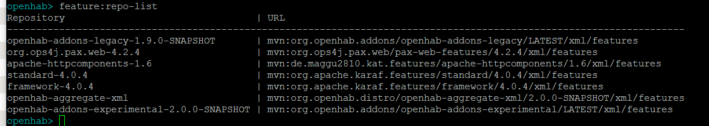
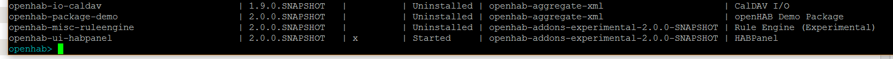
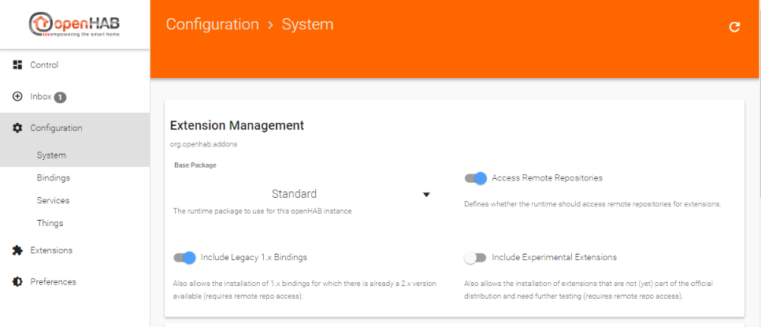
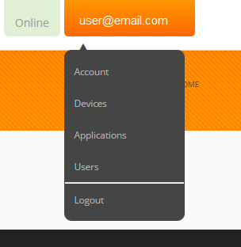
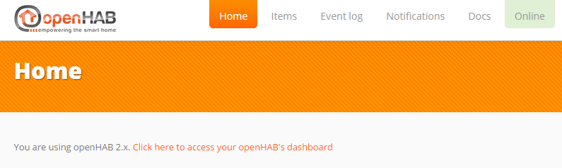



# Migration from openHAB 1.x to openHAB 2

This tutorial provides a step-by-step procedure for migrating an existing openHAB 1.x installation to openHAB 2 snapshot. These procedures were generated starting from an apt-get installed openHAB 1.8.3, though they should work for previous versions. Where needed, additional details are provided for other platforms (Windows, OSX, non-Debian based Linux, etc.) and manually installed openHAB 1.x installs.


These instructions emphasize the text based procedures over the use of PaperUI and Habmin which is closer to the openHAB 1.x experience.

Note: In all of the other pages in this documentation, openHAB 2 is simply referred to as openHAB. In order to distinguish between the two versions in this, the current version is referred to as openHAB 2.

This page is structured as follows:

{::options toc_levels="2..4"/}

* TOC
{:toc}

## Preparation

Now is the time to consider and plan for your newly installed openHAB. Some
questions to ask and answer include:

- Are you happy with your current deployment and maintenance of the deployment?
- Do you have or need to change your backup and configuration management
practices?
- Have you wanted to migrate to a container (e.g.
[Docker]({{base}}/installation/docker.html) or a virtual machine)?
- Do you want to start over fresh on a brand new OS install?

Your answers to these and other similar questions will help guide you to
prepare your installation before you start the migration. For example, if you
want to start using git to back up and configuration manage your openHAB
configurations, or if you are considering moving to
[Docker]({{base}}/installation/docker.html) or a VM or starting over fresh (e.g.
[openHABian](https://github.com/ThomDietrich/openhabian)), now is a good time
to start the process.

The following procedure primarily focuses on an in-place migration. If you are
migrating to a fresh install, container, or another VM some of the following
steps can be skipped. Those steps are identified.

One major consideration is that at the time of this writing openHAB 2 does not
implement authentication and authorization (i.e. no username and password). If
you are relying upon port forwarding to access your openHAB server remotely
instead of via a VPN, SSH tunneling, or [my.openhab](https://my.openhab.org/),
we highly recommend [setting up a reverse proxy]({{base}}/configuration/nginx.html).

## Backups

The first step is to backup everything that you have modified in the existing
openHAB 1.x installation. If you installed using apt-get these files may include:

- `/etc/openhab` - configuration files
- `/var/lib/openhab` - openhab user's home directory, zwave and embedded
persistence database files
- `/usr/share/openhab/webapps` - custom icons, custom webviews (e.g.
[Weather Binding](https://github.com/openhab/openhab/wiki/Weather-Binding))
- `/usr/share/openhab/bin` - custom command line arguments to the Java Virtual
Machine, changes to the default ports, etc.
- `/etc/default/openhab` - an alternative place to change default ports

If you are on an operating system that does not support apt-get or performed a
manual installation for some other reason simply backup the whole
`<openhab home>` directory.

## Shutdown openhab 1.x

One cannot run openHAB 1.x and openHAB 2 at the same time on the same
machine with default settings. They both use the same networking ports and
some bindings require exclusive access to hardware resources (e.g. zwave,
RFXCOM).

On an apt-get installed openHAB 1.x running on a systemd based OS (Ubuntu 15+,
Raspbian Jessy+) run:

```bash
sudo systemctl stop openhab.service
```

On manually installed systems follow your usual procedure for stopping openHAB
(e.g. `<ctrl>-c` in the window where start.sh or start.bat was run).

## Install openHAB 2

Follow the instructions for your platform [here]({{base}}/installation/index.html).

There are two choices to make: Beta or SNAPSHOT, and Offline or Online. Once
the final release of openHAB 2 is made, the Beta will turn into the latest
stable version.

The Beta release represents a point in the development of openHAB where the
core of openHAB and most of its bindings are deemed stable and ready for broad
test. The SNAPSHOT releases come from the nightly builds and represent the
absolute most recent version. While SNAPSHOT is less stable in terms that it is
undergoing lots of changes, this does not mean that SNAPSHOT is inherently less
stable. And since new features are added and bugs fixed after the Beta release
in some ways the SNAPSHOT is more stable and more capable.

The difference between the Offline and Online versions is whether or not all
the bindings are included in the initial installation (included does not mean
installed) or whether openHAB 2 needs to connect to and download the latest
bindings on demand. Offline is a good choice if your openHAB server does not
have access to the internet all the time.

If you plan on running openHAB 1.x as your primary while migrating make sure to
disable openHAB 2 from starting automatically.

```bash
sudo systemctl disable openhab2.service
```

## Prepare openHAB 2 for the Existing openHAB 1.x Configuration

Start your newly installed openHAB 2 instance per the instruction in the
installation guide for your platform and navigate to
`http://<openhab server ip>:8080` where `<openhab server ip>` is the address of
the server where openHAB 2 is running.

Congratulations, you have a running openHAB 2! See
[Concepts]({{base}}/concepts/index.html) and below for important differences between
openHAB 1.x and openHAB 2.

Theoretically one should be able to just enable the
[openHAB 1.x Compatibility Layer]({{base}}/developers/development/compatibilitylayer.html#how-to-use-openhab-1x-add-ons-that-are-not-part-of-the-distribution),
copy over the existing add-ons and config files and have it work. However, while
the compatibility layer is very good and very capable, this approach will
result in errors and end up being more work than the steps below. Therefore the
first steps will be to get it running using the 1.9 version of the bindings
installed through openHAB 2's new add-on management system.

There are three approaches one can use to install and configure bindings, an
all text based one, using the Karaf console, or using one of the administration
GUIs (i.e. PaperUI or Habmin 2). While all three approaches are presented below,
the text based approach is the recommended one for those coming from openHAB 1.x
as it will be more familiar and flexible.

### Text Based

In your configurations folder for openHAB 2 (`/etc/openhab2` on apt-get
installed instances) there is a new folder named `services`. In this folder you
will find a file named `runtime.cfg`. This file contains global openHAB 2
parameters. Open this file for editing and you will find a number of parameters
you may want to set. In particular for this tutorial we recommend setting:

- `org.eclipse.smarthome.persistence:default=mapdb` - default persistence, use
whatever was set in `persistence:default` in openhab.cfg
- `autoapprove:enabled=false` - makes it so you must manually approve
automatically discovered Things in the Inbox (see below)
- `org.eclipse.smarthome.links:autoLinks=false` - prevents openHAB from
automatically creating an Item for each automatically discovered Thing.

Next open for editing `addons.cfg`. This file contains parameters related to
add-ons including allowing one to choose which add-ons to install. For now just
set the following parameters:

- `package = expert` - expert is a good choice here. It will include the standard
UIs, all transformation services and the 1.x compatibility layer,
though you can choose your UIs and add-ons individually later.
- `remote = true` - required for the installation of legacy 1.x add-ons
- `legacy = true` - required to install the 1.9 version of an add-on for which
there is a 2.0 native version
- `binding = ` - a comma separated list of the bindings from openHAB 1.x that
you use. If you are in doubt of the name of a binding, look in openhab.cfg for
that binding's configurations. The first part of the tag in openhab.cfg will be
that name of the binding. For example, the configuration parameters for the
MQTT Binding start with "mqtt" in openhab.cfg so the name of the binding is
"mqtt". For those bindings that have a 2.0 version, use the name followed by a
"1", for example, to use the 1.9 SNAPSHOT version of the Astro binding instead
of the 2.0 version, use the name "astro1". You can find the list of 2.0
bindings [here]({{base}}/addons/bindings.html).
- `ui = ` - if you intend on using PaperUI include "paper", if you use zwave I
recommend "habmin". The list of UIs are [here]({{base}}/addons/uis.html).
- `action = ` - the list of action add-ons you used in openHAB 1.x.
- `transformation = ` - the list of transformations you use. Unlike in openHAB 1,
one must install transformations separately.
- `voice = ` - see [here]({{base}}/addons/voices.html)
- `misc = ` - myopenhab, homekit, etc. Do not list myopenhab at this time,
instructions for it are below.

If you have any doubt as to what add-ons are available and in which category
they belong you can follow the instructions below for listing the bundles in
the Karaf console or install PaperUI and browse the list through it.

This is a great opportunity to identify those add-ons you are not actively
using and avoid their installation.

When you save this file openHAB will begin the download (if using the Online
version) and installing the add-ons.

Note: if running in Docker, create <openHAB 2 home>/userdata/persistence prior to saving the
file if there are any persistence add-ons.

An example addons.cfg:

```bash
# The base installation package of this openHAB instance (default is "standard")
# Valid options:
#   - minimal  : Installation only with dashboard, but no UIs or other addons
#   - simple   : Setup for using openHAB purely through UIs - you need to expect MANY constraints in functionality!
#   - standard : Default setup for normal users, best for textual setup
#   - expert   : Setup for expert users, especially for people migrating from openHAB 1.x
#   - demo     : A demo setup which includes UIs, a few bindings, config files etc.
#
package = standard

# Access Remote Add-on Repositories
# Defines whether the remote openHAB add-on repository should be used for browsing and installing add-ons.
# This not only makes latest snapshots of add-ons available, it is also required for the installation of
# any legacy 1.x add-on and all experimental features. (default is false for offline distro, true for online distro)
#
remote = true

# Include legacy 1.x bindings. If set to true, it also allows the installation of 1.x bindings for which there is
# already a 2.x version available (requires remote repo access, see above). (default is false)
#
legacy = true

# A comma-separated list of bindings to install (e.g. "sonos,knx,zwave")
binding = zwave,astro1,http,mqtt,nest,networkhealth,ntp

# A comma-separated list of UIs to install (e.g. "basic,paper")
ui = paper,classic,habmin,habpanel

# A comma-separated list of persistence services to install (e.g. "rrd4j,jpa")
persistence = influxdb,rrd4j,mapdb

# A comma-separated list of actions to install (e.g. "mail,pushover")
action = nma,mail

# A comma-separated list of transformation services to install (e.g. "map,jsonpath")
transformation = xslt,map,regex,javascript

# A comma-separated list of voice services to install (e.g. "marytts,freetts")
voice =

# A comma-separated list of miscellaneous services to install (e.g. "myopenhab")
misc = myopenhab
```

### Karaf Console

Following the instructions above to populate `runtime.cfg` parameters.

Log into the Karaf console with:

```bash
ssh openhab@localhost -p 8101
```

Use `habopen` as the password.

See the [Karaf Reference]({{base}}/administration/console.html) for details about
navigating and using the console.

Run the following command to see the list of add-on repositories currently
installed.

```bash
feature:repo-list
```



The following command will give the list of available add-ons.

```bash
feature:list
```


For each add-on you are using in openHAB 1.x, and for each transformation type
you are using, install the corresponding add-on using:

```bash
feature:install <add-on name>
```

using the name from the list. For example, to install the Weather Binding run:

```bash
feature:install openhab-binding-weather
```

To get a list of all currently installed items run:

```bash
feature:list | grep Started
```

At this time only install add-ons that are 1.9.0 SNAPSHOT. The 2.0 add-ons will
be installed later.

Note: if running in Docker, create `<openHAB home>/userdata/persistence` manually prior to
installing persistence add-ons.

### PaperUI Approach

These instructions assume no edits have been made to `runtime.cfg` or
`addons.cfg` as described in the previous section.

Navigate your browser to `http://<openhab server address>:8080` and select
PaperUI from the list of UIs. Navigate to `Configuration -> System` on the left
hand side and enable "Include Legacy 1.x Bindings" and "Access Remote
Repositories". This will allow you to install your current bindings even if
there is an openHAB 2 version available. Press "Save".



Now select "Extensions" from the left and browse or search for each of the
bindings and add-ons you currently use. Make note of those that do not appear in
the list. Do not install any binding that has a version 2.0. If there is not a
1.9.0 version we will install the binding manually (see below).

This is a great opportunity to identify those bindings you actually use and
only install those.

When you find a binding to install, press the Install button and wait for
installation to complete. Do not install the My.openHAB Binding yet.

If you are running openHAB in a Docker container you need to create
`<openHAB home>/userdata/persistence` manually prior to installing a persistence
add-on.

One thing to be aware of is any configuration done in PaperUI or Habmin gets
saved to a non-human readable database. And since none of the administration
UIs are currently capable of doing everything, you will end up with a mix of
database and text based configuration. This is why we recommend not using
PaperUI for those migrating to openHAB 2 from openHAB 1.x.

### Configure Add-ons

As bindings and other add-ons are installed, you can watch for errors in the
logs. Errors at this time may not be important but make note of those that did
generate errors during installation for special attention later.

Once a binding or add-on is installed, it will create a
`<openHAB 2 conf>/services/<add-on name>.cfg` file. Unlike in openHAB 1.x where all the
binding configurations are placed in the one openhab.cfg file, openHAB 2 has a
separate .cfg file for each binding. Transfer the settings for each binding from
openhab.cfg to its new .cfg file, removing the binding name from the parameter.
For example, the parameter `nest:refresh=300000` in openhab.cfg becomes
`refresh=300000` in nest.cfg.

Note that a .cfg file is not always generated. If one is not generated and it is
a binding that has a section in openhab.cfg, you can create one yourself and
transfer the settings as described above.

One important thing to note is that bindings and add-ons that require extra steps to register
with a cloud service like Nest and My.openHAB will require reregistering again
as if this were the first installation and configuration (e.g. you need to
generate a new pin code for Nest).

Unlike in openHAB 1.x, transformations are not automatically included in
openHAB 2. Make sure you include these in your installation as well.

### Installing Unofficially Supported openHAB 1.x Add-ons

Skip this section if all the add-ons you need have been installed already.

First check the [list of add-ons that are known not to work in openHAB 2]({{base}}/addons/1xaddons.html#currently-incompatible-1x-add-ons)
and make sure yours is not among them.

Next install the openHAB 1.x compatibility layer using the Karaf Console
instructions above.

Copy your openhab.cfg file to `<openHAB 2 conf>/services`. If you are running an apt-get
installed openHAB 1.x openhab.cfg is located in `/etc/openhab/configurations`.
For an apt-get installed openHAB 2 the `<openHAB 2 conf>` folder is located in
`/etc/openhab2`. For manually installed openHAB 1.x this file is located
in `<openhab home>/configurations` and in manually installed openHAB 2 it is
`<openhab home>/conf`.

This file will have a lot of redundant configuration information in it that you
have already moved over to individual binding .cfgs. Make sure to comment those
out and just leave the config parameters for the bindings you are manually
installing.

Now copy the add-on's jar files that you want to install to the `<openHAB conf>/addons` folder for
openHAB 2. For example:

```bash
cp /usr/share/openhab/addons/org.openhab.binding.astro-1.8.3.jar /usr/share/openhab2/addons
```

There may be some errors about there not being a `bind` and `unbind` method. If
everything worked you should see in the log the same entries from the binding
you see when openHAB 1.x starts.

Watch the logs for errors as they can be informative. For example, some Actions
require a corresponding Binding be installed first. An example error of this
sort looks like:

```text
2016-09-08 15:15:04.613 [WARN ] [org.apache.felix.fileinstall        ] - Error while starting bundle: file:/openhab/addons/org.openhab.action.astro-1.8.3.jar
org.osgi.framework.BundleException: Could not resolve module: org.openhab.action.astro [210]
  Unresolved requirement: Import-Package: org.openhab.binding.astro.internal.calc
```

Note, the above error is for illustration purposes. You should not be
installing Astro this way.

### Final Add-ons Installation Steps

openHAB 2 has a different
[folder layout]({{base}}/installation/linux.html#file-locations).
Of particular node are the configuration folders and userdata folders. See the
previous link for the location of these folders for your installtion.

As with openHAB 1.x, one must restart openHAB 2 to pick up changes to .cfg files.
Therefore restart openHAB 2 now.

If you haven't already, configure default persistence now. You can do this
through `runtime.cfg` or PaperUI.

Now openHAB 2 is ready to receive your other configurations, items and such.
Watch the log file as you transfer over files for errors. These errors will
have to be fixed.

Copy over your files in the following order:

```bash
cp <openHAB 1.x conf>/configurations/transform/* <openHAB 2 conf>/transform/*
cp <openHAB 1.x conf>/configurations/scripts/* <openHAB 2 conf>/scripts/*
cp <openHAB 1.x conf>/configurations/persistence/* <openHAB 2 conf>/persistence
Copy any custom icons added from webapps/images to <openHAB 2 conf>/icons/classic
Copy any custom webviews from webapps to <openHAB 2 conf>/html
cp <openHAB 1.x conf>/configurations/items/* <openHAB 2 conf>/items/*
cp <openHAB 1.x conf>/configurations/rules/* <openHAB 2 conf>/rules/*
cp <openHAB 1.x conf>/configurations/sitemaps/* <openHAB 2 conf>/sitemaps/*
```

## Necessary Changes


### Items

  * You must now manually install any Transformation engine your Items may use.

  * The **SCALE** transformation has evolved.
    * Old syntax that was `[minbound,maxbound]` has to be changed to `[minbound..maxbound]`.
    * Note that you now have the ability to exclude bounds from the ranges (e.g. `]minbound..maxbound]`) and also define open ranges`[minbound..]`.

### Sitemap

  * Change the default icons to png for ClassicUI and BasicUI if migrating custom icons. This can be done in PaperUI under Configuration -> Service -> BasicUI and ClassicUI. Set the "Default Icon Format" to "Bitmap".

  * Not all of the default icons that came with openHAB 1.x are available in the default set for openHAB 2. If you are missing an icon in your sitemap that could be the cause. The full list of openHAB 2 icons is [here]({{base}}/addons/iconsets/classic/readme.html).

  * Dynamic icons must have a default. For example, if one has a bunch of Wunderground icons (e.g. wunderground-chanceflurries.png) there must be a `wunderground.png` icon as well.

  * The URLs to the openHAB frontends have changed:
    * An overview of all installed UIs, including the administration UIs: [`http://<hostname>:8080`]()
    * The direct link to your Sitemap on BasicUI [`http://<hostname>:8080/basicui/app?sitemap=<your-sitemap>`]().
    * The direct link to your Sitemap on ClassicUI [`http://<hostname>:8080/classicui/app?sitemap=<your-sitemap>`]().
    * These and all further UIs can be accessed through the overview page.

  * The default sitemap is configured through a parameter for BasicUI and ClassicUI instead of naming the sitemap `default.sitemap`.

  * Static webview files are now located in `<openhab 2 conf>/html` instead of  `/usr/share/openhab/webapps`

  * The name of the sitemap (i.e. the word right after `sitemap` at the top of the file) must match the file name. For example the file named `myhome.sitemap` should start with `sitemap myhome`.
  * Charts no longer display a legend by default.
  If this parameter is not set, the legend is hidden if there is only one chart series.
  Add 'legend=true' to restore the chart's legend. 

### Rules
  * All references to org.openhab.core.* in imports and class references should be removed. All of these classes are automatically included and have moved.
  * import org.joda.time.* statements should also be removed.
  * To test for Items with an Undefined state replace `if(MyItem.state == Undefined)` with `if(MyItem.state == NULL)`. Case matters. `NULL` is only valid when testing an Item's state to see if it is undefined. `null` is used pretty much everywhere else to mean "no value" and usually indicates no result or an error.
  * The `HSBType` state type can no longer be constructed using a `java.awt.Color` object, and there is no longer a `toColor()` method.  Use the following alternatives:

```java
var HSBType hsb = HSBType::fromRGB(color.red, color.green, color.blue)
var Color color = Color::getHSBColor(hsb.hue.floatValue / 360, hsb.saturation.floatValue / 100, hsb.brightness.floatValue / 100)
```

Continue watching the logs as you move files over. There will likely be a number
of errors. Take note of them with plans to return and correct them if they
persist.

## Testing

- **Items**: Watch `<openHAB 2 userdata>/logs/events.log` and methodically work through all
of your Items activating and deactivating them one-by-one to verify the events
appear in the logs as expected. This may require running openHAB 2 for some
period of time and/or writing new rules, using the REST API, or external scripts
to exercise all the Items.
- **Persistence**: Check your persistence locations to see if all your persisted
Items are listed, if possible. Check your charts on your sitemap to make sure
they are being updated. Check openhab.log or the Karaf console log:tail for
errors when Rules call persistence methods to get historical data (e.g.
lastUpdate). Restart openHAB and verify those Items configured with
restoreOnStartup are initialized to their last state.
- **Rules**: When you first copy over your rules there will be many errors,
particularly if the rules assume that all Items have a state. One can easily
forget to check for NULL in an openHAB instance that has been running for some
time and one is using restoreOnStartup. But because this is a brand new instance
there are no values in the database to restore the Items to when openHAB starts.
- **Sitemap**: The most
common Sitemap issue will be missing icons. Browse through your sitemap
methodically and identify those entries that have a missing or wrong
icon. Select an alternative from the [defaults]({{base}}/addons/iconsets/classic/readme.html)
or copy the ones you were using from openHAB 1.x to the conf/icons/classic folder. 
Both BasicUI and ClassicUI pull their icons from that folder. For details on custom icons make
sure to check the icons section in the [Items]({{base}}/configuration/items.html#icons) documentation.
One important change since openHAB 1.x is that icon filenames need to be lowercase only in openHAB 2.

Once you are satisfied that your new openHAB system is up and running take a
deep breath and take a break. Let it run for a few days or a week and verify
that everything is working as it should. Watch the logs for inexplicable errors.
Once you are happy with how it is running you can start migrating to the openHAB
2 native bindings and start taking advantage of Things and Channels (see the
next section).

Now is also a good time to install [Eclipse SmartHome Designer](https://www.eclipse.org/smarthome/documentation/community/downloads.html)
to edit and review your files.


## New Concepts: Things and Channels

One of the new notions that people quickly come across when moving to openHAB 2
native bindings is that of a ["Thing"]({{base}}/concepts/things.html). To understand
what they are and how they relate to Items, we will compare them to how Items
are "bound" and configured in openHAB 1.x.

In openHAB 1.x (and importantly still for 1.9 version bindings running in openHAB
2) one had to add
["binding configuration"](https://github.com/openhab/openhab/wiki/Explanation-of-items#binding-config)
in curly brackets to the end of Item definitions in order to link that Item to
some control point on a physical device or API. The
[openHAB wiki](https://github.com/openhab/openhab/wiki) gives a nice examples of
how this looks:

```java
Switch  Light_Floor        "Light at Floor"                { knx="1/0/15+0/0/15" }
Switch  Presence           "I'm at home"                   { bluetooth="123456ABCD" }
Switch  Doorbell           "Doorbell"                      { serial="/dev/usb/ttyUSB0" }
Contact Garage             "Garage is [MAP(en.map):%s]"    { zwave="21:command=sensor_binary,respond_to_basic=true" }
String  Error_Ventilation  "Error in Ventilation %s"       { comfoair="error_message" }
Number  DiningRoomTemp     "Maximum Away Temp. [%.1f °F]"  { nest="<[thermostats(Dining Room).away_temperature_high_f]" }
```

Every binding came up with its own syntax for this binding configuration and
while the rest of the item file had nice syntax checks and content assist when
using Designer, this wasn't possible to provide for the binding configurations
themselves. The only way for the user to figure out what to put in there was to
visit the wiki page of the binding. This not only are syntax errors and typos
difficult to detest but it also prevents any "automated" editing of the binding
configurations, e.g. through user-friendly UIs.

Besides the syntax, the old scheme leaves the binding developers the choice to
implement multi-instance support or not. Usually most bindings started off
supporting a single instance only to notice later on that it would be useful to
add support for more than one. For example, you can see in the KNX binding
configuration above that it simply does not allow one to select an interface
(KNX system) to use for that Item. Instead, a single globally configured
connection is defined in the openhab.cfg file.

These issues were identified
[a long time ago](https://groups.google.com/d/msg/openhab/NSiveF9U1vk/PVLemrdrpVsJ)
and the concept of
[Things and Channels](https://www.eclipse.org/forums/index.php/t/668424/)
were introduced to solve them. The general idea is to standardize
the binding configuration and move it away from the .items file. A Thing
represents a configurable device/system/unit, which provides different
functionality through a set of one or more Channels. Each Channel corresponds
exactly to one binding configuration string (stuff in { }) in openHAB 1.x.

Let's look at a concrete example. The [Yahoo Weather Binding]({{base}}/addons/bindings/yahooweather/readme.html)
supports exactly one Thing which takes two parameters: a WOEID location and unit.

Thus, as described in the Binding's readme one would manually define a Thing in
a .things file (located in conf/things) with the line:


```java
Thing yahooweather:weather:berlin [ location=638242 ]
```

As described in the Binding's readme, three Channels are supported: temperature,
humidity, and pressure. Thus, rather than the old openHAB 1.x syntax:

```java
// openHAB 1 Syntax
Number Temperature   { yahooweather="woeid=638242,value=temperature,unit=c" }
Number Humidity      { yahooweather="woeid=638242,value=humidity,unit=c" }
```

with everything defined on in the { } part of the Item, we now merely reference
the Channels.

```java
// openHAB 2 Syntax
Number Temperature   { channel="yahooweather:weather:berlin:temperature" }
Number Humidity      { channel="yahooweather:weather:berlin:humidity" }
```

As you can see, the Channel ID consists of the Thing's name, a "#" and the
Channel name.

For manually defined Things, you can find the syntax for defining a Thing on a
given Item in that Binding's readme.

However, with the concept of Things some openHAB 2 bindings are able to
automatically discover and create Things for you. These automatically created
Things will appear in your Inbox which you can access in PaperUI, Habmin, or
the Karaf console. These Things can be accepted by the user. When you view these
Things in one of the admin UIs it will list all of the supported Channels the
Thing supports. To define an Item for one of these Channels, simply copy the
Channel ID into your Item's definition like the above.

Finally, I will reiterate, Things and Channels only exist for 2.0 version bindings.
Any 1.9 bindings still use the traditional binding configuration as described on
the [openHAB 1.x wiki](https://github.com/openhab/openhab/wiki).

## Retire openHAB 1.x

Now that you have a fully running and tested openHAB 2 instance, now is the time to
disable and remove openHAB 1.x. Stop openHAB 1.x if it is running:

```bash
sudo systemctl stop openhab.service
```

Next disable openHAB 1.x from starting as a service.

```bash
sudo systemctl disable openhab.service
```

Finally, enable openHAB 2 to start as a service.

```bash
sudo systemctl enable openhab2.service
```
Back up your openHAB 1.x configurations and uninstall openHAB 1.x if desired.

## Migrating to openHAB 2 Bindings

### Eclipse SmartHome Designer

As mentioned above, there is a new Integrated Development Environment (IDE) for
openHAB 2 configurations,
[Eclipse SmartHome Designer](https://www.eclipse.org/smarthome/documentation/community/downloads.html).
The old openHAB Designer is not compatible with openHAB 2.

### My.openHAB

There is no 1.9 My.openHAB binding that is compatible with openHAB 2, only a
native 2.0 binding. Furthermore, one can have only one openHAB instance linked to
a http://my.openhab.org account at a time. This is why we have saved migrating this
binding until now.

Each openHAB instance generates its own unique UUID and Secret so one cannot simply
copy these files from your old openHAB 1.x installation.

Using your preferred method for add-on installation (see above) install the
My.openHAB binding. Once installed a new `uuid` and `secret` file will be created.
These two files are located in a different place in openHAB 2:
`<openhab 2 userdata>/uuid` and `<openHAB 2 userdata>/myopenhab/secret`.
As of this writing, the http://my.openhab.org documentation still references the
openHAB 1.x locations.

Log into your My.openHAB account and select "Account" from the pull down menu
under your email:



Copy the contents of the `uuid` file into the openHAB UUID field. Copy the contents
of the `secret` file into the openHAB Secret field.

You may need to restart openHAB at this point to get the binding to reconnect. It
should now show your system as being online and running openHAB 2.



### Other Bindings

One is not required to use 2.0 version addi-ons with openHAB 2. It is highly
recommended to do so as most cases where there is a 1.9 and a 2.0 add-on only the
2.0 binding is undergoing continued development. On-the-other-hand, some of the
2.0 bindings are currently lacking certain features their older version has (e.g.
Astro). See the add-on's [wiki page]({{base}}/addons/1xaddons.html)  and
[readme page]({{base}}/addons/bindings.html) to compare and contrast the two versions.

Identify an add-on where there is a 2.0 version that you want to migrate to. Begin
by identifying those Items that use this binding. On Linux/OSX this can easily be
done with the following command

```bash
grep <binding> <openHAB 2 conf>/items/*
```
where `<binding>` is the string used in the binding config on the Item. For example:

```bash
grep zwave /etc/openhab2/items/*
grep astro /opt/openhab2/conf/items/*
```

Now comment out those Items to ensure there are no unexpected interactions between
the old configurations and the new ones.

Next uninstall the 1.9 binding. In the Karaf console use the command
`feature:uninstall <add-on name>`. If you used addons.cfg to install the addons you
must uninstall it using the Karaf console. In PaperUI, browse to the add-on and
choose uninstall.

Move the add-on's .cfg file to a backup location. Some bindings have significantly
changed their configurations but much of the old information will still be
relevant.

Install the 2.0 version of the add-on using your preferred method as described
above. If this is the zwave binding, install the Habmin UI at this time as well if
you have not done so already.

Configure the add-on as described in the add-on's readme file. Once it is properly
configured and if the binding supports automatic Thing discovery, new Things will
start to slowly appear in the Inbox. If left on its own this process can take five
minutes to an hour. However, one can press the scan button in PaperUI -> Inbox to
speed this up. Or from the Karaf console one can run:

```bash
smarthome:discovery openhab-binding-<binding name>
```

## Managing the Inbox, Things, and Channels

### Managing the Inbox using PaperUI

In PaperUI, review the Items in the Inbox and accept those that should be included
in your configuration. You can press the eye icon to hide the Thing from the list
if you never plan on including it, such as a dead zwave node. Once approved
browsing to the Configuration -> Things menus and selecting the Thing from the list
one can get the list of Channel IDs for that Thing.

### Managing the Inbox Using the Karaf Console

In the Karaf console you can see everything in the Inbox with the command:

```bash
smarthome:inbox
```


NOTE: The screenshot above shows Ignored Inbox Items. New Items will not show
"IGNORED".

To accept a Thing from the Inbox run:

```bash
smarthome:inbox approve <thingId>
```

Once approved one can get the list of Channel IDs with the command:

```bash
smarthome:links list
```

You can narrow down the list using grep:

```bash
smarthome:links list | grep <Thing ID>
```

To ignore a Thing in the Inbox use the command:

```bash
smarthome:inbox ignore <thingId>
```

### Linking Channels to Items

There is more than one way to link Channels to Items using PaperUI, Karaf console,
and through the text configuration files. Only the text configuration files are
covered here as they are closer to the openHAB 1.x way of doing things and will
cause the least amount of work to migrate.

Open your .items files where you commented out the Items that used the old version
of the binding. Replace the old binding's configuration with the Channel ID that
Item represents. For example:

```java
Switch S_L_Family "Family Room Lamp" <light> {zwave="10:command=switch_binary,respond_to_basic=true"}
```

becomes

```java
Switch S_L_Family "Family Room Lamp" <light> {channel="zwave:device:528f7aca:node10:switch_binary"}
```

Congratulations, you are now using the 2.0 version of the binding. Assuming the
behaviors of the binding are the same, there should be no required changes to your
Rules, Sitemaps, or Persitence. Test your Items each step of the way to verify
they are working.

### Manually Creating Things

Not all 2.0 bindings support automatic discovery of Things or by their very nature
require manual creation of Things. As with linking Channels to Items, there is
more than one way to do this including through PaperUI, Habmin, the REST API, or
through text files. This tutorial will only cover creating Things in text files as
that will be closer to the openHAB 1.x way of doing things.

All definitions of new Things are written to .things files in the
`<openHAB 2 conf>/things` folder. The syntax for a Thing definition varies from
binding to binding. See the binding's readme for the specific format and parameters
required. Also see the binding's readme for the list of channels the Thing
supports. As discussed above, the Channel ID will be the `<Thing ID>#<channel>`.
