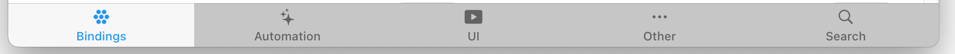

# Add-ons Store

This is the section that allows openHAB to be extended via add-ons.
There is a huge variety of extension possibilities that openHAB provides:

- **Bindings** are used to connect and control hardware and online services. This section provides
  - **openHAB Distribution**: Official bindings maintained by the openHAB project and
  - **Community Marketplace**: Bindings independently released by the community.
- **Automation** contains scripting languages, templates and module types
  - **languages** like Groovy, JRuby, Jython, JavaScript or
  - **technologies** like PID Controller, PWM (pulse width modulation)
  - **Rule Templates** shared by the community to bootstrap your automation
  - **[Blockly](/docs/configuration/blockly/)** libraries that contain custom blocks written by the community.
- **UI / User Interface**: Widgets for the Main UI
- **Other...**: System Integrations, Persistence Services, Transformation Services and Voice & Speech

Clicking on the individual tile reveals more information about the add-on:

- A general overview what it is about
- By clicking "more" the whole documentation is provided for the add-on
- An information section that provides
  - Source (openHAB or Community Marketplace)
  - Provided by (the author of the add-on)
  - Type of add-on (binding, automation...)
  - Content type (Karaf, Template, UI Widget...)
  - Created and Update date
  - A link to the related community forum entry

Note that there is a tab bar at the bottom that allows you to switch between the different pages:

[[toc]]

## Bindings

Bindings are used to connect and control hardware and online services. This section provides bindings from openHAB Distribution, which have been thoroughly reviewed by the maintainers of openHAB, as well as bindings from the Community Marketplace.
If you want to know more about the marketplace, please read the following [Marketplace announcement](https://community.openhab.org/t/announcing-the-community-marketplace/127188).

To learn more how to install tutorial see the  [Installation of Add-ons tutorial](/docs/configuration/addons.html).

## Automation

Automation provides technologies that allow you to write rules and scripts.

- **Languages & Technologies**
  openHAB comes with two languages by default: Rules DSL and Blockly (which requires a JavaScript Scripting automation add-on to be installed) while this section allows to install more languages and technologies.
  To know more about them click on the respective tile.

- **Rule templates** provide you with solutions already written for certain usecases.
  Rule templates can be used when you have a common use case for a rule and for instance need to bootstrap several of them, or share with others how to solve that use case in a configurable manner.
  These will appear in Main UI when you create a new rule, and will present you with the configuration parameters - after the rule is created, the pre-configured rule modules (triggers, conditions, actions) will appear based on your choices.

- Block Libraries, community extensions to the [Blockly](/docs/configuration/blockly/) toolbox
  These libraries extend the core blockly library with many useful blocks that might else be a bit too specific for the core block library or just fills the gap where a core block is still missing.
  When installed they appear in a separate section beneath the core blocks of the blockly editor.

## User Interfaces

Community widgets & alternative frontends

- **Widgets for Main UI**: Extend your pages with these community-designed widgets
  After adding a widget it can be used when creating UI page.
  You can the press the "+" on a cell and a popup appears with two section: _Standard Library_, which contains the standard openHAB widgets and Personal Widgets, which contain UI widgets installed from the marketplace.
  They can also be found for further adapting (or analyzing) the widget under "Developer Tools ->  Widgets".
- **Other UI Add-ons**: Alternative user interfaces and icon sets
  openHAB by default support the Basic UI as well as the HABPanel (which used to be the standard before openHAB 3).
  However, openHAB supports some more User Interfaces like
  - the [CometVisu-Backend](https://www.cometvisu.org/)
  - PHP support for CometVisu
  - and [HABot](/docs/ui/habot/),

## Other Add-ons

- **System integrations**: Integrate openHAB with external systems
  Here you can find the
  - openHAB Cloud Connector
  - Homekit Integration
  - openHAB Metric Service, an additional REST endpoint to retrieve openHAB core metrics from.
  - and others...

- **Persistence**: Backend connectors to store historical data like
  - RRD
  - InfluxDB
  - MongoDB
  - MapDB
  - Several JDBC Connectors and
  - JPA Persistence

- **Transformation Add-ons**: Extensions for a particular transformation like
  - JSONPath
  - RegEx
  - Map
  - Binary To JSON
  - Exec (executes an external program and returns the output as a string)
  - Jinja
  - Scale (the Scale transformation service is an easy to handle tool that can help you with the discretization of number inputs)
  - Xpath
  - XSLT
  - Multi / long press transformation profile for rocker switch

- **Voice & Speech**: Convert between text and speech, interpret human language queries
  - Google Cloud Text-to-Speech
  - Amazon Polly
  - VoiceRSS Text-to-Speech
  - and many more

## Search

Search for any of the above add-ons and then directly install it from here.
