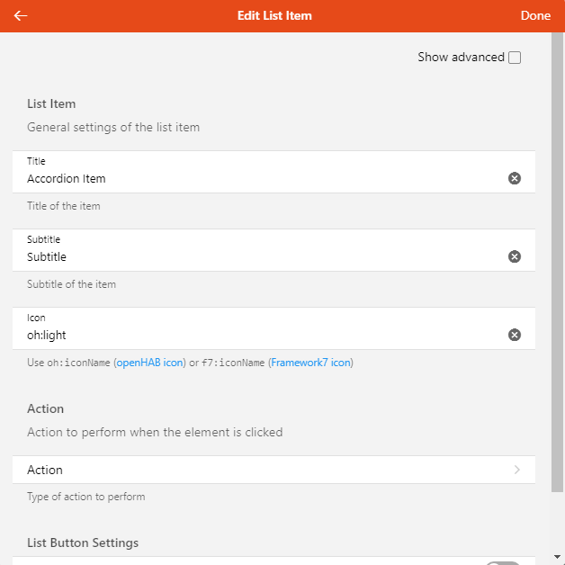
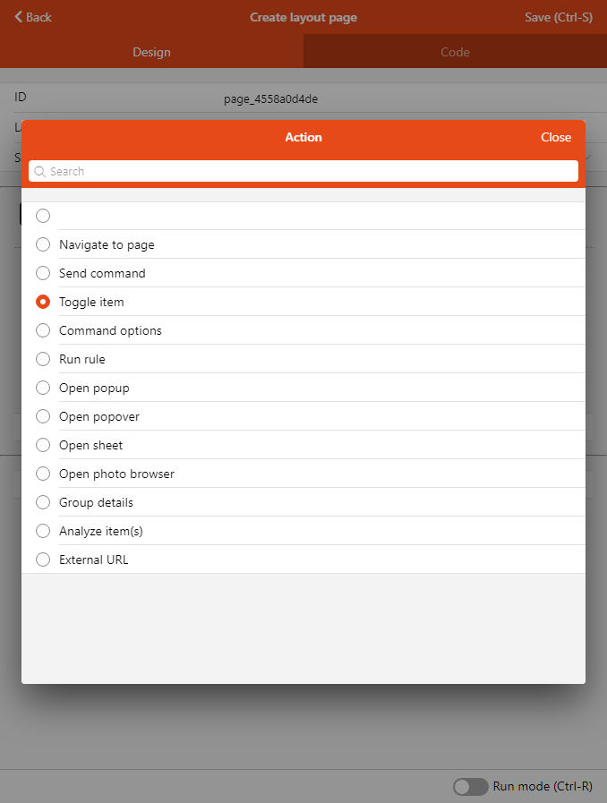
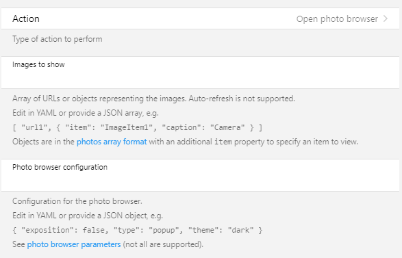

# Building Pages: Components & Widgets

[[toc]]

## UI Components: introduction and structure

**UI components** are the basic building blocks for many UIs in openHAB 3.
The Main UI Pages and Personal Widgets are notable UI components, but Sitemaps that were created in the UI and HABPanel dashboards are as well.

These structures make up hierarchies that notably define the pages in their entirety are relatively simple:

Each component has:

- A **type**
- Most of the time, a set of **configuration properties**
- Optionally, a set of **named slots** which hold collections of more components. By putting components into slots, we therefore define a hierarchy.
Slots are optional, and have a name; usually when there’s slots involved there’s a `default` slot but not always.

The semantics of both the config properties and the slots depend on the component type, as well as the allowed sub-component types in the slots.
The Component Reference provide details on what you can put in a certain component's config & slots.

Sometimes, the slots can be seen as different placeholders within a component where new components may be added. For instance, cell widgets have a `header` slot which represents the part of the cell when not expanded.
The `default` slot is the space in the cell which becomes visible when the cell is expanded.

In various parts of the UI page designers you can "focus" on a particular component usually by selecting the **Edit YAML** item in a black context menu.

Below is a typical component as represented in YAML:

```yaml
component: oh-type
config:
  prop1: value1
  prop2: value2
  prop3: =expression
  ...
slots:
  default:
    - component: ...
      config: ...
      slots: ...
    - component: ...
  anotherSlot:
    - component: ...
      ...
  ...
```

## Root Components & Props

At the top of the component tree there’s we can find a **root component**.
Pages are examples of root components.
They have additional attributes:

```yaml
uid: component1
props:
  parameterGroups:
    - name: group1
      label: Property group
    ...
  parameters:
   - name: prop1
     label: Prop 1
     type: BOOLEAN
     groupName: group1
     description: What prop1 does
   - name: prop2
     label: Prop 2
     type: TEXT
     context: item
     description: Choose an item for this prop
   - name: prop3
     type: NUMBER
     advanced: true
     ...
tags: ["tag1", "tag2"]
component: ...
config: ...
slots: ...
```

- an **uid** (its Unique IDentifier)
- a **props** structure describing its own properties; props define parameters and parameter groups following a subset of the configuration description schema found in bindings, services and throughout openHAB: see [Configuration Descriptions](/docs/developer/bindings/onfig-xml.html)
- a set of **tags**

## Widgets: Definition & Usage

Widgets are nothing more than discrete components that can be added to a Page.

No matter which type of page you’re editing, the designer will feature black buttons beside most widgets, that open a contextual menu for the widget in question.

These menus will in most cases allow you to:

- configure the documented parameters with a config sheet (“Configure Widget” or similar)
- open the part of the page’s YAML representation pertaining to the widget (“Edit YAML”), that is, a subgraph of the page’s component tree with that widget as its root component
- perform cut/copy/paste operations, if supported (you can only do that in the same page currently, to copy or move widgets between pages, you may use the YAML view)
- reorder the widget within its parent slot (these options are usually named “Move Up” and “Move Down” although you may occasionally encounter other labels, like “Move Left”/“Move Right”)
- remove the widget

Configuring the widget with the config sheet is of course more user-friendly than editing the YAML, as the options are usually organized logically in groups and feature a description:



However, it's important to know that there are limitations and sometimes editing the YAML directly will be best, because:

1. not all options are described, since widgets are often wrappers for a similar    concept in the library it's based on, either Framework7, ECharts, Leaflet, or other specialized libraries.
  This means that in these cases, these underlying concepts will usually be passed the key/values of the (openHAB) widget component's config so that more parameters can be accepted than those which are documented in the widget's definition.
  Sometimes it will be indicated somewhere when configuring the widget, or in the openHAB documentation itself, on the other hand some options won't be available for use (for instance, because they expect a callback function and you cannot define those in the widget's config) or need some transformation.

1. Sometimes you'll want to use an expression to configure the property, but the UI will get in your way - for instance, it will display an item picker while your intention is to set the prop value to be `=props.item1`.
  See below to learn more about expressions.

1. To quickly and efficiently duplicate similar widgets with only a few differences, it is always way easier to copy/paste the relevant YAML in the editor.

1. The YAML is the best way of sharing complete or partial component structures like pages or widgets with others in the forum.

Besides, there are several options that virtually all widgets in layout pages, map pages and plan pages accept, all of which are not currently available in the config sheet:

- `visible`: you can specify a `false` boolean to this option to hide the widget. This powerful feature, combined with expressions (see below), allows you to dynamically show widgets or even entire sections (if you use it on layout widgets containing other widgets), depending on the state of your items
Example: `visible: =items.TV_Powered.state === 'ON' && items.TV_Input.state === 'HDMI1'`
- `visibleTo`: this accepts an array of strings like `role:administrator`, `role:user`, or `user:<userid>`, allowing the widget to be only visible to specific users or those with a certain role.
Example: `visibleTo: ["user:scott", "role:administrator"]`
- `class` and `style` are  [standard Vue.js attributes](https://vuejs.org/v2/guide/class-and-style.html) and can be used to either alter the CSS classes or add inline styling to the component.
See "Styling" below.

### Types of Widgets

To help you define usable pages, there are a number of built-in widgets that you can use - most of which will be in layout pages. Those built-in widgets revolve around several libraries:

- the **System** library includes "crude" controls that you cannot add with the designers - for instance `oh-button`, `oh-slider`, `oh-colorpicker`. Instead, you're more likely use them within some container (card, list item...) provided by a widget of the Standard library; but when designing a personal widget with a complex layout you may want to use one or several of them directly. You may also use them in a slot of another widget, for those which define some, in order to add additional controls to that widget.
- the **Standard** library, which has several classes of widgets:
  - **layout widgets**, examples: `oh-block`, `oh-masonry`, `oh-grid-row`, `oh-grid-col` that you usually add with the designer to a layout page
  - **standalone widgets**, examples: `oh-label-card`, `oh-slider-card`, `oh-player-card` - usually not much more than widgets from the System library wrapped in a card
  - **list item widgets**, examples: `oh-list-item`, `oh-stepper-item`, `oh-toggle-item` - widgets that are thinner than the standalone ones, which you can only add a part of a list (`oh-list` or `oh-list-card`)
  - **cell widgets**, examples: `oh-cell`, `oh-knob-cell`, `oh-colorpicker-cell`: these widgets are fixed-size cells that you can only add to a `oh-cells` container widget immediately below a `oh-block` in a layout page - they will either perform an action - switching a light on & off - or expanding to reveal additional controls
  - **page-specific widgets**, for instance map pages have `oh-map-marker` or `oh-map-circle-marker`, charts have different types of widgets than the rest to represent axes, series etc.

See the [Component Reference](./components/) for details about the different libraries of components.

## Dynamically Configuring Components with Expressions

Virtually everywhere - with the notable exception of chart pages - every time you need a config prop to be dynamically updated, you can use an expression to configure it.
Expressions are string literals beginning with the symbol `=` and everything after it is evaluated using a syntax very similar to JavaScript, you can use arithmetic or string operations etc., the [conditional (ternary) operator](https://developer.mozilla.org/en-US/docs/Web/JavaScript/Reference/Operators/Conditional_Operator), as well as the following objects (subject to evolutions):

- `items` is a dynamic key/value dictionary allowing you to retrieve the state of items; the result of `items.Item1` will be an object like `{ state: '23', displayState: '23 °C' }` (`displayState` may be omitted). You can therefore use `items.Item1.state` to use the current state of Item1 in your expression, if it changes, it will be reevaluated
- `props` is a dictionary of the key/values of self-defined props for the current personal widget, or page (pages, like any root UI components, may indeed have props). It is indispensable to use props in expressions when developing a personal widget
- `vars` is a dictionary of variables (see below) that are available in the component's context
- `loop` is a dictionary containing iteration information when you're repeating components from a source collection, it is defined only when in the context of a `oh-repeater` component
- the JavaScript `Math` object (so you can use `Math.floor(...)`, `Math.round(...)` and the like)
- the JavaScript `JSON` object to parse or produce JSON;
- `dayjs` to build instances of the [day.js library](https://day.js.org/docs/en/parse/now) that you can use to parse or manipulate date & time
- `theme` which holds the current theme: `ios`, `md` or `aurora`
- `themeOptions` and `device` allow to use the relevant objects that you can see in the About page, Technical information, View details, under `clientInfo`

Expressions are particularly useful in cases where one wants to combine the states of more than one Item, or use the state of more than one Item in a single widget element.
For example, the icon of an Item can be based on the state of a different Item.

### Examples

```js
=(items.Color1.state.split(',')[2] !== '0') ? 'On ' + '(' + items.Color1.state.split(',')[2] + '%)' : 'Off'
```

Translates the third part of the HSB state (brightness) of the Color1 item to On or Off.

```js
icon: =(items[props.item].state === 'ON') ? 'f7:lightbulb_fill' : 'f7:lightbulb'
```

Use a filled icon of a lightbulb but only if the state of the items passed in the prop `item` is ON.

```js
= (items.xxx.state === '0') ? 'Off' : (items.xxx.state === '1') ? 'Heat' : (items.xxx.state === '11') ? 'Economy Heat' : (items.xxx.state === '15') ? 'Full Power': (items.xxx.state === '31') ? 'Manual' : 'Not Set'
```

Stacked ternary statements to translate a value to a description.

```js
=dayjs(items.DateItem.state).subtract(1, 'week').fromNow()
```

Substracts one week from the state of `DateTime` and return a relative time representation in the current locale ("3 weeks ago").

### Debugging Expressions

Expressions can be tested in the Widgets Expression Tester found in the Developer Sidebar
(<kbd>Shift+Alt+D</kbd>).

## Actions

When configuring a widget, you will encounter options related to actions (usually, when something is clicked or touched, but there might be several actions configured for a single widget, for instance, clicking on different parts or a long tap with a touch device); regardless, they will all have the same options:



These action options allow you to configure the interactivity within your pages, as well as the relation between them, in an extensive way. You can navigate to another page, display additional controls, popups and other modals, send commands to items every time a widget allows you to choose an action.
For instance, a floor plan marker might either open another page in a popup, or toggle an item.
Configuring the action type reveal more options in the action sheet:



### Types of Actions

Action | What it does
-|-
Navigate to page | Opens a different Page with an optional transition.
Send command | Issues a command to an Item.
Toggle Item | Alternate an item between two states by sending commands (regular command if the item's state is different, or an alternative command if the state is equal to the regular command). Typically used with ON/OFF.
Command options | Issues a command to the configured Item based on a comma-separated locally-defined list of options, or on the Item's State Description.
Run rule | Trigger a rule directly.
Open popup | Open a Page or personal widget in a popup which will be displayed fullscreen on phones and in a 630x630-pixel modal dialog on larger screens.
Open popover | Open a Page or personal widget in a small "callout" comic-like bubble
Open sheet | Open a Page or personal widget in a drawer appearing from the bottom of the screen.
Open photo browser | Displays a full screen interface to view one of several images
Group details | Used with Group items to open a popup with an automatically-generated list of the members of the group, represented by their default list item widget. For Groups with a base type like Switch, a standard card widget will also be shown for the Group itself.
Analyze Item(s) | Opens the Analyzer window for the specified item(s) and period
External URL | Open an external web page
Set Variable | Set a variable that you can use in other parts of the page or widget.

::: tip

In your own personal widgets (see below), you can define a parameter group with an `action` context to automatically define implicit props that you can pass "en masse" to built-in components that accept actions with the `actionPropsParameterGroup` property:

```yaml
props:
  parameterGroups:
    - name: myaction
      label: My Action
      context: action
...
  component: oh-button
  config:
    actionPropsParameterGroup: myaction
```

:::

## Variables

Varibles are a way to allow more complex scenarios in pages & personal widget development.

Variables can be used using several methods:

- the `variable` config parameter of `oh-gauge` (read-only),
  `oh-input`, `oh-knob`, `oh-slider`, `oh-stepper`, `oh-toggle`
  will accept a variable name and control it instead of
  sending commands to items if set.
  The "item" parameter can
  still be set to set the widget to the item's state, when
  the variable has no value.
- the `vars`object available in expressions (for example
  `=vars.var1` will evaluate to the value of the variable `var1`.
- the `variable` action allows to set a fixed or computed
  (using an expression) value to a variable.

`oh-button` & `oh-link` have a special parameter `clearVariable`
which allows to unset a version when clicked, after performing
the action.
This is useful when "validating" a variable e.g.
send a command to an item with the variable value then reset it.

## Techniques for Styling Widgets

### Predefined CSS Classes

As seen before, you can use CSS classes in the `class` property (as an array) or set CSS properties in the `style` property (as a dictionary) on your components.

You cannot define new CSS classes, but you can use classes from Framework7, for instance:

- [Typography](https://v5.framework7.io/docs/typography.html)
- [Color Themes](https://v5.framework7.io/docs/color-themes.html#apply-color-themes)
- [Hairlines](https://v5.framework7.io/docs/hairlines.html)
- [Elevation](https://v5.framework7.io/docs/elevation.html)

### CSS Variables

Another interesting technique is to override the many [CSS Variables](https://v5.framework7.io/docs/css-variables.html) defined by the framework to suit your particular component's needs.
The override will be applied to all descendants in the HTML DOM tree, in case of the Framework7 variables the underlying components which use them will use the new value.
It is recommended to use Framework7 CSS variables in your components too, when appropriate, so that way you'll be sure the properties change according to the current theme and dark mode setting.

To redefine a CSS variable for the component and its descendants, use this syntax:

```yaml
style:
  --f7-button-border-color: rgb(255, 0, 0)
```

To reuse a CSS variable, use:

```yaml
  border-color: var(--f7-button-border-color)
```

You can even define your own CSS variables and use them in your components:

```yaml
config:
  style:
    --my-color: =props.color
slots:
  ...
     ...
        ...
           config:
             style:
               background-color: var(--my-color)
```

### Applying CSS Properties Directly

Applying CSS properties like `border-color` directly on components is sometimes enough; but contrary to CSS variables like `--f7-button-border-color` which will be inherited to descendants in the tree, either by your own components or by f7 components (or their OH derivatives) that make use of these variables, they will only work on the element where you put the style configuration.

There are hundreds of [CSS properties](https://www.w3schools.com/cssref/) you can use to design your widgets. Use the resources at [W3Schools](https://www.w3schools.com/css/default.asp) to learn more about CSS techniques - these examples will provide code in HTML and classes definitions but you can most of the time adapt them for usage in components' YAML definitions.

While the Layout components (`oh-block`, `oh-grid-row`, `oh-grid-col`) can help you with the placement of your widgets, to lay out sub-components _within_ a widget, you shouldn't use them because they include design mode controls that you don't need.
While can use their `f7-block`, `f7-row` and `f7-col` equivalents instead, in many cases this is still "overkill": consider applying directly the Flexbox or Grid properties to the components.

These resources will help you with Flexbox and Grid:

- [A Complete Guide to Flexbox](https://css-tricks.com/snippets/css/a-guide-to-flexbox/)
- [justify-content "Play it"](https://www.w3schools.com/cssref/playit.asp?filename=playcss_justify-content&preval=flex-start) and others found in the reference
- [A Complete Guide to Grid](https://css-tricks.com/snippets/css/complete-guide-grid/)
- [Grid Tutorial on W3Schools](https://www.w3schools.com/css/css_grid.asp)

## Personal Widgets

You can extend the library of widgets you have at your disposal by creating personal ones, either by yourself, or copy-pasting from examples by the community; then you can reuse them on pages, multiple times if need be, simply configuring their props to your needs.
To add a new personal widget, as an admin, go to **Developer Tools > Widgets**, then use the '+' button to create a new one.

The view features a code (YAML) editor and a live preview, you can change the orientation with the button in the center of the bottom toolbar.

::: warning WARNING

Don't forget to change the `uid` right away because you won't be able to alter it afterwards.

:::

Sometimes the live preview will fail to update, you may want to hit the Redraw button or <kbd>Ctrl-R</kbd>/<kbd>Cmd-R</kbd> regularly when designing your widget.

To actually see how the config sheet would look like, and specify props for your widget for the live preview, click on Set props (<kbd>Ctrl-P</kbd>) and configure them as needed.

After saving the widget, you will have it as an option (under "Personal widgets") to add it to a layout page, or display in a modal like a popover, or use it as the default representation of an item.

Note the special `widget:<uid>` syntax for the component type to specify "use this personal widget here", the `config` being the value to wish to assign to the widget props:

```yaml
component: widget:widget_0a26c10a4d
config:
  prop1: Test
  item: Color1
```
