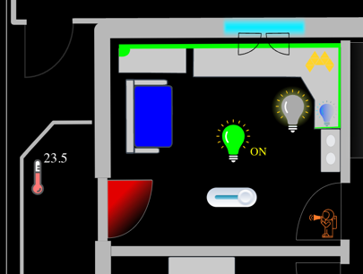
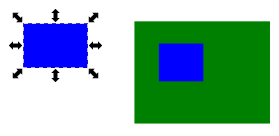
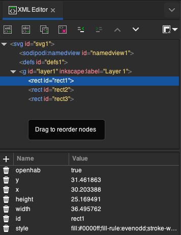
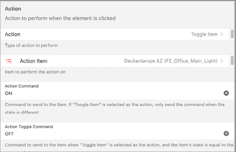
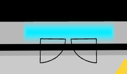
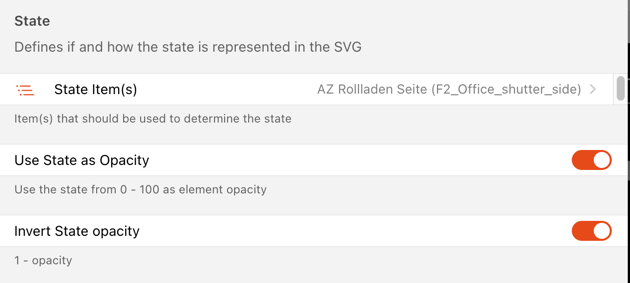
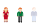
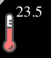

## Fixed Layouts


Fixed layouts allow you to position and size widgets freely, either on a grid with **Fixed Grid** layout, or in a completely free way with **Fixed Canvas** layouts (with **Fixed Canvas**, you are still able to temporarily switch on a grid if you want to snap some widgets).

The main idea is to create a layout on which you can freely place [widgets](/ui/building-pages.html#building-pages-components-widgets) which provide the interaction with your home automation system.

You can even make the **background image interactive** and use it as multi-widget to control and trigger actions like you can do with widgets.

## Getting Started

The first thing to do when creating a Fixed Layout is to define your screen size. In most cases this should be the **CSS Resolution** of the device you're creating this layout for.

::: tip Note

For most modern tablets, mobile phones and some other screens the **CSS resolution** is different from the **physical pixel resolution** (sometimes referred to as _Retina_ displays).
The user interface tries to help you to determine the CSS resolution by showing the currently detected value as _Current Screen_ rate at the top of the virtual screen area.

:::

### Fixed Grid Layouts

To define your screen size open the  menu and click **Configure Grid Layout**.

The layout editor shows a gray surface as the _virtual screen area_, which represents your defined screen.
You can now place widgets on that screen by clicking the **Add Widget** button.
Just like with responsive layouts a placeholder will appear, allowing you to choose widgets from the library.

Additionally, you can move the widget within the virtual screen area by dragging its upper left corner at the arrow icon shown.
You can also resize the widget by grabbing the handle in the bottom right corner.

Positioning and resizing will snap to the underlying invisible grid.
The size of that grid can be adjusted by configuring the number of columns in the layout configuration.
The number of rows gets automatically aligned to create the most square-like grid.

The gear icon in the top right corner of each widget allows you to configure or remove a widget.

#### Configuration

The following parameters can be adjusted for a Fixed Grid Layout:

##### Layout Settings

_Number of Columns:_
Number of grid columns across the page. Defaults to 16.
Limited to a minimum widget width of 50px (calculated from screen width, margin and number of columns)

_Margin:_
Margin between items and to screen edge in CSS pixels. Defaults to 10.

##### Screen Settings

_Screen Width:_
Screen width in CSS pixels. Defaults to 1280.

_Screen Height:_
Screen height in CSS pixels. Defaults to 720.

_Scaling:_
Enabling this scales the defined screen to the width available in the browser window.
All widgets are resized accordingly, with the margin staying fixed.
While this works well in many cases, it can lead to unpredictable styling issues, especially on large divergence from the defined screen width.
Defaults to false.

##### Appearance

_Hide Navigation Bar:_
When enabled the navigation bar on top of a page does not get displayed on this page.
In conjunction with hiding the sidebar via its pin icon, this can be used for full screen display, e.g. in a fullscreen browser or when used as Home Screen App on iOS.
Defaults to false.

_Hide Sidebar Icon:_
With the navigation bar hidden, an icon is displayed on the top left corner when the sidebar is closed.
Enabling this hides the icon. Defaults to false.

_Show Fullscreen Icon:_
Show a fullscreen icon on the top right corner to enter browser fullscreen mode.
Defaults to false.

### Fixed Canvas Layouts

To define your screen size open the canvas menu  and click **Configure Canvas Layout**.

The layout editor shows a gray surface as the _virtual screen area_, which represents your defined screen.
You can now place widgets on that screen by clicking the **Add Widget** button.
Just like with responsive layouts a placeholder will appear, allowing you to choose widgets from the library.

Additionally, you can move the widget within the virtual screen area by dragging its upper left corner at the arrow icon shown.
You can also resize the widget by grabbing the handles.
Depending on the widget, you may also toggle the **Autosize** option in the widget options available from the gear icon on the top right corner of each widget to have the widget take its natural size.

If you toggle the grid using the grid button, positioning and resizing will snap to the grid but untouched widgets will remain at their current size and position.
The pitch of that grid can be adjusted in the layout configuration.

The gear icon in the top right corner of each widget allows you to configure or remove a widget.

#### Configuration

The following parameters can be adjusted for a Fixed Canvas Layout:

##### Layout Settings

_Grid size:_
Pitch of the grid when the editor grid button is enabled, in CSS pixels, to snap the content.

##### Screen Settings

_Screen Width:_
Screen width in CSS pixels. Defaults to 1280.

_Screen Height:_
Screen height in CSS pixels. Defaults to 720.

_Scaling:_
Enabling this scales the defined screen to the width available in the browser window. All widgets are resized accordingly.
While this works well in many cases, it can lead to unpredictable styling issues, especially on large divergence from the defined screen width.
Defaults to false.

_Image URL:_
URL of the image to display in the background. The image is stretched to fit the screen size, while preserving its aspect ratio.
If you want to achieve a different placement, adding margins to the image in an image editor will be necessary.

This setting is in particular in important if you want to make your background image interactive, in which case it has to be of type SVG.
See below for more information on [interactive backgrounds](layout-pages-fixed.html#interactive-backgrounds).

_Image Source Set:_
The setting is passed to the [`srcset`](https://developer.mozilla.org/en-US/docs/Learn/HTML/Multimedia_and_embedding/Responsive_images) attribute of the image element, allowing to specify different images to be used depending on the actual resolution of the device, for example is the layout will be used both on a so called 'retina' and non-'retina' tablet.

##### Widget Settings

Specific widget settings are available through the gear popup menu displayed on each widget in the layout.
It provides access to the settings related to the type of the widget (**Widget Settings**) and to settings specific to the usage of this widget within a canvas.

##### Container Settings

_Preserve classic style:_
Enabling this option preserves the widget style definition as in other layout pages (responsive, fixed grid).
Usually, this means preserving the background of the widget.

_Shadow:_
Applies a shadow to the widget inner outline.

_Bring to Front_, _Mode Up_, _Move Down_, _Send to Back_:
Change the drawing order of several overlapping widgets.

## Interactive SVG Backgrounds

When using a Fixed Canvas Layout, you can make background images interactive.

This allows designs similar like floor plans but with a much more intuitive way to interact with your house, room or even furniture.

Note that it does not intent to replace widgets - widgets can still be additionally placed on top of the background image.
Both **interactive backgrounds and widgets together allow endless possibilities** to create a unique user interface.

The below image depicts a few examples that can be achieved with interactive backgrounds which are completely done without using widgets.



- The sofa can be directly clicked to control something that is related to the sofa.
- The green bar around the desk is not only a clickable LED-Strip but also reflects the color that is currently selected.
- The light bulb in the middle is filled by the color that is configured for the State ON of the light.
- The light at the right is using a "glow" effect to indicate that it is currently switched on.
This glow effect is modelled in the SVG and is just enabled disabled by the item state.
- The door is depicted with red gradient designed in the SVG and the gradient is shown when the door is open (the same would happen for the windows on the top).
- The astronaut with the megaphone has an animation that fades in and out when the state is ON.
- The horizontal button below the green light is an animated button completely modelled in the SVG and controlled by openHAB.

### Embedding SVG Images

This feature requires the image to be of type SVG.
Note that this approach requires a bit more of a technical background as you need to [prepare the SVG](#preparing-the-svg-image).

Additionally, the following settings are important:

- **Embed SVG**: Only when enabled, the SVG image is embedded in the page as "real" HTML elements, allowing to interact with it (normally an SVG would only be referenced by an IMG tag).
By default, this is switched off and therefore needs to be enabled.

- **Embed SVG Flashing in Run-Mode**: It is possible within the editor to flash the elements of the SVG image that have been previously marked as interactive through the attribute 'openhab' (see below).
This setting will also flash the elements in run-mode guiding the user getting by knowing which part of the image is clickable or not.
By default, this is switched off.

### Preparing the SVG Image

SVG images are basically XML files, and can be edited with any text editor.
It is recommended to use a dedicated SVG editor like [Inkscape](https://inkscape.org/) to manipulate the SVG image because it does not only provide a user interface to draw the image but also to see and view the XML "behind" the SVG itself.

**Example:**

Let's create a very simple SVG with Inkscape which we will embed in a Fixed Canvas Layout.

- Create a new SVG and draw three rectangles like the following and save the file as `background.svg`
  - Copy the file into the `conf/html` folder of your openHAB installation.



- Add "/static/background.svg" in the Image URL field of the Fixed Canvas Layout configuration, and you will see the SVG image in the background of the layout editor.
- Save the page.
- Open the XML-Editor in Inkscape (Edit -> XML Editor) and you can see something like the following (note that you will see the same if you open the SVG directly with a text editor):

```xml
<svg width="210mm" height="297mm" ... some information omitted here>
<defs id="defs1" />
  <g inkscape:label="Layer 1" inkscape:groupmode="layer id="layer1">
    <rect style="fill:#0000ff;fill-rule:evenodd;stroke-width:0.264583"
       id="rect1"
       width="36.495762"
       height="25.169491"
       x="30.203388"
       y="31.461863" />
    <rect style="fill:#ff2a00;fill-rule:evenodd;stroke-width:0.264583;fill-opacity:1"
        id="rect2"
       ...omitted />
    <rect style="fill:#0000ff;fill-rule:evenodd;stroke-width:0.264583"
        id="rect3"
    ...omitted />
  </g>
</svg>
```

You can see several elements that represent the rectangles we have drawn.
To make the SVG interactive, you need to add a special attribute to the elements you want to be clickable and therefore interactive.
This attribute is called `openhab` and can be set to any value, but it is recommended to use a meaningful value like "true".

Let's add this attribute to the first rectangle either via Inkscape or directly within the file, then save the image and reload the page:



```xml
  <rect style="fill:#0000ff;fill-rule:evenodd;stroke-width:0.264583"
    id="rect1"
    width="36.495762"
    height="25.169491"
    x="30.203388"
    y="31.461863"
    openhab="true" />
```

Note that you have added the `openhab="true"` attribute to the first `<rect>`angle  and not to a group `<g>` (which we talk about below)

- Make sure that the `Embed SVG` option is enabled in the Fixed Canvas Layout configuration.
- Stay in Edit-Mode of the page
- On the right between the "Grid" icon and the "Configure Layout" icon, you can see a new icon with a flash which allows you to flash the interactive elements.
When you click on it, the first rectangle should flash which indicates that has become an interactive element for openHAB.
- There are two different colors when the element flashes:
  - Red: The element is defined as an interactive element but is not yet configured.
  - Green: The element is defined as an interactive element and is already configured.
- Click on it and a dialog, which is similar to configurations of a normal widget except that it has some additional settings, will appear.
- Later, after configuration, you can go to Run-Mode and try out your configuration.

### Configuration of an interactive element

The dialog has many options that allow you to configure the interactive element.
Usually you will first configure the Action and the Action Item like in a normal widget.



Many special options though will only be available when you click on "Show Advanced".

- **State Items**: Define the item that is used to retrieve the state of the element to reflect the state.
Reflecting the state can be either applying a color or using the opacity of that svg element.
The reason why you can choose several states is that in some cases you might want use expressions.
In this case you need to select all items that you use in this expression (see below for an example).

- **Use State Proxy Element**: Often you have more complex elements that are made of a group (a `<g>` element in the SVG) that do not either allow to be directly filled with a color or where you explictly want to use a specific element in that group to reflect the state.
A good example is the following bulb.
The left image shows the bulb in the OFF state and the right image shows the bulb in the ON state.
In this case we do apply a color based on the state but enable / disable a proxy element in that group that makes up the bulb object.

   

The way this can be achieved by indication a proxy element, an element that is part of that group.
Similarly like the main element is marked with an `openhab` attribute, the proxy element is marked with a special attribte, the `flash` attribute.
In this case the proxy element is made _visible_ or _invisible_ depending on the state of the item.
It is also used when flashing the interactive elements with the flash icon, hence the name "flash" attribute.

```xml
  <-- simplified elements from the bulb group -->
  <g id="az-main-lightbulb2" openhab="true">
    <path/>
    <ellipse flash="true" >...</ellipse>
    more elements in the group
  </g>
```

Tip: Search for nice SVG objects and import into your SVG background file

- **State  ON Color / OFF Color**: Define the color that should be applied when the state is ON or OFF.
An expression can be used here as well which is especially useful when, e.g. you want to apply the color of a light to that element.
Here is an example of an expression that uses the color state of a light item to apply the color to the element:

```yaml
=(items.AZ_Govee_Light_Strip_Power.state==='ON') ? items.AZ_Govee_Schreibtisch_Light_Strip_Color.state: '#aaaaaa'
```

Keep in mind that in this case, the _AZ_Govee_Light_Strip_Power_ and the _AZ_Govee_Schreibtisch_Light_Strip_Color_ both need to be selected in State Items.

- **Use State as Opacity**: If this option is enabled, the state of the item will be used to set the opacity of the element.
This is in particular helpful if the element should become more transparent depending on State Percentage or ON/FF of an item.
- **Invert State Opacity**: If this option is enabled, the opacity will be inverted.

An example could be the closing state of a rollershutter that makes a window element more and more (in)transparent.
The blue bar that depicts the window will become less and less transperent the more the rollershutter is closed and will finally look like the wall when the rollershutter is completely closed.

  

The following configuration uses the inversion of the percentage state value as 100 should become 0 and vice versa.

  

- **Minimum Opacity applied**: If you want the minimum not to be 0, you can set it which makes sure the element will not be completely hidden but still be partially visible.
An example could be to show the presence/absence of people like shown below where the minimum has been set to 0.2.
In this case the opacity is derived from the ON/OFF state of the openHAB presence item state where 1 equals 100% and 0 equals 20% instead of 0%.

  

#### Show State information as Text

If you want to display the state value as text, create a text element within the SVG (which is a `<tspan>`), mark it as openhab=true and select the State Item.
The value of that State Item will then be written to the text element:



- **Use displayState as Text**: Sometimes you want to apply the formatted display state instead of the raw state.
  This is especially useful when you want to display the state of a temperature item in a more human-readable way.

#### Using styles and SVG animations

This is the most sophisticated part of the interactive SVG backgrounds which allows very interesting designs.

- **"Set Style Class based on ON" / OFF State**: These properties allow you to apply CSS classes to an element when the state is ON or OFF.

In general, any style class that is defined in the CSS of the page can be applied to the SVG element.
CSS classes can be used to apply colors, animations, or any other style that is possible with CSS.
They can be added to SVG text file in the same way it is added to HTML files.

**Animations**:

Here is a simple example that works with the above astronaut to create a fading in/out animation:


The above setting for _Set Style Class based on ON_ will apply the class `animate` to the element with the id 'astro_animate'.

This can be achieved by adding the following style to the CSS of the page to implement an "animation" of the opacity.

```css
<style><![CDATA[
  .animate {
      animation: astro_keyframes 2000ms linear infinite normal forwards;
  }

  @keyframes astro_keyframes {
      0% { opacity: 0; }
      50% { opacity: 1; }
      100% { opacity: 0; }
  }
]]</style
```

As soon as the style is applied to the astronaut, it will start to fade in and out.

Even multiple style classes can be applied to different elements at the same time by providing them in a comma separated list.

```yaml
  Set Style Class based on On State:
  sz_main_light_buttonLine:buttonLine_toOn, sz_main_light_roundedButton:roundedButton_toOn
```

In this case, the element with the id _sz_main_light_buttonLine_ gets the class _buttonLine_toOn_ and the element with the id _sz_main_light_roundedButton_ gets the class _roundedButton_toOn_.
Both trigger different animations at the same time (buttonLine_toOn makes the line turn from red to green, and roundedButton_toOn moves the button from the left to the right) which implements an interactive button completely implemented within the SVG.

A perfect example for animations could be an animated energy flow in a house.
