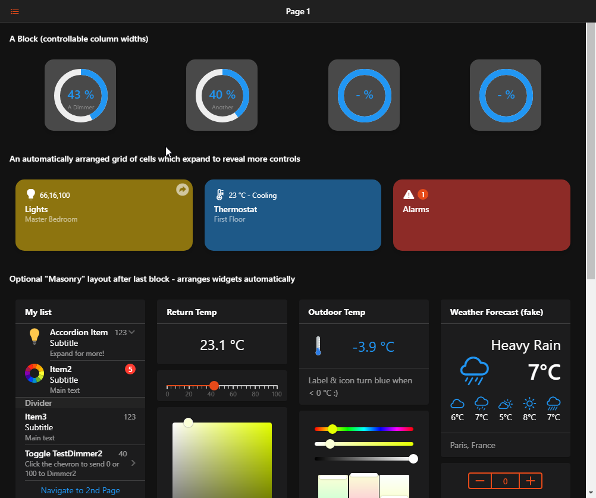
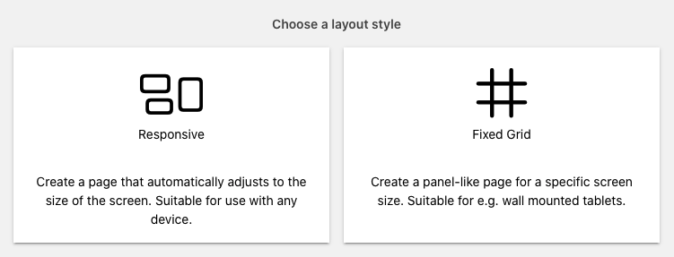

# Layout Pages

Layout Pages are used in the main web user interface to display widgets in an organized manner.

[[toc]]

## Responsive Layouts

Responsive Layouts work well on mobile devices that need to adapt to different screen sizes.
Fixed Grid Layouts are more suitable for wall-mounted tablets or other devices with a fixed screen size.
In particular, Fixed Grid Layouts are suited as an alternative for [floor plan pages](floorplan-pages.md) and even support an interactive background image that can act similar like widgets.

**Responsive Layouts** are the main layouts in openHAB and recommended for most uses. They automatically adjust to the device's screen and thus can be used as general interface from all devices.
Within Responsive Layouts you can choose among several types of arrangements, based on whether you want to control the layout completely, or let the container decide where to place the widgets.

## Fixed Grid Layouts

Fixed Grid Layouts allow you to create a Layout Page where elements have _predefined positions and sizes_. They are used to design a panel-like page for a specific screen size and are most suitable for static interfaces like wall mounted tablets.

<!---  !--->

## Creating a Layout Page

When you first create a layout you are asked which type of layout you want to create. Note that the type cannot be changed afterwards.

Then follow the configuration steps for the chosen layout type:

- [Responsive Layouts](layout-pages-responsive.md) or
- [Fixed Grid Layouts](layout-pages-fixed.md)
