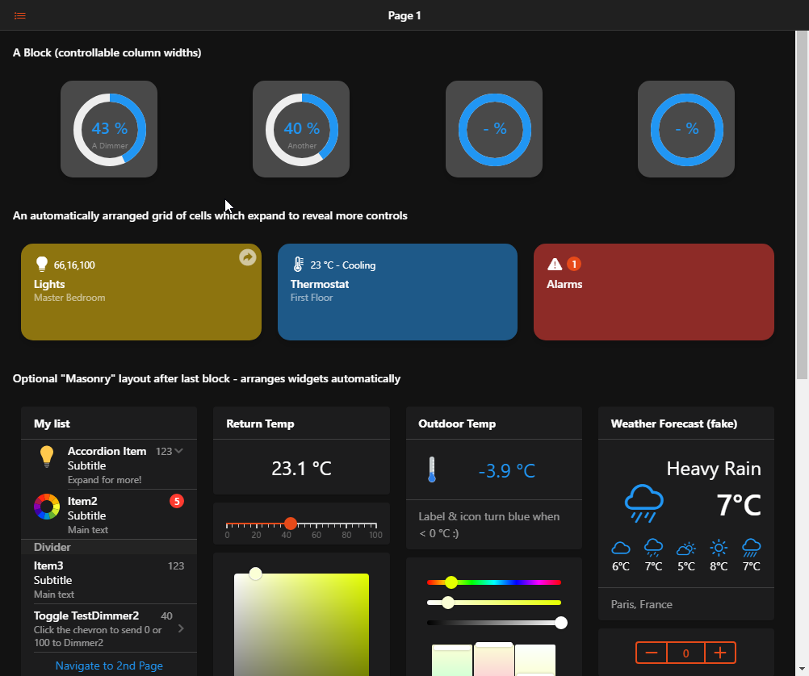
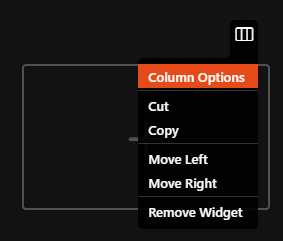
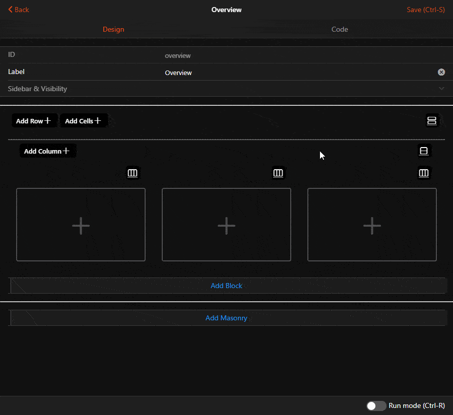
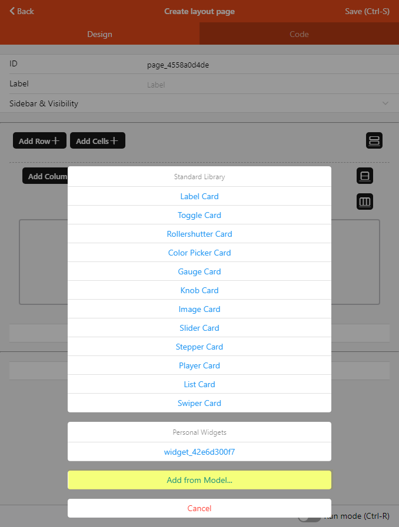

# Layout Pages

Layout Pages are used in the main web user interface to display widgets in an organized manner.
You can choose among several layouts, based on whether you want to control the layout completely, or let the container decide where to place the widgets.



## Anatomy of a Layout Page

A layout page can host one or multiple **blocks**, optionally followed by a **masonry** layout.

In every block there could be an arbitrary set of **rows** or **cells** containers.

In a cell container, you may add widgets from the standard cell widget library (or personal widgets, provided they're based on a `oh-cell` widget or derivative).

In a row, you may add **columns** which will spread across the row, possibly wrapping their contents to another row (but still within the same `oh-grid-row`).
Each column can host one widget from the standard standalone widget library, or a personal one.

The masonry container will decide how many columns it has based on the screen width, and will try to arrange the widgets automatically to form a compact layout.

## Designing Responsive Layout Pages

When you're designing a layout page, it's important to remember how this page will be used.
Sometimes, it will be on a phone, and other times on a bigger screen.

With that in mind, it is advisable to build the page for the narrow screens first, and then make sure it expands gracefully to the wider ones, instead of thinking the other way around. If you plan to share the UI you built, you can expect them to access it with mobile devices rather than desktop computers.

For cells and masonry, you don't have to worry about it, it will be handled for you. However, when you choose to keep control of the layout by making use of rows and columns, you need to take extra care about the responsive breakpoints.

These are controlled using the parameters on the column (`oh-grid-col`) components - you can configure them in the Design tab with the *Column Options* menu entries, or in YAML with the Code tab or a "Edit YAML" options on a parent component.



Using code, you can quickly duplicate the breakpoints for similar columns.

The breakpoints work like this: the `width` property of the column is the default width that will be applied for the smallest screen, then `xsmall`, `small`, `medium`, `large`, `xlarge` width will apply on wider screens appropriately:

| Property | Minimum screen width | Examples of devices |
|----------|----------------------|---------------------|
| `width` | No minimum, default | All devices including phones |
| `xsmall` | >= 480px | Smartphones in landscape mode |
| `small` | >= 568px | Smaller tablets (Nexus 7...) in portrait mode |
| `medium` | >= 768px | Most tablets in portrait mode |
| `large` | >= 1024px | Smaller/regular tablets (iPad, iPad Mini...) in landscape mode* |
| `xlarge` | >= 1200px | High-end tablets (iPad Pro...), desktops |

<footnote><small>* Note that the sidebar will potentially be displayed and has a width of 260px</small></footnote>

If you don't specify any width or breakpoints, the column will spread evenly on the row, without wrapping. This is fine for a couple of columns and simple widgets only, since on a small smartphone screen, you will rapidly get out of room.
That's why you may find yourself wanting to let a column be 100% by default, so that it occupies the entire screen, and then reduce the width for `medium` or `large` breakpoints.

For example, given this set of rows & cols:

```yaml
config:
  label: Overview
blocks:
  - component: oh-block
    config: {}
    slots:
      default:
        - component: oh-grid-row
          config: {}
          slots:
            default:
              - component: oh-grid-col
                config:
                  width: "100"
                  small: "50"
                  medium: "33"
                slots:
                  default: []
              - component: oh-grid-col
                config:
                  width: "100"
                  small: "50"
                  medium: "33"
                slots:
                  default: []
              - component: oh-grid-col
                config:
                  width: "100"
                  medium: "33"
                slots:
                  default: []
```

This is how the layout will adapt depending on the width of the screen:



## How to Build a Layout Page

### Defining the Layout

When you create a new Layout Page, you'll notice the 2 buttons **Add Block** and **Add Masonry**.
Clicking either will add the respective container to the page.
If you have multiple blocks, you can use the black context button (or the Code view) to reorder them with the Move Up/Move Down menu options.
You can also copy it and paste it as another block after they've been designed, if you wish to have multiple similar blocks.
You can also give a title to the block which will be displayed above it.

Blocks are also good candidates to use the conditional visibility features on, with the `visible` and `visibleTo` properties.
You can restrict what's displayed on the page based on an expression, or who is currently viewing the page.
In Design mode, _you will not be able to see the effect of these properties_, notably `visible`, but in Run mode they will be taken into account.

Under blocks, as explained above, you can have a mix of cells or rows. The 2 buttons **Add Row** and **Add Cells** will let you add more of them.
They will be added at the end of the block, but as for the blocks themselves, you can reorder them, or duplicate them, using the context menus or the YAML.

In Design mode, rows will feature an additional step before you can actually add widgets: adding columns: the **Add Column** serves this purpose.

### Adding Widgets

Big gray placeholders with a "+" sign will appear where you can add Widgets.

Depending on the type of containers, different widgets from the Standard library will be offered in the menu, as well as widgets from your personal library.

You will also get an additional option: **Add from Model...**. This option will display your semantic model, and let you pick one or several items, then add them in the container. The Widget that will be added will be the _default widget_ for the item for that type of container which can be controlled with metadata:

- for columns or masonry, the _default standalone widget_;
- for items inside list cards, the _default list item widget_;
- for cell containers, the _default cell widget_.



::: tip REMARK

The widget that will be put on the page is a _copy_ of the current widget as defined in metadata at the time of the addition; if you change this definition for an item, widgets that were already put on a page with the **Add from Model...** feature will **NOT** be updated.

:::
