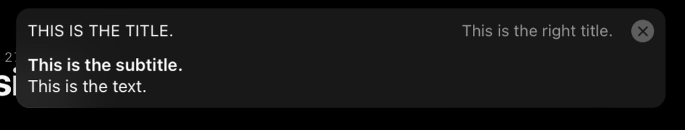

# Main UI

Since openHAB 3.0, the so called "Main UI" is the main web user interface of openHAB.
Main UI allows the administrator (you) to setup and configure openHAB, and provides many types of pages to visualize data and control Items.

This page aims at providing an overview over Main UI's "special" features, which means it does not try to document Main UI in general or provide a comprehensive overview over all its many capabilities and configuration pages.
If you are new to openHAB, please refer to the [Getting Started guide]({{base}}/tutorial/), which is introducing you to Main UI by using it to setup openHAB.

[[toc]]

## Developer Sidebar

Main UI provides a developer sidebar for administrator user(s), that is accessible from anywhere in the UI.
The developer sidebar is split into a "tools" section with several useful tools including an universal search across nearly all UI-configurable entities and a widget expression tester, and a "help" section aiming at providing help and useful information regarding configuration and setup.

If your device's screen is wide enough (it has to be at least 1280 pixels wide), you can open the developer sidepanel by:

- Opening the "Developer Tools" page from the menu and enabling the developer sidebar.
- Clicking on the help icon displayed in the upper right corner of most pages.
- Pressing the key combination <kbd>Alt</kbd><kbd>Shift</kbd><kbd>D</kbd> on your keyboard.

### Developer Sidebar Search

As already mentioned, the developer sidebar provides an universal search across nearly all UI-configurable entities.
This means, you can search through most configuration available in Main UI, including Things, Items, pages.

Imagine you need to find all usages of an Item.
You could start to open all rules, scenes and scripts, check persistence configuration and have a look at pages and sitemaps to find usages of that Item - Or you use the developer sidebar search.

The developer sidebar search ignores case (so it doesn't matter whether you search `LivingRoom_Light` or `livingroom_light`) and searches inside the following entities:

- Things
  - UID
  - label
- Items
  - name
  - label
  - tags (requires exact match, i.e. if the Item has a tag `Lightbulb`, only the search query `Lightbulb` (case doesn't matter) will match)
  - metadata
- Pages (including Sitemaps)
  - uid
  - label
  - content (widgets, tabs, charts, etc. with their configuration)/slots
- Transformations
  - uid
  - label
  - type
- Rules, Scenes & Scripts
  - Item name & Thing UID of triggers, actions & conditions
  - script code (e.g. Rules DSL, JavaScript, and even Blockly)
  - script MIME types (requires exact match)
  - Blockly scripts (using `block`, `blockly` or `blocksource` as search string, where case is ignored)
  - tags (requires exact match)
- Persistence Configurations:
  - label & service id of persistence service
  - Items persisted by persistence service

## Web Audio Sink

Main UI implements a web audio sink, which means the openHAB server can play audio through on a client device through the browser.

To enable web audio sink support for a client, open the "Help & About" page from the menu and turn on the "Enable Web Audio sink support" option.
As it is setting specific to your browser environment, web audio support has to be enabled for every client where it should be used.

Please note that due to limitations in Safari (and possibly Chrome as well), a user interaction is required after the first audio stream has been sent to actually play it.
This means, that after opening Main UI, the first audio that should be played on the web audio sink is only player after the user interacts with Main UI in any way (i.e. touching the screen is enough).
For subsequent audio playback, that is not required anymore and the audio is played immediately.

For more information about audio sinks, please refer to the [multimedia configuration docs]({{base}}/configuration/multimedia.html#audio).

## UI Command Item

Main UI can be controlled from the openHAB server by setting up a so-called UI command Item.

Similarly to web audio support, this is a setting specific to your local browser environment, so you have to define the UI command Item for each client, which also allows you to different UI command Items for different clients.
To setup an Item as the UI command Item on your device, open the "Help & About" page from the menu and select an Item for "Listen for UI command to".

The command Item has to be a `String` Item.
The UI is listening for commands to that Item, and if an Item command is a valid command string, the UI executes the given command.

Currently, the supported commands are:

- `navigate:$path`:
  Navigate to a given `$path`, e.g. `navigate:/locations` to navigate to the "Locations" tab of the home page or `navigate:/page/my_custom_page` to navigate to a page with the ID `my_custom_page`.
- `popup:$target`, `popover:$target` and `sheet:$target`:
  Open a `$target`, which can be a page (`$target` is `page:` + a page ID), a custom widget (`$target` is `widget:` + widget ID) or any [`oh-` component]({{base}}/ui/components/) (`$target` is the component name), in a popup, popover or sheet.
  
  For example, to open `oh-clock-card` inside a popup, send `popup:oh-clock-card` to the UI command Item.
- `notification:$text:$title:$subtitle:$titleRight:$closeTimeout`:
  Display a notification inside the UI:
  The `$text` parameter is mandatory, all other parameters are optional.
  `$closeTimeout` is in milliseconds and defaults 5000, which means by default a notification will be closed after 5 seconds.
  
  For example, send `notification:This is the text.:This is the title.:This is the subtitle.:This is the right title.` to the UI command Item to display the following notification:
  

- `close`:
  Close all popups, popovers and sheets.
- `back`:
  Naviate back.
- `reload`:
  Reload the current page.
