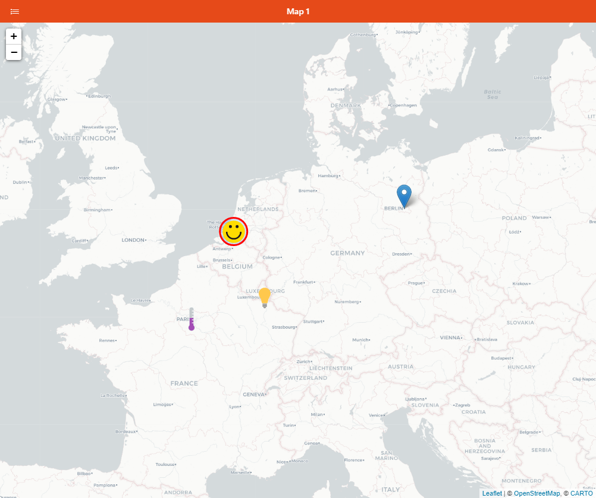

# Map Pages

Map Pages can display either fixed markers or markers representating items of type Location, on a map.

## Anatomy of a Map Page

Map pages have some configuration properties that you mostly can define in the Design mode.
You can also add two types of markers in the Markers area.

- A Marker is an icon that will represent a position; you can define an icon, a label, and either a fixed position or a Location item. You can also define an action that will be performed with the marker is clicked.
- A Circle Marker is a marker that will be represented as a circle on the map; it's useful for representing ranges. Instead of definining an icon, you can define a fixed radius in meters, or use the state of an item to control this radius. You can alter the look of the circle marker in the `markerConfig` YAML-only config property; it will be forwarded to the [LCircle](https://vue2-leaflet.netlify.app/components/LCircle.html#demo) component as props.

## Building a Map Page

In the Design view, configure the properties below Page Configuration.
Some of them, like the background tiles or overlay providers, will indicate that some additional properties may need to be defined in YAML, for instance to set an OpenWeatherMap API key for the associated overlays to work.

To add markers, under Markers, click either **Add marker** or **Add circle marker** as necessary. Then click on the newly added entry to configure the marker. using the black context menu, you can reorder or remove existing markers.

Use the Run mode to preview the page.
