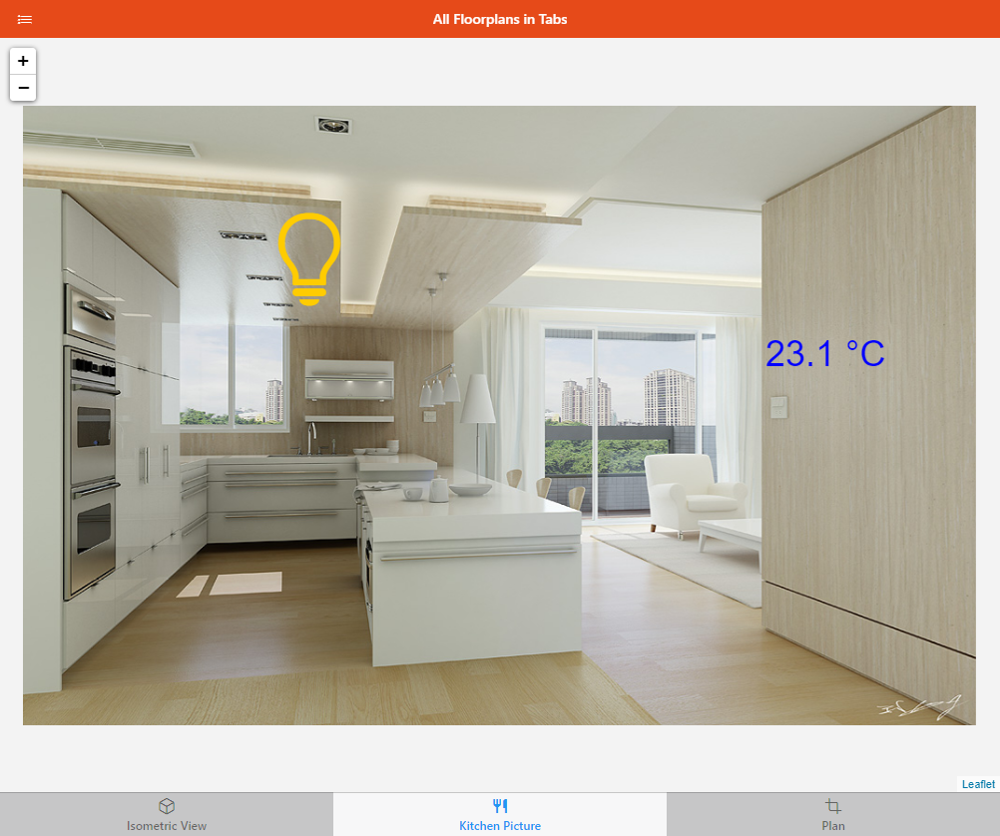

# Tabbed Pages

Tabbed Pages are composite Pages which are able to display other Pages in tabs.

## Anatomy of a Tabbed Page

Tabbed pages are very simple: you can only add `oh-tabs` components which will have a label, icon, and a reference to another Page.
The tabs will be displayed in the order they're defined.

## Building a Tabbed Page

In the Design view, under Tabs, click *"Add tab"* to add another tab. Then click on the newly added entry to configure the tab. using the black context menu, you can reorder or remove existing tabs.
