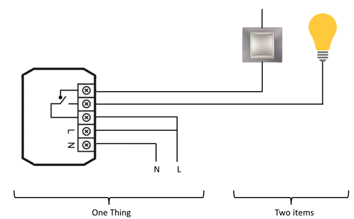
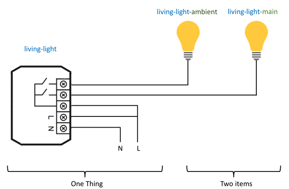
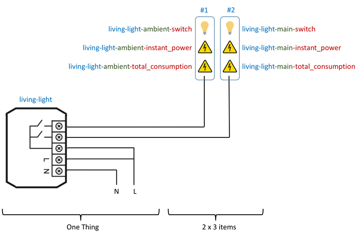



# Things, items and Co

OpenHAB 2 introduces two levels to describe the devices and their functionalities: things and items. This chapter gives the related basic concepts.

## Things vs items

_Things_ are the entities that can physically be added to a system and which can potentially provide many functionalities in one. It is important to note that things do not have to be devices, but they can also represent a web service or any other manageable source of information and functionality.
They are relevant for the setup and configuration process, but not for the operation.

_Items_ represent functionality that is used by the application - as user interfaces or automation logic) -. Items have a state and are used through events.

The glue between Things and Items are channels. A Thing deliver information or a functionality through a channel. This is made visible and usable by the item. 

The following illustrates the difference between them.

## One device to manage two lights

This corresponds to one double-switch device: one thing corresponds to 2 items, one per switch.

## One device to manage one light and a switch

This corresponds to a device with one switch, with an entry for a mechanical switch.

## Naming convention

Naming things and items in a consistent way is important in order to help maintaining the system from time to time.

Here is the one I propose, based on the way I think to the devices when I need to find them:

* first of all, I am working in a room - for example, the living-room that we will call *living*
* in this room, I have a thing that allows to switch two lights - let’s call this *light*
* the two items are a main light and an ambient light - let's call them *main* and * ambient

So:
* the thing will be named *living-light*
* the main light will be the item named *living-light-main*
* the ambient light will be the item named *living-light-ambient*

## Real Life example

Real life things comes sometimes with different kinds of items and can offers much more that 2 items.

Let's do a real life example with a device, inspired by the FIBARO double switch model. It can be described this way:

* A switch #1 that has:
* the switch #1, that we will use for main light,
* an instant power consumption value linked to the switch #1
* an total electricity consumption value linked to the switch #1
* A switch #2 that has:
* the switch #2, that we will use for ambient light,
* an instant power consumption value linked to the switch #2
* An total electricity consumption value linked to the switch #2

So, this one thing will create two sets of three items, according the following:

In order to simplify notation, you can decide to not add “switch” at the end of the name of the item (i.e.: living-light-ambient and living-light-main instead of living-light-ambient-switch and living-light-main-switch) as this is the main functionality or the device.

